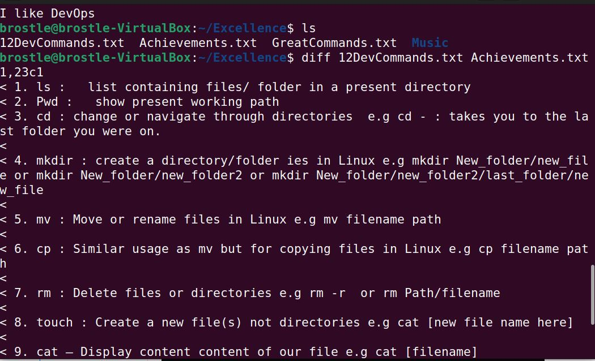

# My DevOps_Project 
## Project 1: Linux Pratice Project
## Darey.io DevOps Bootcamp


Linux Commands are the primary commands needed to communicate with the cloud devices

Requirements:
* 1. Download and install VirtualBox from <https://www.virtualbox.org/wiki/Downloads>
* 2. Download and install Linux Ubuntu Deskstop OS as a virtual Machine in VirtualBox from [Ubuntu](https://ubuntu.com/download/desktop)
* 3. Configure settings ofVirtual Machine with 2 processors and 4GB RAM
* 4. Install WSL Windows Subsystem for smooth dispaly and apprearance
* 5. Find and Open App, Terminal


Operations:
* ```sudo apt update``` : To update the dependencies
 

* ```sudo apt upgrade``` : To upgrade necessary packages
 

* ```pwd``` : To know your Present Working Directory
* ```ls```  : To list content of your presnt working directory
* ```cd```  : Change from directory from present working directory to another.
 

* ```mkdir Music```  : Creates a new directory called Music
 

* ```touch Achievement.txt``` : Creates a new file called Achievement
* ```cat Achievement.txt```: To view content of the file Achievement.txt


* ``` mv Achievement.txt Excellence```: Move the file Achievement.txt to a directory named Excellence


* ```echo “I like DevOps” >> Achievement.txt```  : Append with double operator to the last line of the file the text "I like DevOps"


* ```ls -a```: Displays all directories and files including .(dot) files i.e hidden files.


* ```rmdir -p Songs```: Removes the directory/folder called Songs and -p represent Parent, specifying removing all subdirectory ofthe parent directory.


* ```grep "filename" GreatCommands.txt```: Find "filename" in the file called GreatCommands.txt


* ```head greatCommands.txt```  : It displays the first 10 lines of the greatCommands.txt


* ```tail greatCommands.txt```:  It displays the last 10 lines of the greatCommands.txt


* ```diff 12GreatCommands.txt Achievement.txt``` : Displays the difference between content of 12GreatCommands.txt and Achievement.txt



* ```df -h```  : Displays human readable detials of file systems of Linux


* ```mkdir -p second_folder/third_folder/fourth_folder```: Creates a nested folder up to fourth level with -p flag u to parent directory


* ```sudo apt-get install tree```   : Installs directory tree in linux
* ```tree first_folder/```   : Displays the hiercahy of nested folder


*```tree / -L 1```   : Displays level one directory of linus filesystem root 


*```sudo ls -l /root```   : listing the root file of the linux OS you need superuser


*```wget raw.githubusercontent.com/pakinsa/Model-Training-..../master/predict.py``` : Downloads a specified file from github to your linux PC,e.g predict.py a python file


*```sudo groupadd jun_engrs```  : Creates a new group called jun_engrs
*```sudo useradd -G jun_engrs tolu``` : Adds tolu as a user to the group jun_engrs


*```sudo chown tolu:brostle error.txt```   :change ownership of error.txt from brostle to tolu


*```ls -l``` : to list files and directories with thier various formats


-rwrx. : When a display starts with hyphne(-), then that is a file, r is read, w is write and x is execute

dwrx: When a line of display starts with a (d), then that is a directory, r is read, w is write, x is execute

Example: "-rwx r-x r- -": User(u) group(g) others(o) : Means users can read, write and execute, while group can only read and execute but can't write, and others can only read.

*```chmod -c g+w filename```  :grants permissions to group to now write

*```chmod -c o+x filename```  :grants the permissions to others to execute

*```chmod -c u-r filename```  :removes the permissions from users to read.

*```chmod -c u+x error.txt```  :grants permission for users to execute.


* Read = 4,
* Write = 2,
* Execute = 1,
* No permission = 0.


* Read + Write + Execute = 7,
* Read + Write = 6,
* Read + Execute = 5,
* Write + Execute = 3.

*```chmod 735 predict.py```   : changes the mode of the file predict.py into a read, write, exeutable for users(u), only write and execute for groups(g) and read and execute for others(o)  
 


*```sudo systemctl status apache2``` : know the status of apache in the server if it is running


*```sudo mysql``` : enter into the mysql service, or use
*```sudo mysql -p```  : flag -p is a prompt for password


*```sudo mysql_secure_installation``` : Install securely with the use of passwords for rootuser in mysql


*```sudo /etc/init.d/mysql restart```  :  stop and restart mysql service 


*```ALTER USER 'root'@'localhost' IDENTIFIED WITH mysql_native_password BY 'Success1'```


*```sudo mv test.php /var/www/html```   : moves the test.php file into a directory /var/www/html
*```find / -type f -name "test.php"```   : finds from the root directory filename test.php and the path to the file
if you change test to * wildcard, *.php, will find out all php file from linux system from the root 


