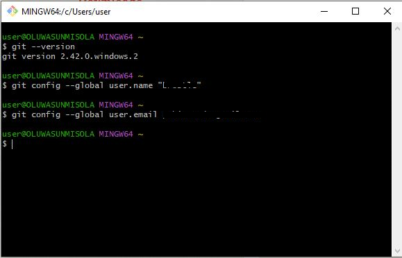
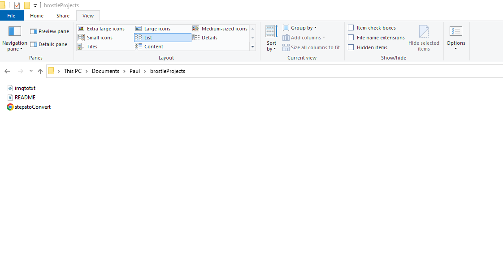
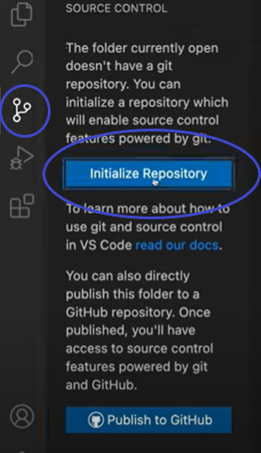
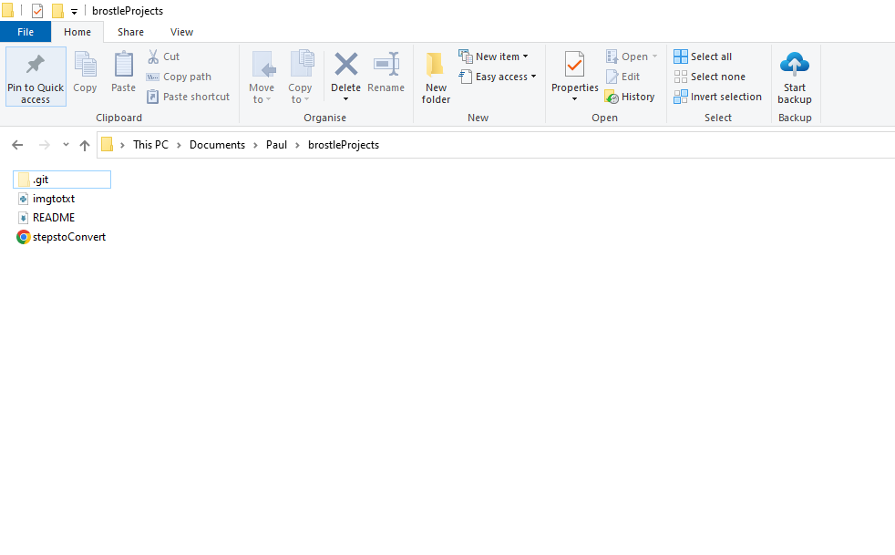

# My DevOps_Project 
## Project 2: GIT Pratice Project
## Darey.io DevOps Bootcamp

Git Commands helps to collaborate on projects amongst technical teams 

Required Steps:
* 1. Download and install Git  from <https://git-scm.com/downloads>
     
     

* 2. Configure username and password on Git Bash

     

* 3. Create a repository by first creating a folder with necessary files you might need

     

* 4. `git init` : to initialise the repository. This can be done on Git Bash with this command 
      and can also done on Visual Studio code GUI
      
      
      

      

* 20. Create a github accounts and repositories at [Git](https://github.com/)

      
 