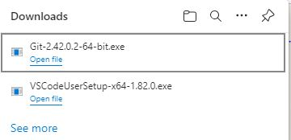
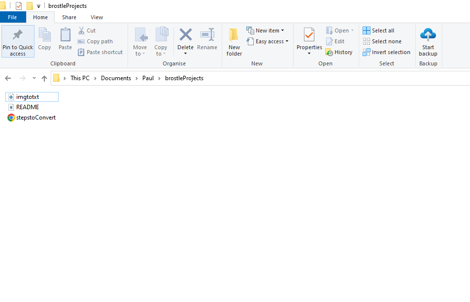
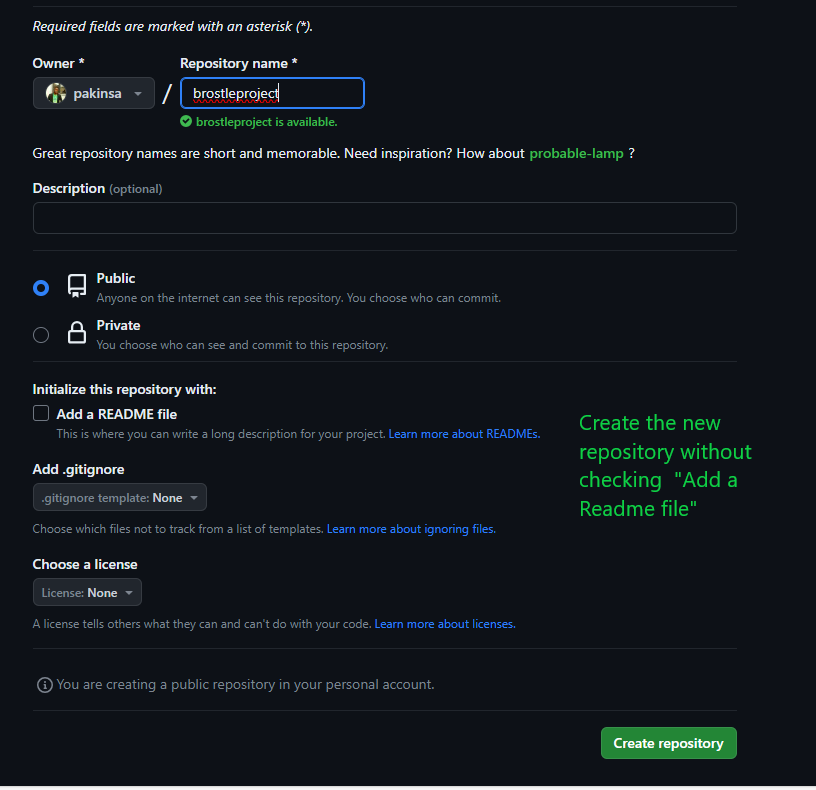

# My DevOps_Project 
## Project 2: GIT Pratice Project
### Darey.io DevOps Bootcamp

Git Commands helps to collaborate on projects amongst technical teams 

Required Steps:
* 1. Download and install Git  from <https://git-scm.com/downloads>
     
     

* 2. Configure username and password on Git Bash

     

* 3. Create a repository by first creating a folder with necessary  files you might need

     

* 4. `git init` : to initialise the repository. This can be done on Git Bash with this command 
      and can also done on Visual Studio code GUI
      
      
      

* 5. `git commit` : my firstcommit was to rename a python file and was commited with this command

      

     
* 6. `git log --oneline` : view previous commits in one log with this command.

     

* 7. `git rm filename.txt`  : delete by removing this filename

      

* 8. `git diff`  : shows the difference in changes made to a file.

      

      `git ls-files`  : displays all files in your repository

      

* 9. `git branch branch_name`  : create a new branch
     `git branch`              : confirm branches available in your repository
     `git switch branch_name`  : switch to a specified branch_name  

      

* 10. `git merge -m "tag_comments_here" branchtobemerged` : merge commits of branch to main with flag -m with tag comments.

      

* 11. `git merge branch_name`  :    e.g git merge FixText created a merge conflict

      

      

* 12. `git commit -a -m "tag_comments"` : e.g git commit -a -m "resolves conflict"  commits all changes with -a flag
to main branch with -m flag and tag with comment in quotation marks. Conflict resolved.

      

* 13. `git branch -d FixImageText` : deletes a the branchname FixImagetext with flag -d

      

* 14. `git restore --unstaged "imagetotxt.py"`   : unstaged the file "imagetotxt.py" which was previously be staged for commit.

      
      

* 15. `git-h`  : get help with commands on git
      

* 16. Create a github account at [Git](https://github.com/) 
      

* 17. Create the repository on Github without adding a readme file and gitignore file. 
      This allows seamless git remote repo addition without errors of "remote repository has an existing file"
        

* 18. Copy the https of your remote repo

      `git remote add origin https://github.com/pakinsa/Brostleprojects.git`  // attempts to add your github repo to your local repo.
      `git branch -m main`          //takes the Head, i.e the main branch of your github repo
      `git push -u origin main`     // connects it to the main branch of your local repo with -u flag for upstream

        

* 19. git push --all  // push all branches to remotely
        
      

* 20. You can contribute to a project on GitHub by identifying and opening issues
        

* 21. You can solve issues in a project with pull request seeking a reviewer to merge into main if successful.
        

* 22. Once pull request is approved, a merging take place by the assigned reviewer.
        

* 23. Take a look at number of issues, pull requests, commits made in a repository at insights
        

* 24. Finally sync your local repo with your remote repo.
      `git pull` : With git pull from Bash, you update all changes made on your remote repo with your local repo.
        
 