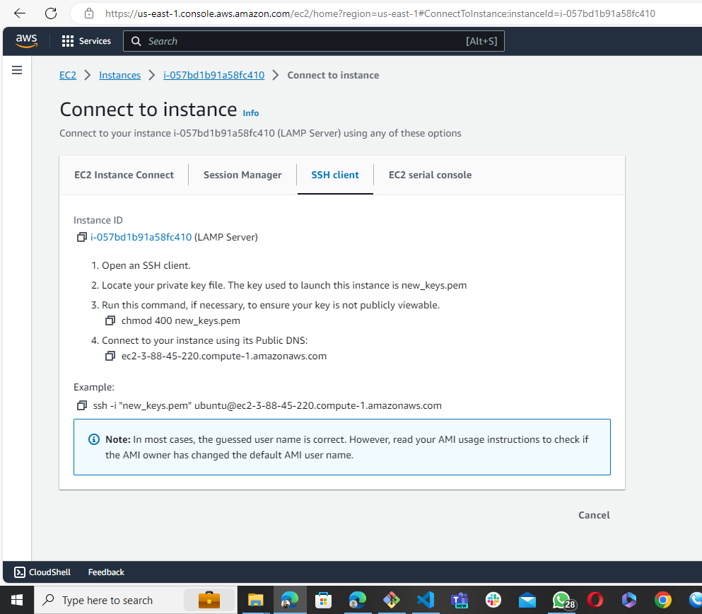
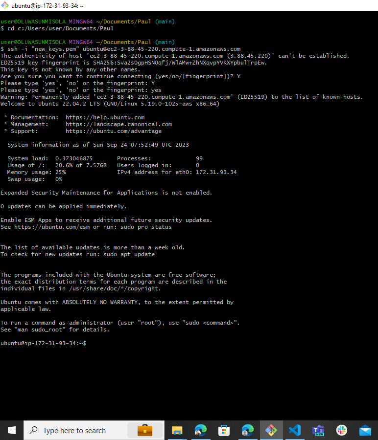
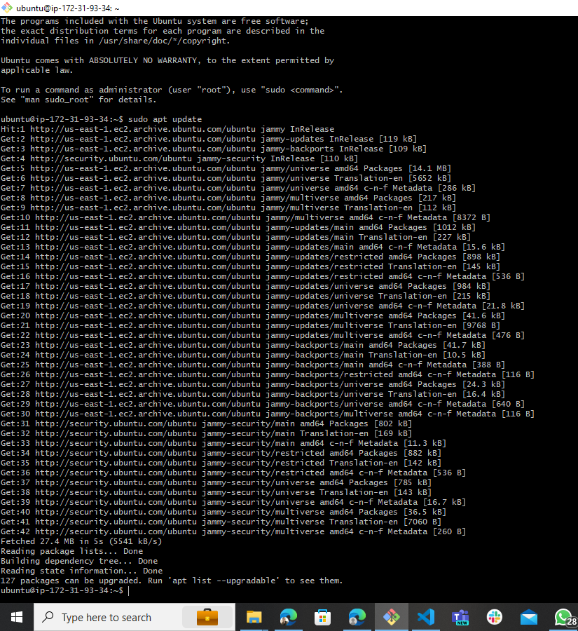
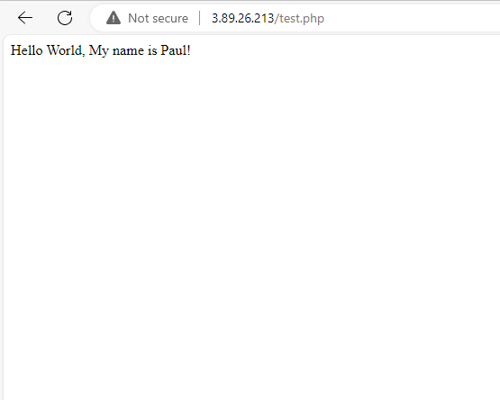

# My DevOps_Project 

## Project 2: LAMP Stack Implementation Project

### Darey.io DevOps Bootcamp


### Required Steps:
1. #### Create and/or signin into your AWS account


2. #### Launch an EC2 instance Server with Ubuntu OS pre-installed

   

   Create a Key Pair
   
   

   A running Instance

   


3. #### Open GitBash or Powershell or Visual Studio code to coonect to a running instance

   Ensure you  the SSH client cursor is in the current directory where your key .pem file is 
   saved.  
   Copy and paste the SSH command to your SSH Client.

   


   Successful Connection status to a running Ubuntu Cloud Server from local SSH Client: Git Bash

   


4. #### Install Apache version 2.0

   ```sudo apt update``` : update the linux OS with latest dependencies.
   
   

   ```sudo apt install apache2```   :  This command installs apache version 2 on the Linux Server
   


   ```sudo systemctl status apache2```  : This command checks the status of the apache if active
    


5. #### Make an early visit to our public web server 
   At: 3.88.45.220  This gives you an error below,
   because we have not added a http protocol on our inbound rule to the server

    


   Add a http protocol at port 80 as a new inbound rule

   


   New inbound rule now successfully added

   


   Apache now loads up from: Bash and Public IP at 3.88.45.220:80

   
   


6. #### Install MySQL

    ```sudo apt install mysql``` : This command installs mysql relational DBMS 

    ```sudo systemctl status mysql``` : Confirm mysql successfull installation and active

     

   
    ```sudo mysql```  : Initialises the mysql database system

     


    ```ALTER USER 'root'@'localhost' IDENTIFIED WITH mysql_native_password BY 'Password.1'```

    
    
    You can as well change the root user password with this command.

    

    Perform secure installation of mysql

    


Apache has been installed to serve content and MySQL has been installed to store and manage data.
PHP is the component of our setup to that will process code to display dynamic content to the end-user.


7. #### Install PHP

    We shall need the ```php``` packages installed.
    We shall need ```php-mysql```, a PHP module that allows PHP to communicate with MySql Databases. 
    We shall also need ```libapache2-mod-php``` to enable Apache handle PHP files.

    You can install the three at once with this command:

    ```sudo apt install php libapache2-mod-php php-mysql```

    

    ```php -v```  : displays the version of our newly installed php

    


8. #### Testing PHP

    Test installed PHP with a new file called test.php 

    ```sudo nano test.php``` create a new text editor file called test.php  nano or vi can work here

    

    Copy and paste the code below inside the text file:

    ```<?php```
        ```$name = "Paul";```
        ```echo "Hello World, My name is $name!";```
    ```?>```
    
    Type Ctrl + O : save the text to file
    Type Ctrl + X : to exit nano enviroment

    ```cat test.php```  : To view content of the file test.php

    


    ```sudo find / -type f -name "test.php"```   : Displays full path of the test.php file

    


    Let's test php on terminal first:

    ```php test.php```  : Test on terminal
    


    Now we can test on browser. To test on browser, we need move our test.php file to
    a directory popularly used to store php files in apache web server.

    ```sudo mv test.php /var/www/html``` : moves the test.php file into a directory /var/www/html

    


    Following this link, our PHP tested positive on the web Browser

    [Test](http://3.89.26.213/test.php)
    

    All thanks to: [Itslinuxfoss](https://itslinuxfoss.com/how-to-test-a-php-script-in-linux/#google_vignette)


9.  #### Virtual Hosting of Websites on Apache

    ##### Create a root document that can hold several domain sites

    ```sudo mkdir -p /var/www/lamppro.com/public_html```   : creates directory to store files of lamppro.com on Apache
    ```sudo mkdir -p /var/www/lampguru.com/public_html```  : creates directory to store files of lampguru.com on Apache
    

    ##### Grant Permissions
    ```sudo chown -R $USER:$USER /var/www/lamppro.com/public_html``` : change ownership and grant regular user privileges to work on the site
    ```sudo chown -R $USER:$USER /var/www/lampguru.com/public_html```:change ownershipand grant regular user privileges to work on this site
    '$USER' is a variable that stores credentials of any given user.


    ```sudo chmod -R 755 /var/www``` : change mod of directories and subdirectories with flag -R to recursively grant operations of read, write, and execute according to users:7, group:5 and others:5

    


    ##### Create Default Pages for each Virtual Hosts.

    ```nano /var/www/lamppro.com/public_html/index.html```  : No sudo here because we have given permissions to regular users, howver, this command creates a new html file called index.html has base for www.lamppro.com

    ```nano /var/www/lampguru.com/public_html/index.html```  : No sudo here because we have given permissions to regular users, howver, this command creates a new html file called index.html has base for www.lampguru.com 
    
    
    

    ##### Create New Virtual Host files

    1. Copy the default configuration file over to the first domain uisng this command
       ```sudo cp /etc/apache2/sites-available/000-default.conf /etc/apache2/sites-available/lamppro.com.conf```
       ```sudo cp /etc/apache2/sites-available/000-default.conf /etc/apache2/sites-available/lampguru.com.conf```


       Write some edited config into the lamppro.conf file    
    2. ```sudo nano /etc/apache2/sites-available/lamppro.com.conf``` :This file is to be edited to point a request to the lamppro domain
       ```sudo nano /etc/apache2/sites-available/lampguru.com.conf```: This file is to be edited to point a request to the lampguru domain
       The config file is edited to reflect the below in the 2 config files:
       
       ServerAdmin      admin@lamppro.com                                     admin@lampguru.com
       ServerName       lamppro.com                                           lampguru.com
       ServerAlias      www.lamppro.com                                       www.lampguru.com
       Document Root    /var/www/lamppro.com/public_html                      /var/www/lampguru.com/public_html
      

    3. Enable the New Virtual Host Files 

       Before restart the Apache service
       ```sudo a2dissite 000-default.conf```: Disable the default apache config file we copied content from earlier


       Now that you have created your virtual host files, we must enable them
       ```sudo a2ensite lamppro.com.conf```  : a2ensite is the tool to enable our virtual host website with the newly config file
       ```sudo a2ensite lampguru.com.conf```  : a2ensite is the tool to enable our virtual host website with the newly config file

       
       Again test for errors before restart and be sure virtual host configuration is OK:

       ```sudo apache2ctl configtest```

       


       Needs to restart Apachewith this command
       ```systemctl reload apache2```  : Restarts apache service


       Now lets test if virtual host website configuration is working:

       We configure our windows PC to intercept request from localhost like a DNS server will act.
       


       Our result:
       When <http://lampguru.com> is inputted to browser or public IP 54.208.161.104:80 is inputted to browser
       The lampguru.com site virtual host works. 
       
       

       
       Limitations:
       Unfortunately, the www.lamppro.com doesnt display like lampgurue, as the IP resolves to 
       the same server with lampguru.com

       Upon findings in Digital Ocean, it was revealed that a re-setup of apache
       on linux with SSL on https port 443 is necessarily to allow one site to load from port 443
       and the other to load from port 80 which prevents one from defaulting into the other.


      References:
      All thanks to: [Digital Ocean](https://www.digitalocean.com/community/tutorials/how-to-set-up-apache-virtual-hosts-on-ubuntu-20-04)