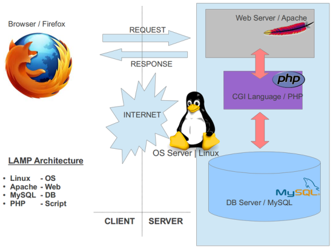

# My DevOps_Project 

## Project 2: LAMP Stack Implementation Project

### Darey.io DevOps Bootcamp



### Required Steps:
1. #### Create and/or signin into your AWS account


2. #### Launch an EC2 instance Server with Ubuntu OS pre-installed


   Create a Key Pair
   


   A running Instance


3. #### Open GitBash or Powershell or Visual Studio code to coonect to a running instance

   Ensure you  the SSH client cursor is in the current directory where your key .pem file is 
   saved.  
   Copy and paste the SSH command to your SSH Client.

   


   Successful Connection status to a running Ubuntu Cloud Server from local SSH Client: Git Bash

   


4. #### Install Apache version 2.0

   ```sudo apt update``` : update the linux OS with latest dependencies.
   
   

   ```sudo apt install apache2```   :  This command installs apache version 2 on the Linux Server
   


   ```sudo systemctl status apache2```  : This command checks the status of the apache if active
    


5. #### Make an early visit to our public web server 
   At: 3.88.45.220  This gives you an error below,
   because we have not added a http protocol on our inbound rule to the server

    


   Add a http protocol at port 80 as a new inbound rule

   


   New inbound rule now successfully added

   


   Apache now loads up from: Bash and Public IP at 3.88.45.220:80

   
   


6. #### Install MySQL

    ```sudo apt install mysql``` : This command installs mysql relational DBMS 

    ```sudo systemctl status mysql``` : Confirm mysql successfull installation and active

     

   
    ```sudo mysql```  : Initialises the mysql database system

     


    ```ALTER USER 'root'@'localhost' IDENTIFIED WITH mysql_native_password BY 'Password.1'```

    
    
    You can as well change the root user password with this command.

    

    Perform secure installation of mysql

    


