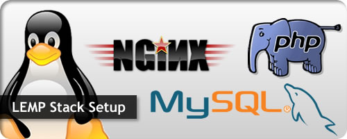

# My DevOps_Project 

## Project 4: LEMP Stack Implementation Project

### Darey.io DevOps Bootcamp



### Required Steps:
1. ### Create and/or signin into your AWS account

   


2. ### Launch an EC2 instance Server with Ubuntu OS pre-installed and Connect with Bash

   

   


3. ### Install Nginx, the web Server

   ```sudo apt update```
   ```sudo apt install nginx -y```    // install nginx with -y flag with yes as predetermined 
   ```sudo system status nginx```     // to check if nginx is active
   ```sudo system stop nginx```       // stop the web server
   ```sudo system start nginx```      // start the web server
   ```sudo system restart nginx```    // restart the web server
   ```sudo system reload nginx```     // reload the web service without shutting down
   ```sudo system disable nginx```    // disable nginx from starting at boot
   ```sudo system enable nginx```     // enable nginx to start at boot

   
   

    
4. ### Installing MYSQL

   ```sudo apt install mysql-server```    // installs mysql as a DBMS to manage and store data
   ``` sudo mysql_secure_installation```  // secure installaton, to change root user priveledges and password
    
   
   

    


5. ### Installing PHP
   ```sudo apt install php-fpm php-mysql```  // installs php-fpm fast cgi process manager and uses php-mysql module to communicate with the mysql database.
   


6.  ### Configuring Nginx to Use PHP Processor

    ```sudo mkdir /var/www/lempguru.com``` :              // create a directory for the website.

    ```sudo chown -R $USER:$USER /var/www/lempguru.com```    // change ownership and grant priviledges to users, group and others

    ```sudo nano /etc/nginx/sites-available/lempguru.com```   // creat

    

    


    ```$ sudo ln -s /etc/nginx/sites-available/lempguru.com /etc/nginx/sites-enabled/```   // we link our site to nginx site enabler through a symblic link with flag -ln and -s 

    ```$ sudo nginx -t```            //check for possible typographical  errors in the config file

    ```nano /var/www/your_domain/index.html```    // save an index.html file as an example to test if the PHP processor works

    

    ```$ sudo systemctl reload nginx```    //reload nginx, it save and use  preconifgured template.


       

    


7. ### Testing PHP with nginx


   