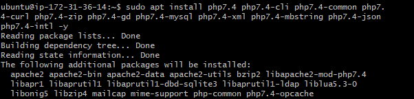

# My DevOps_Project 

## Project 4: LEMP Stack Implementation Project

### Darey.io DevOps Bootcamp


### Required Steps:
1. ### Create and/or signin into your AWS account

   


2. ### Launch an EC2 instance Server with Ubuntu OS pre-installed and Connect with Bash

   

   


3. ### Install Nginx, the web Server

   ```sudo apt update```
   ```sudo apt install nginx -y```    // install nginx with -y flag with yes as predetermined 
   ```sudo system status nginx```     // to check if nginx is active
   ```sudo system stop nginx```       // stop the web server
   ```sudo system start nginx```      // start the web server
   ```sudo system restart nginx```    // restart the web server
   ```sudo system reload nginx```     // reload the web service without shutting down
   ```sudo system disable nginx```    // disable nginx from starting at boot
   ```sudo system enable nginx```     // enable nginx to start at boot

   
   

    
4. ### Installing MYSQL

   ```sudo apt install mysql-server```    // installs mysql as a DBMS to manage and store data
   ```sudo mysql_secure_installation```  // secure installaton, to change root user priveledges and password
    
   
   

    


5. ### Installing PHP
   ```sudo apt install php-fpm php-mysql```  // installs php-fpm fast cgi process manager and uses php-mysql module to communicate with the mysql database.
   


6.  ### Configuring Nginx to Use PHP Processor

    ```sudo mkdir /var/www/lempguru.com``` :              // create a directory for the website.

    ```sudo chown -R $USER:$USER /var/www/lempguru.com```    // change ownership and grant priviledges to users, group and others

    ```sudo nano /etc/nginx/sites-available/lempguru.com```   // creat

    

    


    ```$ sudo ln -s /etc/nginx/sites-available/lempguru.com /etc/nginx/sites-enabled/```   // we link our site to nginx site enabler through a symblic link with flag -ln and -s 

    ```$ sudo nginx -t```            //check for possible typographical  errors in the config file

    ```nano /var/www/lempguru.com/index.html```    // save an index.html file as an example to test for the PHP processor to test with our site.

    

    ```$ sudo systemctl reload nginx```    //reload nginx, it save and use  preconifgured template.


       

    


7. ### Testing PHP with nginx

    ```nano /var/www/lempguru.com/info.php```  // a php file to test if php installed is working with the following php code
       ```<?php```
       ```phpinfo();```


    <http://54.210.206.171/info.php>  // test if PHP Processor works, I got a 502 Bad Gateway Error
    I tried change the info.php to index.php so that it is read from the document root, yet I got 502 Bad Gateway Error.
    

    I was told to use install php 7.4 version not the latest 8.1 verison and try test again. 

    #### How to install php 7.4
    Note:  I cancelled every attempt to start any specific service here during this installation

    ```sudo apt update && sudo apt upgrade```
    ```sudo add-apt-repository ppa:ondrej/php -y```   // add the PPA repository for PHP 7.4 from Ondřej Surý1  
    

    
    ```sudo apt install php7.4 php7.4-cli php7.4-common php7.4-curl php7.4-zip php7.4-gd php7.4-mysql php7.4-xml php7.4-mbstring php7.4-json php7.4-intl -y``` // install PHP 7.4 and its common extensions

    


    ```sudo apt install php7.4-fpm -y``` // install PHP-FPM, which is a FastCGI Process Manager for PHP
    


    ```sudo apt install php7.4-mysql```   // install php-mysql 7.4
    


    ```sudo systemctl restart nginx```    //restart nginx


    ```nano /var/www/lempguru.com/info.php```  // a php file to test if php installed is working with the following php code
       ```<?php```
       ```phpinfo();```


    Lets test PHP again
    <http://54.211.205.161/info.php>
      
    
    //In conclusion, Php test works on 7.4 and not on latest 8.1
    


    

8. ### Retrieving Data from Mysql database with PHP

    ```sudo mysql``` // enter the mysql service enviroment

    ```mysql> CREATE DATABASE example_database;```    // create database called example_database

    ```mysql> CREATE USER 'example_user'@'%' IDENTIFIED WITH mysql_native_password BY 'password';```   // create a user called example_user, with password called "password"

    ```mysql> GRANT ALL ON example_database.* TO 'example_user'@'%';```  // grant the user all priveledges

    ```mysql> exit```        // exit the mysql enviroment


    ```mysql -u example_user -p```     // enter mysql service as a user, providing your password

    ```mysql>  SHOW DATABASES;```      //show list of databases in mysql enviroment

    
    


    Let's create the PHP script that will connect to MySQL and query for content. Creating a new PHP file in the custom web root directory using nano editor:

    ```sudo nano /var/www/lempguru.com/todo_list.php```   // create a php file with mysql commands to test that data can be fetched successfully

    

    Let's test <http://3.81.129.142/todo_list.php>

    Encountered  a strange error, due to the use of php 7.4 verison, apache was the default web server. 
    Therefore I encountered the following .
       
    

    To stop this error
    ```sudo /etc/init.d/apache2 stop```   //stop the apache server 

    ```sudo systemctl restart nginx```    //and restart the nginx
       


    Let's test again
    <http://3.81.129.142/todo_list.php>
    


9. ### Further related projects

   1. Implement LEMP Stack with SSL and live domain name

   2. Implement LEMP Stack with SSL and deploy Wordpress for website hosting Service 

   

9. ### References:

   1.  [Digital Ocean: How To Install Linux, Nginx, MySQL, PHP (LEMP stack) on Ubuntu 20.04](https://www.digitalocean.com/community/tutorials/how-to-install-linux-nginx-mysql-php-lemp-stack-on-ubuntu-20-04)

   2. [Stack Overflow: nginx.service failed because the control process exited](https://stackoverflow.com/a/55164432)

   3. [W3Schools: INSERT INTO Example](https://www.w3schools.com/sql/sql_insert.asp)

