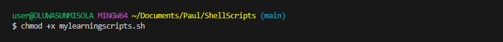
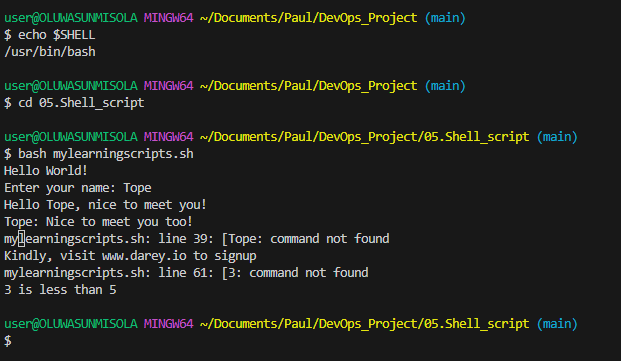
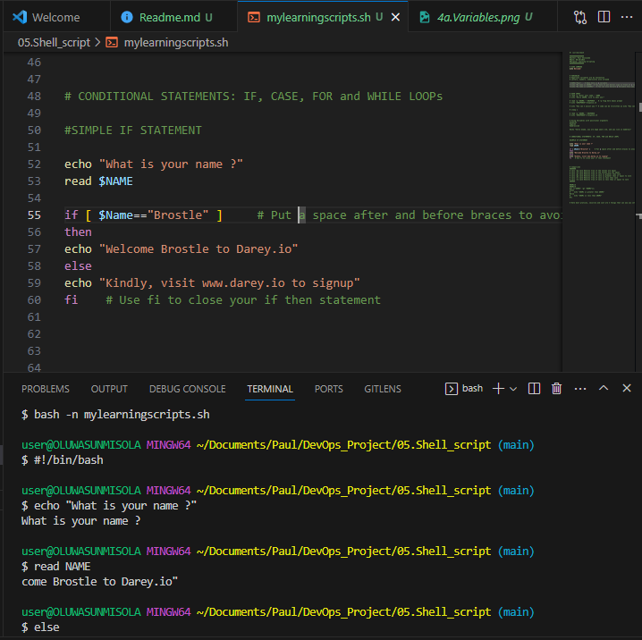
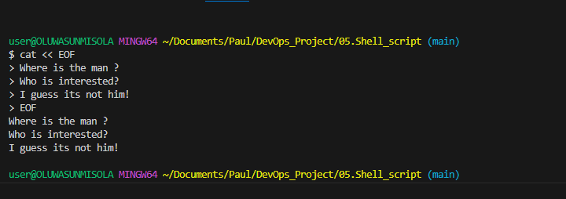
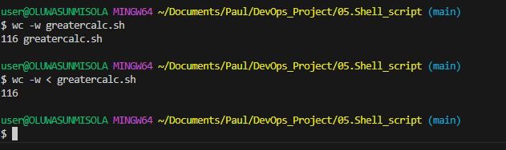
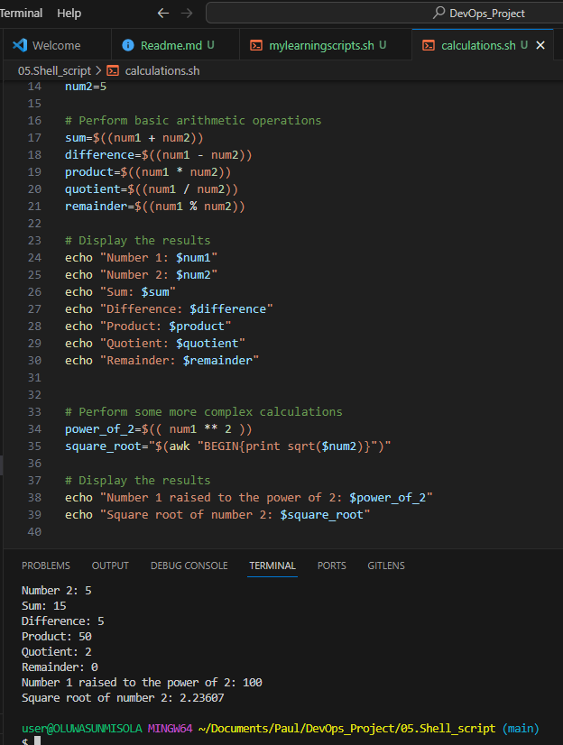
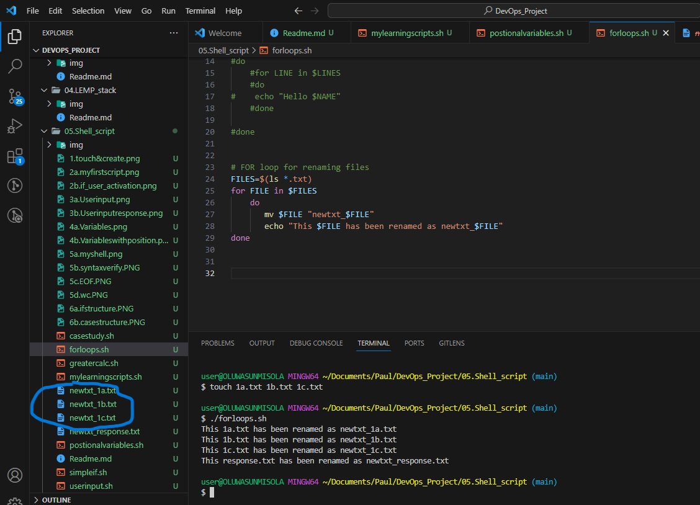
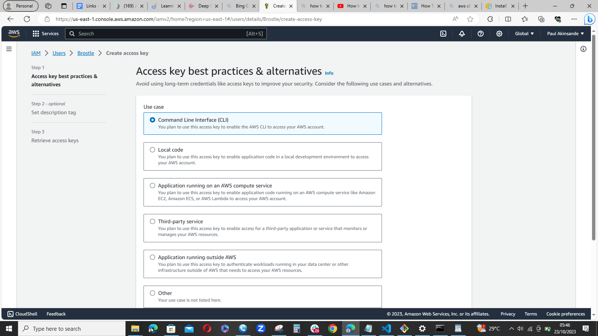
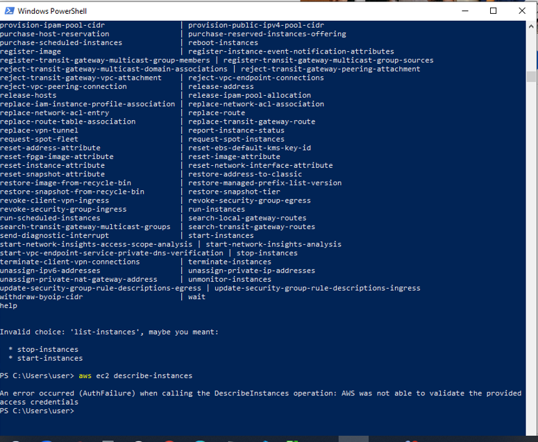

# My DevOps_Project 

## Project 5: Shell/Bash Scripting Practice Project

### Darey.io DevOps Bootcamp


```touch mylearningscripts.sh```  // creates a script called "mylearningscript.sh"
```ls```                         // list containing files


```which bash```                 // command to display the type of shell script: bash


```chmod  +x mylearningscripts.sh```  // command changes the mode of this script for to executable



A bash script that receives user input and chats
[UserInput](DevOps_project/05.Shell_script/userinput.sh)   //userinput.sh can be found in the mylearningscripts.sh


[Response](/response.txt)  // response.txt contains responses saved from the chat





















#### Learning scripts
```./mylearningscripts.sh```  
// Contains appendix. Appendix contains all implemneted learning scripts
// Some of appendix codes were corrected and edited with the use of BING AI


#### Appendix
1. positionalvariables.sh

2. userinput.sh

3. response.txt

4. calulations.sh

5. simpleif.sh

6. greatercalc.sh

7. casestudy.sh

8. forloops.sh

9. backup.sh


#### REFERENCES:

[FreeCodeCamp.org: Bash Scripting Tutorial for Beginners](https://www.youtube.com/watch?v=tK9Oc6AEnR4)

[BeaBetterDev: How to install and configure the AWS CLI on Windows 10](https://www.youtube.com/watch?v=jCHOsMPbcV0)