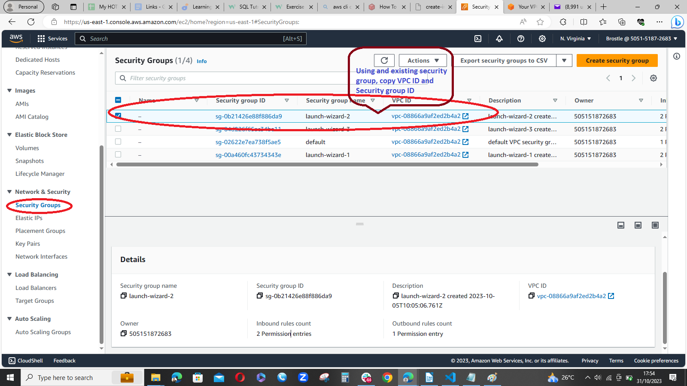

# My DevOps_Project 

## Project 6: Client-Server Architecture using AWS COMMAND CLI

### Darey.io DevOps Bootcamp


#### Create 2 new servers with Linux Ubuntu OS Installed
# namely mysql_server and mysql_client via PowerShell or Terminal
Get the Ami-id from AWS Management Console


Get the VPC-id from AWS Management Console


Get the Key-Pair from AWS Management Console


Get the Subnet-id from AWS Management Console


Launch new servers withou GUI, Using COmmand line, 
Before the clicode Launch


The CLI Command launched
```aws ec2 run-instances --image-id ami-0fc5d935ebf8bc3bc --count 2 --instance-type t2.micro --key-name new_keys --security-group-ids sg-0b21426e88f886da9 --subnet-id  subnet-0a0e3a8df801bcd0b --tag-specifications 'ResourceType=instance,Tags=[{Key=Name1,Value=mysql_client},{Key=Name2,Value=mysql_server}]'```


After the clicode Launch


#### Connect to the mysql_client via SSH
This command ```aws ec2 get-password-data --instance-id i-0d7bf4111e35ecb2e --priv-launch-key C:/Users/user/Documents/Paul/new_keys.pem```
returns the instance id

This command ```ssh -i C:/Users/user/Documents/Paul/new_keys.pem ec2-user@ec2-3-232-108-41.compute-1.amazonaws.com -L 8080:localhost:80```
or this would connect to the Ec2 instance via SSH
```ssh -i C:/Users/user/Documents/Paul/new_keys.pem ec2-user@3.232.108.41```

Denied permission to public key Error
  

##### User needs be changed from ec2-user to ubuntu hence the public key permision denial.
The principle is ssh keypair/path ubuntu@server-public-ip
This command: ```ssh -i C:/Users/user/Documents/Paul/new_keys.pem ubuntu@3.232.108.41``` 
or this:  
```ssh -i C:/Users/user/Documents/Paul/new_keys.pem ubuntu@ec2-3-232-108-41.compute-1.amazonaws.com -L 8080:localhost:80```
will connect via SSH to the established EC2 instance.


##### Install mysql client software on mysql_client server
```sudo apt update```   Update the Linux Ubuntu OS
```sudo apt install mysql-client```  Install MySql Client software


#### Connect to the mysql_server via SSH
The principle is ssh keypair/path ubuntu@server-public-ip

```aws ec2 get-password-data --instance-id i-07b6db6095317e0b7 --priv-launch-key C:/Users/user/Documents/Paul/new_keys.pem```
```ssh -i C:/Users/user/Documents/Paul/new_keys.pem ubuntu@44.211.57.217```  


##### Install mysql server software on mysql_server server

```sudo apt update```  Update the Linux Ubuntu OS
```sudo apt install mysql-server```  Install Mysql Server 


# Open port 3306 on mysqlserver by configuring the new inbound rule
# and connect to mysqlserver from mysql_client server
# Note for extra security, do not  allow all IP address to reach 
# 'mysql_server' -only allow acccess only to specific local IP address of 
# 'mysql_client'  

To allow access tot the specific ip of the mysql-client. We get the private IP of mysql-client


Go through the port 3306


Already available but shall be updated


If you want to allow only a single IP address, you need to use /32 instead of /20. For example, if you want to allow only 172.31.0.58, you can use 172.31.0.58/32 as the source IP in your security group rule. Using /20 means you want to offer access to a port range from 172.31.0.0 to 172.31.15.255

Lets authorise 172.31.0.58/32
```aws ec2 authorize-security-group-ingress --group-id sg-0b21426e88f886da9 --protocol tcp --port 3306 --cidr 172.31.7.58/32```


Lets revoke 172.31.0.58/20
```aws ec2 revoke-security-group-ingress --group-id sg-0b21426e88f886da9 --protocol tcp --port 3306 --cidr 172.31.7.58/20```


Use this command to update from one inbound ip to another
```aws ec2 update-security-group-rule-descriptions-ingress --group-id sg-0b21426e88f886da9 --protocol tcp --port 3306 --cidr 172.31.7.58/32```

Confirm single private ip of mysqlclient is configured


#### Configure mysql_server to allow connections from remote hosts,  
#### and connect to mysqlserverDB engine from mysql_client server without SSH 
#### but with mysql connect utility


There are different ways to connect to a MySQL database engine without SSH using MySQL. One possible method is to edit the MySQL configuration file on the server and change the bind-address key to the server’s IP address instead of 127.0.0.1. Then, you need to allow the MySQL port 3306 on the firewall and configure the user and host permissions for authentication. After that, you can use the mysql command-line client or a graphical tool like MySQL Workbench to connect to the database


After a full day of trying to connect remotely with an increased RAM Size of 1GB Ram micro EC2 CPU to 2GB Ram small EC2 


# Confirm successful remote Mysql_server DB, by running some mysql queries

Howver, show Database from mysql_server is successful not mysql_client


#### References:

1. [DevOpsCube: Use AWS CLI Create EC2 Instance](https://devopscube.com/use-aws-cli-create-ec2-instance/)

2. [W3Schools: Sql](https://www.w3schools.com/sql/)

3. [DevOpsCube: Become DevOps Engineer](https://devopscube.com/become-devops-engineer/)

4. [AWS: Security Group Rules](https://docs.aws.amazon.com/AWSEC2/latest/UserGuide/security-group-rules.html)


