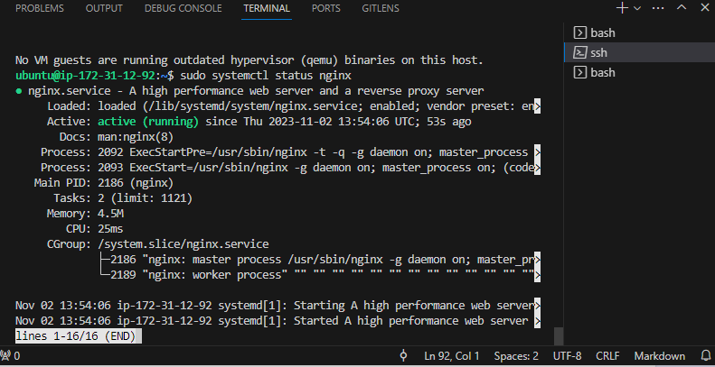

# My DevOps_Project 

## Project 7: Nginx Loadbalancer

### Darey.io DevOps Bootcamp

#### Purpose: To configure two EC2 apache webserver  with nginx load balancer 


#### Why Port 8000 ?
There is no definitive answer to why apache webserver should serve on port 8000 and not port 80, as it depends on the configuration and preference of the server administrator. However, some possible reasons are:

Port 80 is the default port for HTTP, so a lot of applications won’t use that by default to avoid clashing with existing applications that are using port 801. Port 8000 looks similar to 80, so you see that used a lot as an alternative port for web servers.

Port 80 requires root privileges or special permissions to be used by a process, whereas port 8000 does not. This means that using port 8000 can be more secure and convenient than using port 8023.

Port 80 is more likely to be blocked by firewalls or proxies than port 8000, which can cause problems for accessing the web server from outside the local network. Using port 8000 can avoid some of these issues

Of course, these are not the only reasons why one might choose port 8000 over port 80, and there may be situations where port 80 is preferable or necessary. Ultimately, it is up to the server administrator to decide which port to use for their web server, and to configure it accordingly.

However, specifying port 8000 or 8080 or any other port is allowed if tthe app severs are running on those ports and they need be stated into nginx config file upstream section. 


#### Load Balancing Methods
The following load balancing mechanisms (or methods) are supported in nginx: 

Round-robin: requests to the application servers are distributed in a round-robin fashion

Least-connected: next request is assigned to the server with the least number of active connections

Ip-hash: a hash-function is used to determine what server should be selected for the next request (based on the client’s IP address). This is helpful when you want to have persistence or stick connection of the incoming request. 

Weighted round Robin: similar to the Round Robin algorrithm, but servers are assigned based on requests based on their capabilities

Weighted Least Connections: similar to  Least Connections Algorithm,
but servers are assigned different weight of connections based on their capabilities.

Timeout Options for the Individual Servers – max_fails and fail_timeout:

The default fail_timeout is 10 seconds. If we set to 30 seconds. This means that within 30 seconds if there were x number of failed attempts (as defined by max_fails), then the server will be unavailable. Also, the server will remain unavailable for 30 seconds.

The default max_fails is 1 attempt. If we set to 3 attempts. This means that after 3 unsuccessful attempts to connect to this particular server, Nginx will consider this server unavailable for the duration of fail_timeout which is 30 seconds.


#### Lauch and Configure 3 EC2 servers:

Launch two EC2 instances with Apache web server installed and configured. You can use the same AMI image or create your own custom image. Make sure the security group of the instances allows inbound traffic on port 80 (HTTP) or 443 (HTTPS) from the load balancer.  

It is also recommended to launch instances in separate Availability Zones to protect your applications from the failure of a single location. You can also use a load balancer to distribute traffic across multiple instances in different Availability Zones for better performance and fault tolerance

Launch 3 servers from an Installed AWS-CLI
```aws ec2 run-instances --image-id ami-0fc5d935ebf8bc3bc --count 3 --instance-type t2.micro --key-name latestkeys2 --security-group-ids sg-0b21426e88f886da9 --subnet-id  subnet-0a0e3a8df801bcd0b --tag-specifications 'ResourceType=instance,Tags=[{Key=Name1,Value=Apache1},{Key=Name2,Value=Apache2},{Key=Name3,Value=Nginx}]'```   


#### Connect VIA SSH

Make sure PEM file is in the present working directory via Console
or via CLI

For cli: 
```ssh -i C:/Users/user/Documents/Paul/latestkeys2.pem ubuntu@3.235.45.201```


#### Install Apache and Nginx

Update Linux and Install Apache v2 at the same time
```sudo apt update -y &&  sudo apt install apache2 -y```


Update Linux and Install Nginx at the same time
```sudo apt update -y && sudo apt install nginx -y```




#### Edit config files for Apache1 and 2 Servers

Edit config file on apache1 and apache2 servers to display it own public IP address

1. Create new Listen directive in /etc/apache2/ports.conf

```sudo nano /etc/apache2/ports.conf```


2. Change listening port from 80 to 8000 in /etc/apache2/sites-available/000-default.conf

```sudo nano /etc/apache2/sites-available/000-default.conf```


3. code to display public Ip address on /var/www/html/index.html
```sudo chmod u+x index.html```        Change the mode of index.html
```sudo nano index.html```             Edit the index.html
```shift+insert```                     To paste in nano 
```Alt+T```                            To cut from the cursor line to the end in nano
```Alt+K```                            To cut from the begining of file to the end in nano, not case-sensitive
```sudo systemctl restart apache2```   Restart the apache2 service


4. This HTML code has a functin that calls an external public ip for apache1 server


5. HTML code here doesnt have a function to call an external public ip outside for apache2 server


#### Edit config file for Nginx

Edit the nginx configuration file (/etc/nginx/nginx.conf) and define an upstream block with the IP addresses or domain names of the web servers. You can also choose a load balancing method, such as round-robin, least-connected, or ip-hash. 

To copy text from within nano, you need to mark the text first by pressing Ctrl + 6, then use the arrow keys to select the text, and then press Alt + 6 to copy it

```sudo nano /etc/nginx/nginx.conf```

```sudo nano /etc/nginx/conf.d/loadbalancer.conf```

``` sudo nano /etc/nginx/conf.d/default.conf```

Confusion trails on which of the 3 nginx file above I should edit.
```sudo nginx -t``` proved ```sudo nano /etc/nginx/conf.d/default.conf``` to be successfull but no result on the loadbalancer

```sudo nginx -t``` proved ```sudo nano /etc/nginx/sites-available/default``` to be successful and results in loadbalancing after visiting Digital Ocean.

Restart nginx to apply the changes: ```sudo service nginx restart```


Test  load balancer by accessing its public IP address or domain name from a web browser. The response from one of the web servers.


### References:

1. [TheGeekStuff: How to Setup Nginx as loadbalancer for Apache or Tomcat for HTTP/HTTPS](https://www.thegeekstuff.com/2017/01/nginx-loadbalancer/)

2. [Digital Ocean: How to set up nginx loadbalancing](https://www.digitalocean.com/community/tutorials/how-to-set-up-nginx-load-balancing)

