# My DevOps_Project 

## Project 8: Automating Loadbalance Configuration

### Darey.io DevOps Bootcamp

### Purpose: To automate the configuration of two EC2 apache webserver  with nginx load balancer using Shell Scripting

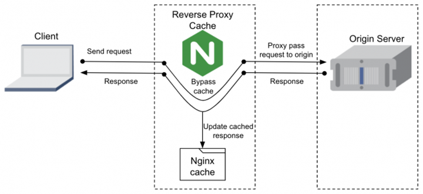


We shall divide the automation script into two(2).

### First Script
First Script contains commands to be used on AWS CLI :

1. Create 2 new EC2 instances as webservers 1 & 2

```aws ec2 run-instances --image-id ami-0fc5d935ebf8bc3bc --count 2 --instance-type t2.micro --key-name latestkeys2 --security-group-ids sg-00a460fc43734343e --subnet-id  subnet-065f8a695884c8a8a --tag-specifications "ResourceType=instance,Tags=[{Key=Name1,Value=WebServer1},{Key=Name2,Value=WebServer2}]"```


2. Create New Inbound Rule on Port 8000

```aws ec2 authorize-security-group-ingress --group-id sg-00a460fc43734343e --protocol tcp --port 8000 --cidr 0.0.0.0/0```


3. Connect via SSH

4. Update Ubuntu and Install Apache

5. Edit configuration files of Apache in the 2 servers

Find two recently launched and currently running instances
```ips=($(aws ec2 describe-instances --filters Name=instance-state-name,Values=running --query 'Reservations[*].Instances[*].PublicIpAddress' --output text))```   

Connect via SSH
for ip in "${ips[@]}"; do
    ssh -i C:/Users/user/Documents/Paul/DevOps_Project/latestkeys2.pem -o StrictHostKeyChecking=no ubuntu@$ip << EOF
    
    # Update and Install Apache
    sudo apt update -y && sudo apt install apache2 -y
    sudo systemctl status apache2
    
    sudo chmod 777 /var/www/html/
    echo "mode changed successfully"

    
    # Edit configuration files in the 2 servers
    # echo "Listen 8000" >> /etc/apache2/ports.conf
    sudo sed -i "2s/$/\\nListen 8000/" /etc/apache2/ports.conf
    sudo sed -i "s/<VirtualHost \*:80>/<VirtualHost *:8000>/" /etc/apache2/sites-available/000-default.conf
    sed -i.bak "c\<!DOCTYPE html> \
                    <html> \
                    <head> \
                        <title>My EC2 Instance</title> \
                    </head> \
                    <body> \
                        <h1>Welcome to my EC2 instance</h1> \
                        <p>Public IP: $ip</p> \
                    </body> \
                    </html>" /var/www/html/index.html
    sudo systemctl restart apache2
    echo "operation complete and apache2 restarted"
EOF
done
***

```bash lastScript.sh```  Run the script as a bash executable file and see the operation

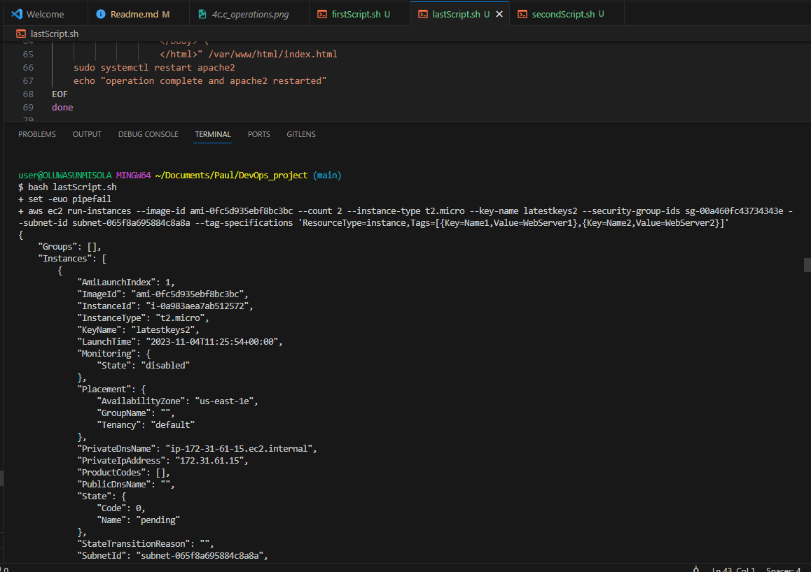

Connected SSH to First WebServer
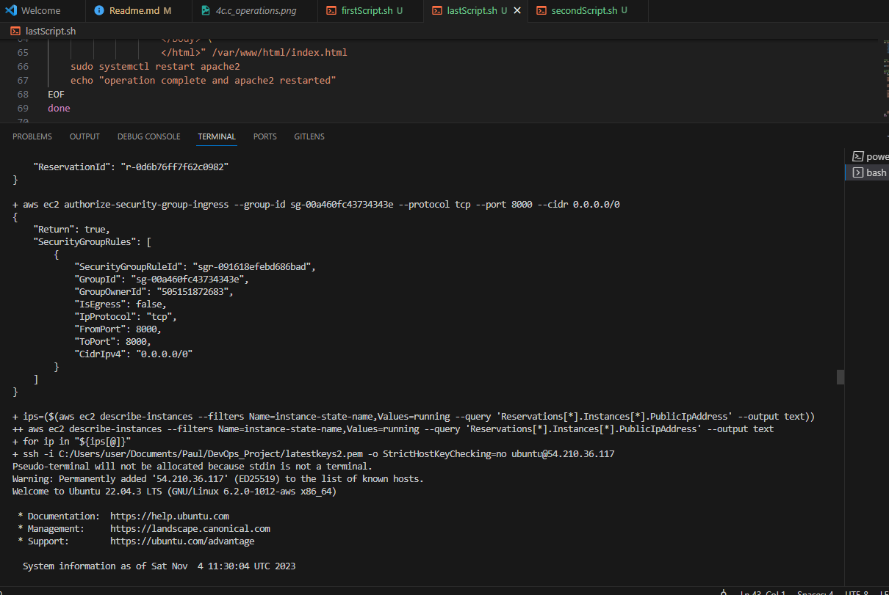   

End of First WebServer Config and Connected to SSH of Second WebServer
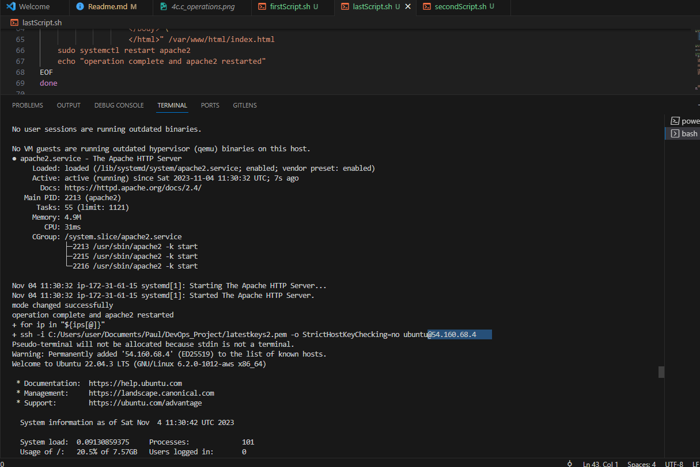

Operations Complete
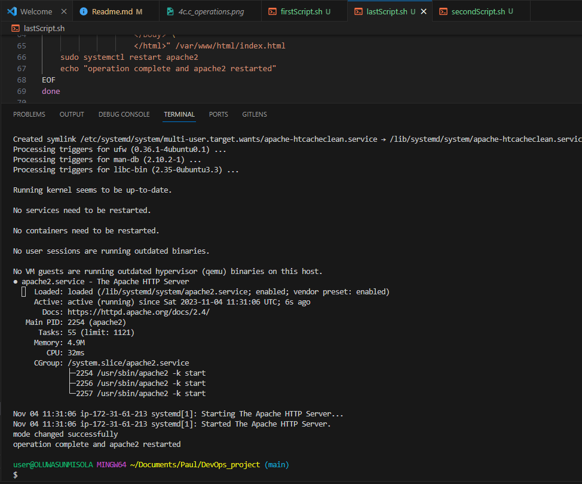


6. Verify Webservers IP addresses

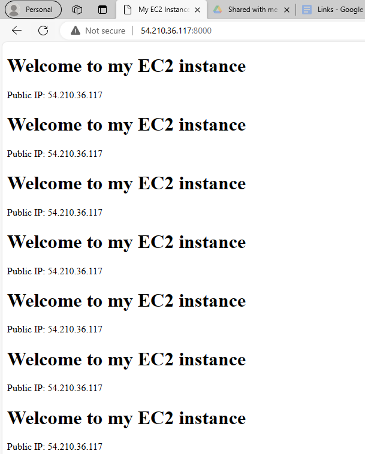

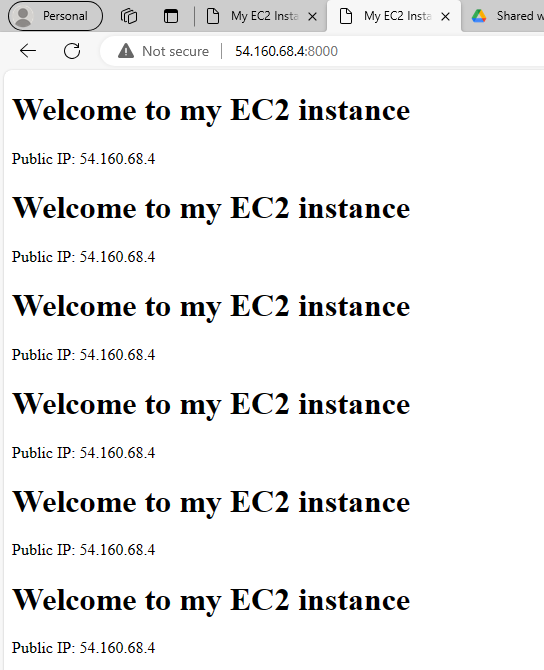

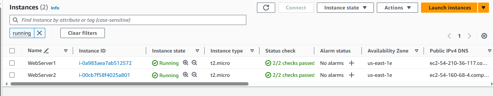


## Second Script

1. Create 1 new EC2 instance as Nginx

```aws ec2 run-instances --image-id ami-0fc5d935ebf8bc3bc --count 1 --instance-type t2.micro --key-name latestkeys2 --security-group-ids sg-04d226f65ac34be11 --subnet-id  subnet-01ab2c27034fa72f8 --tag-specifications "ResourceType=instance,Tags=[{Key=Name,Value=NewNginx}]"```


2. Allow to run on port 80 and get WebServers IP Address

#### Get the newNginx Server IP address.
```ip=$(aws ec2 describe-instances --filters "Name=tag:Name,Values=NewNginx" "Name=instance-state-name,Values=running" --query "Reservations[*].Instances[*].PublicIpAddress" --output text)```

#### Get the WebServers IP addresses.

```ip1=($(aws ec2 describe-instances --filters "Name=tag:Name,Values=WebServer1" "Name=instance-state-name,Values=running" --query "Reservations[*].Instances[*].PublicIpAddress" --output text))```

```ip2=($(aws ec2 describe-instances --filters "Name=tag:Name,Values=WebServer2" "Name=instance-state-name,Values=running" --query "Reservations[*].Instances[*].PublicIpAddress" --output text))```


3. Connect to the newNginx Server via SSH

4. Update and Install Nginx

5. Edit configuration file for loadbalancing

```ssh -i C:/Users/user/Documents/Paul/DevOps_Project/latestkeys2.pem -o StrictHostKeyChecking=no ubuntu@$ip << EOF```
    
    # Update and Install Nginx
    sudo apt update -y && sudo apt install nginx -y
    sudo systemctl status nginx

    # Backup the original default configuration file
    sudo cp /etc/nginx/sites-available/default /etc/nginx/sites-available/default.bak

    # Create a new default configuration file
    sudo tee /etc/nginx/sites-available/default <<EOF2
    # Default Server configuration 
    upstream myapps { 
    # Load balancing method 
    least_conn; 
    
    # Web servers 
    server $ip1:8000;   # Public IP of WebServer1 with port 
    server $ip2:8000;  # Public IP of WebServer2 with port 
    
    } 
    
    server { 
        # Listen on port 80 
        listen 80 default_server;                 # nginx listens on port 80 
        listen [::]:80 default_server; 
    
        server_name $ip; 
    
        location / { 
          # Pass requests to the upstream group 
          proxy_pass http://myapps;   # http has been declared above to avoid error 
          try_files $uri $uri/ =404; 
        } 
    }
EOF2
    
    # Test the new configuration
    sudo nginx -t 

    # Restart Nginx
    sudo systemctl restart nginx

    # Print a success message
    echo "Operation complete and Nginx restarted"
EOF
***

```bash secondLastScript.sh```  Runs the script as a bash executable file

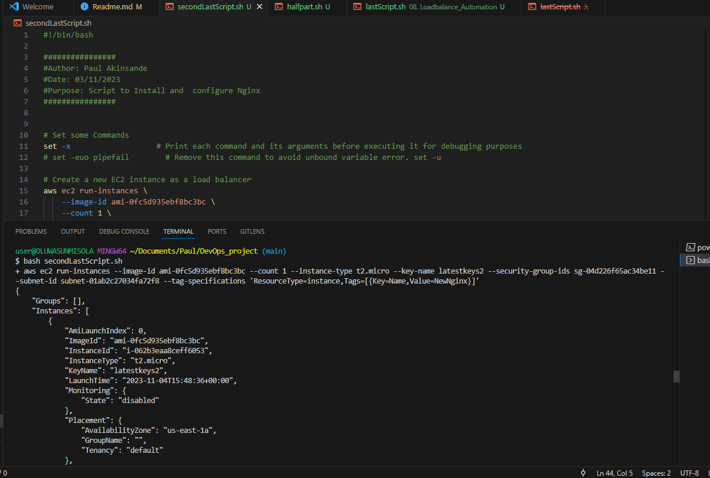

Connected to NGINX via SSH

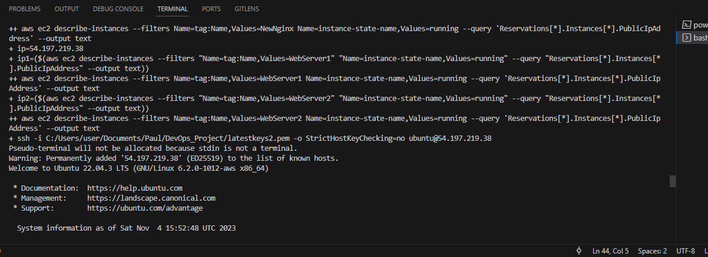

Ngnix Confirmed Active

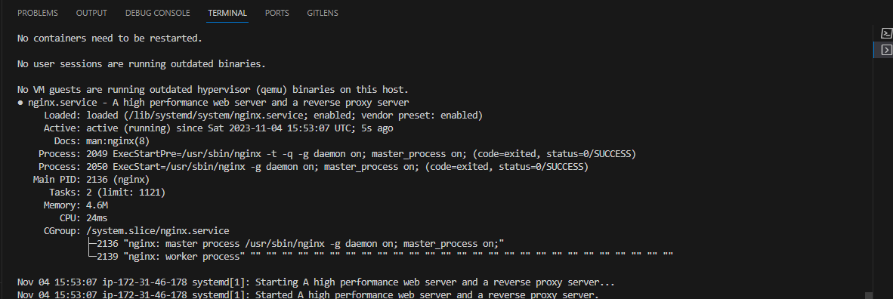

End of configuration

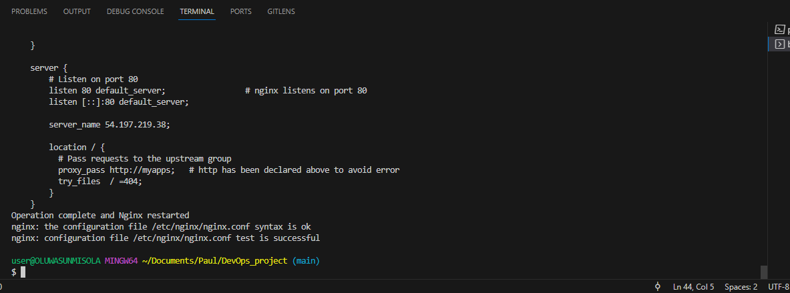


5. Verify the setup

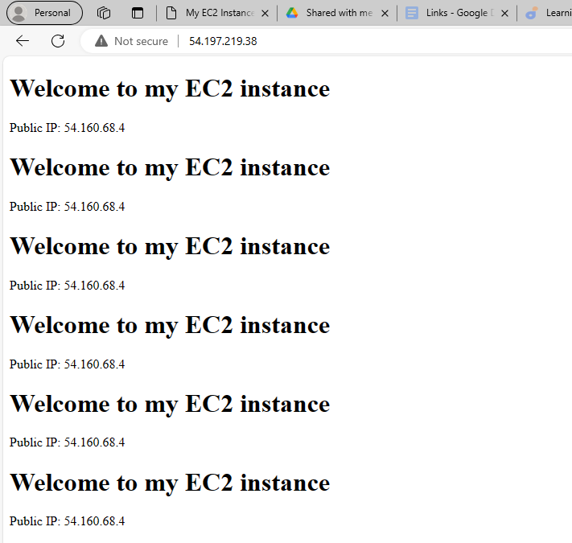

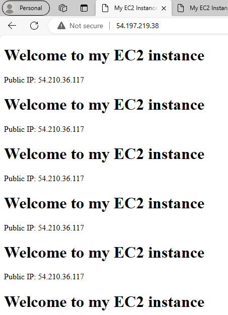

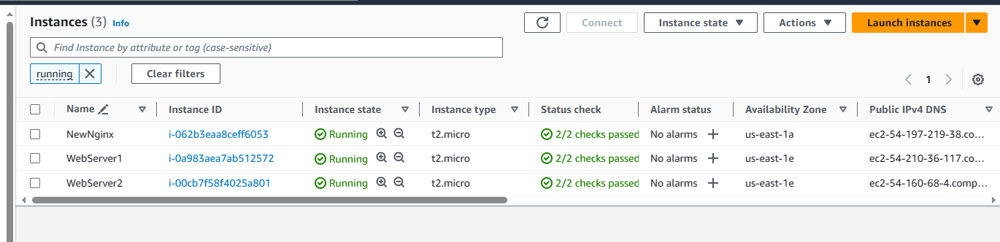


### References

1. AI BING

