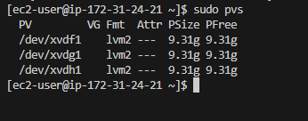
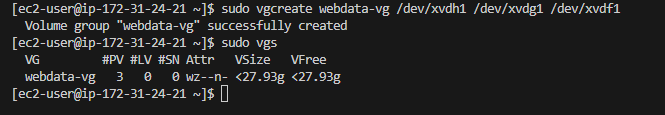

# My DevOps_Project 

## Project 9: Three Tier Arch with LVM Storage

### Darey.io DevOps Bootcamp

### Purpose: Implement a Three Tier Architecture WordPress Website  with LVN Storage Management


Steps are in Two Parts:

Part 1

1. Launch 1 EC2 Instances with RedHart (To Configure and install this First Server as WebServer using Apache)


2. Create and attach 3 Volumes to the WebServer

```lsblk``` This command lists information about all available or the specified block devices.


 

 


```ls /dev/``` Lists available volumes

 


Why Attach Extra Storage Volumes ?

One of the benefits of using LVM is that it can improve the performance and reliability of your web server. By creating and attaching multiple disks to your web server, you can distribute the I/O load across different physical devices, which can reduce the latency and increase the throughput of your web server. 

You can also use different types of disks, such as SSD, HDD, or EBS, to optimize the performance and cost of your web server

You can increase the storage capacity and availability of your web server. 

You can also use LVM to create snapshots, backups, and clones of your web server, which can help you recover from failures or test new configurations

You can actually select the whole disk volume for partition


3. Create Primary Partition in Volumes
    ```sudo parted -s /dev/xvdf mkpart primary ext4 1 5G```  Command creates new partition in individual disk/volume xvdf
    ```sudo parted -s /dev/xvdg mkpart primary ext4 1 5G```  Command creates new partition in individual disk/volume xvdg
    ```sudo parted -s /dev/xvdh mkpart primary ext4 1 5G```  Command creates new partition in individual disk/volume xvdh

    


4. Format individual partitions with EXT4 File system

    You can use any file system type, such as ext4, xfs, or btrfs

    ``` sudo mkfs.ext4 /dev/xvdf1```    This command formats the partition xvdf1 clean of previous files 
    ``` sudo mkfs.ext4 /dev/xvdg1```    This command format the partition xvdg1 clean of previous files 
    ``` sudo mkfs.ext4 /dev/xvdh1```    This command format the partition xvdh1 clean of previous files 

    


5. Install Lvm

    ```sudo yum install lvm2 ```  installs lvm for storage management and utility

    ```sudo lvmdiskscan```         Scans disks for all availlabo partitions after installation

    


6. Create Physical Volumes
    ```pvcreate /dev/xvdf1```

    ```pvcreate /dev/xvdg1```

    ```pvcreate /dev/xvdh1```

    
    

    
    #### Why Logical Volumes ? 

    Instead of using primary phyiscal volume, which can be limiting in themselves. There are benefit of migrating your web data and logs to logical volume. Logical volumes guarantees 
    
    a. Flexibility: You can easily resize, extend, or reduce the logical volumes as per your needs, without affecting the data or the performance of your web server
    
    b. Reliability: You can separate the data and log files onto different logical drives, which can improve the reliability of your system. If one of the drives fails, you can still recover your data or logs from the other drive
    
    c. Efficiency: You can optimize the performance of your web server by allocating the appropriate amount of space and resources to each logical volume. You can also use different file systems or RAID levels for different logical volumes, depending on your requirements

    To create logical group, we shall collate the physical volumes into a volume group, which can be further divided into logical groups. 


7. Create Volume Group(VG)

    ```sudo vgcreate webdata-vg /dev/xvdh1 /dev/xvdg1 /dev/xvdf1```  Collate the physical volume into a volume group, which can be further divided into logical groups.

    ```sudo vgs```   Check the volume group 13.96GB. This can be increased with the command `vgextend` with necessary arguments.

    


8. Create the Logical Volume(LV) in the VG with relevant properties

   ```sudo lvcreate -n apps-lv -L 7.3G webdata-vg```

   ```sudo lvcreate -n logs-lv -L 6G webdata-vg```

   

   ```sudo lvs```  lists and describe logical volumes available

   


9.  Finally,

   

    Format the logical volumes

     This format the logical volume with ext4. You can also format with other filesystem types e.g xfs,btrfs


   Make directories

   ```sudo mkdir -p /var/www/html```    Make a directory to store webfiles, a default store location for linux distribution

   ```sudo mkdir -p /home/recovery/logs```  Make a directory to store logs, -p flag is parent, parent directory

   


   #### Update UUIDs 
   UUIDs are unique identifiers for your partitions that do not change across future reboots or device changes.
   If UUID arent updated, one might encounter problems if the device names change due to adding or removing disks, changing the kernel version, or other factors. Using UUIDs ensures that your system can always mount the correct partitions at every boot time.

   To update /etc/fstab with the UUIDs of app__lv and logs__lv, you need to first find out the UUIDs of these partitions by using the command `sudo blkid`. Then, you need to edit the /etc/fstab file with a text editor (such as nano or vi) and replace the device names with the UUIDs.


   *** 
   sudo mount /dev/webdata-vg/apps-lv /var/www/html/

   sudo rsync -av /var/log/. /home/recovery/logs/   rsync is a copy command that copies from /var/log/. to /home/recovery/logs directory

   sudo mount /dev/webdata-vg/logs-lv /var/log

   sudo rsync -av /home/recovery/logs/. /var/log

   sudo blkid

   Update /etc/fstab  with the UUIDs of app__lv in boot line and logs__lv in the other with the `sudo vi /etc/fstab`

   sudo mount -a

   sudo systemctl daemon-reload

   ***
 

    
   
    
   
    
   
    
   
    
   
   

***
sudo yum -y update

Install Apache and all dependencies and start Apache

    sudo yum -y install wget httpd php php-mysqlnd php-fpm php-json
    sudo systemctl enable httpd
    sudo systemctl start httpd


Install Php with all dependencies

    sudo yum install https://dl.fedoraproject.org/pub/epel/epel-release-latest-8.noarch.rpm
    sudo yum install yum-utils http://rpms.remirepo.net/enterprise/remi-release-8.rpm
    sudo yum module list php
    sudo yum module reset php
    sudo yum module enable php:remi-7.4
    sudo yum install php php-opcache php-gd php-curl php-mysqlnd
    sudo systemctl start php-fpm
    sudo systemctl enable php-fpm
    setsebool -P httpd_execmem 1


Restart Apache

    sudo systemctl restart httpd


Download WordPress and copy to /var/www/html

    mkdir wordpress
    cd   wordpress
    sudo wget http://wordpress.org/latest.tar.gz
    sudo tar xzvf latest.tar.gz
    sudo rm -rf latest.tar.gz
    cp wordpress/wp-config-sample.php wordpress/wp-config.php
    cp -R wordpress /var/www/html/


Configure SELinux Policies

    sudo chown -R apache:apache /var/www/html/wordpress
    sudo chcon -t httpd_sys_rw_content_t /var/www/html/wordpress -R
    sudo setsebool -P httpd_can_network_connect=1


Install MySQL Client

Connect to remote MYSQL SERVER

Test your setup 


   


```pvcreate xvdf1Create Physical Volume
Create Logical Volume


   d. Mount the apps-lv and apps-pv on /var/www/html

4. 


Part 2

1. Launch 1 EC2 Instances with RedHart.(To Configure and install this Second Server as Database Server using MYSQL Server)

2. Create and attach 3 Volumes to the DB Server

3. a. Change the block Devices name to : xvdf, xvdh, xvdg
   b. Create partition in each
   c. Divide partition into PV and LV
   d. Mount the db-lv and db-pv on /db

4. a. Install MYSQL SERVER 
   b. Configure Root User
   c. Open port 3306 for WebServer only remote connection


(Altaro: Hyper-v Storage Best-Pratices)[https://www.altaro.com/hyper-v/hyper-v-storage-best-practices-configuration/]

[Microsoft: Deploy Storage Spaces on a stand-alone server](https://learn.microsoft.com/en-us/windows-server/storage/storage-spaces/deploy-standalone-storage-spaces)


#### REFERENCES


1. [Brentozar: Does Separating Data and Log Files Make Your Server More Reliable?](https://www.brentozar.com/archive/2017/06/separating-data-log-files-make-server-reliable/)

2. [forbes.com: Why Migrate To The Cloud: The Basics, Benefits And Real-Life Examples](https://www.forbes.com/sites/forbestechcouncil/2021/03/12/why-migrate-to-the-cloud-the-basics-benefits-and-real-life-examples/?sh=127748385e27)

3. [dba.stackexchange.com: SQL Server - Benefits of splitting databases across different logical drives](https://dba.stackexchange.com/questions/280269/sql-server-benefits-of-splitting-databases-across-different-logical-drives)

4. [Unix&Linux: Why use UUIDs in /etc/fstab instead of device names? [duplicate]](https://unix.stackexchange.com/questions/423693/why-use-uuids-in-etc-fstab-instead-of-device-names)
