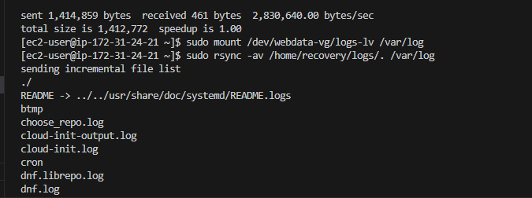

# My DevOps_Project 

## Project 9: Three Tier Arch with LVM Storage

### Darey.io DevOps Bootcamp

### Purpose: Implement a Three Tier Architecture WordPress Website  with LVN Storage Management


Projects steps are in Three Parts:

### Part 1

1. Launch 1 EC2 Instances with RedHart (To Configure and install this First Server as WebServer using Apache)


2. Create and attach 3 Volumes to the WebServer

```lsblk``` This command lists information about all available or the specified block devices.


 

 


```ls /dev/``` Lists available volumes

 


### Why Attach Extra Storage Volumes ?

One of the benefits of using LVM is that it can improve the performance and reliability of your web server. By creating and attaching multiple disks to your web server, you can distribute the I/O load across different physical devices, which can reduce the latency and increase the throughput of your web server. 

You can also use different types of disks, such as SSD, HDD, or EBS, to optimize the performance and cost of your web server

You can increase the storage capacity and availability of your web server. 

You can also use LVM to create snapshots, backups, and clones of your web server, which can help you recover from failures or test new configurations

You can actually select the whole disk volume for partition

#### 3. Create Primary Partition in Volumes

```sudo parted -s /dev/xvdf mkpart primary ext4 1 10G```  Command creates new partition in individual disk/volume xvdf

```sudo parted -s /dev/xvdg mkpart primary ext4 1 10G```  Command creates new partition in individual disk/volume xvdg

```sudo parted -s /dev/xvdh mkpart primary ext4 1 10G```  Command creates new partition in individual disk/volume xvdh


#### 4.Format individual partitions with EXT4 File system

You can use any file system type, such as ext4, xfs, or btrfs

``` sudo mkfs.ext4 /dev/xvdf1```    This command formats the partition xvdf1 clean of previous files

``` sudo mkfs.ext4 /dev/xvdg1```    This command format the partition xvdg1 clean of previous files 

``` sudo mkfs.ext4 /dev/xvdh1```    This command format the partition xvdh1 clean of previous files 


#### 5. Install Lvm

```sudo yum install lvm2 ```  installs lvm for storage management and utility

```sudo lvmdiskscan```         Scans disks for all available partitions after installation


#### 6.Create Physical Volumes
```pvcreate /dev/xvdf1```

```pvcreate /dev/xvdg1```

```pvcreate /dev/xvdh1```


    
### Why Logical Volumes ? 

Instead of using primary phyiscal volume, which can be limiting in themselves. There are benefit of migrating your web data and logs to logical volume. Logical volumes guarantees 
    
a. Flexibility: You can easily resize, extend, or reduce the logical volumes as per your needs, without affecting the data or the performance of your web server
    
b. Reliability: You can separate the data and log files onto different logical drives, which can improve the reliability of your system. If one of the drives fails, you can still recover your data or logs from the other drive
    
c. Efficiency: You can optimize the performance of your web server by allocating the appropriate amount of space and resources to each logical volume. You can also use different file systems or RAID levels for different logical volumes, depending on your requirements

d. To create logical group, we shall collate the physical volumes into a volume group, which can be further divided into logical groups. 


#### 7. Create Volume Group(VG)

```sudo vgcreate webdata-vg /dev/xvdh1 /dev/xvdg1 /dev/xvdf1```  Collate the physical volume into a volume group, which can be further divided into logical groups.

```sudo vgs```   Check the volume group 13.96GB. This can be increased with the command `vgextend` with necessary arguments.


#### 8. Create the Logical Volume(LV) in the VG with relevant properties

```sudo lvcreate -n apps-lv -L 13.5G webdata-vg```

```sudo lvcreate -n logs-lv -L 13.5G webdata-vg```


```sudo lvs```  lists and describe logical volumes available


#### 9. Some Final Configurations

```sudo lsblk```
   


    
##### Format the logical volumes
   
```sudo mkfs -t ext4 /dev/webdata-vg/apps-lv```
   
```sudo mkfs -t ext4 /dev/webdata-vg/logs-lv```

This commands format the logical volume with ext4. You can also format with other filesystem types e.g xfs,btrfs etc
   
 


##### Make directories

```sudo mkdir -p /var/www/html```    Make a directory to store webfiles, a default store location for linux distribution

```sudo mkdir -p /home/recovery/logs```  Make a directory to store logs, -p flag is parent, parent directory


#### Update UUIDs 
UUIDs are unique identifiers for your partitions that do not change across future reboots or device changes.
If UUID arent updated, one might encounter problems if the device names change due to adding or removing disks, changing the kernel version, or other factors. Using UUIDs ensures that your system can always mount the correct partitions at every boot time.

To update /etc/fstab with the UUIDs of app__lv and logs__lv, you need to first find out the UUIDs of these partitions by using the command `sudo blkid`. Then, you need to edit the /etc/fstab file with a text editor (such as nano or vi) and replace the device names with the UUIDs.


*** 
sudo mount /dev/webdata-vg/apps-lv /var/www/html/

sudo rsync -av /var/log/. /home/recovery/logs/   rsync is a copy command that copies from /var/log/. to /home/recovery/logs directory

sudo mount /dev/webdata-vg/logs-lv /var/log

sudo rsync -av /home/recovery/logs/. /var/log

sudo blkid
***

Update /etc/fstab  with the UUIDs of app-lv in boot line and logs-lv in the other with the 
   
`sudo vi /etc/fstab`

`sudo mount -a`

`sudo systemctl daemon-reload`

 
   
 
   
 
UUID="902391bc-1b25-467b-9254-62509d0a85bd  apps
UUID="28dee8af-8305-4c3b-8056-0319f1d3f301  logs


 
   


`sudo yum -y update`

Install Apache and all dependencies and start Apache

    sudo yum -y install wget httpd php php-mysqlnd php-fpm php-json
    sudo systemctl enable httpd
    sudo systemctl start httpd


Install Php with all dependencies

    sudo yum install https://dl.fedoraproject.org/pub/epel/epel-release-latest-8.noarch.rpm
    sudo yum install yum-utils http://rpms.remirepo.net/enterprise/remi-release-8.rpm
    sudo yum module list php
    sudo yum module reset php
    sudo yum module enable php:remi-7.4
    sudo yum install php php-opcache php-gd php-curl php-mysqlnd
    sudo systemctl start php-fpm
    sudo systemctl enable php-fpm
    setsebool -P httpd_execmem 1


Restart Apache

    sudo systemctl restart httpd


Download WordPress and copy to /var/www/html

    mkdir wordpress
    cd   wordpress
    sudo wget http://wordpress.org/latest.tar.gz
    sudo tar xzvf latest.tar.gz
    sudo rm -rf latest.tar.gz
    cp wordpress/wp-config-sample.php wordpress/wp-config.php
    cp -R wordpress /var/www/html/


Configure SELinux Policies

    sudo chown -R apache:apache /var/www/html/wordpress
    sudo chcon -t httpd_sys_rw_content_t /var/www/html/wordpress -R
    sudo setsebool -P httpd_can_network_connect=1


 


### Part 2

#### 1. Launch 1 EC2 Instances with RedHart.(To Configure and install this Second Server as Database Server using MYSQL Server)

 

 

Volume was attached from the Launch of Instance


#### 2. Create and attach 3 Volumes to the DB Server

Create a label for the attached volume

    sudo parted -s /dev/xvdb mklabel msdos   

    sudo parted -s /dev/xvdc mklabel msdos

    sudo parted -s /dev/xvdd mklabel msdos


#### 3. Create Only One partition in each the attached volume

    sudo parted -s /dev/xvdb mkpart primary ext4 1 10G

    sudo parted -s /dev/xvdc mkpart primary ext4 1 10G

    sudo parted -s /dev/xvdd mkpart primary ext4 1 10G


#### 4. Format the partitions

    sudo mkfs.ext4 /dev/xvdb 

    sudo mkfs.ext4 /dev/xvdc

    sudo mkfs.ext4 /dev/xvdd    


#### 5. Install lvm

    sudo yum install lvm2   Installs lvm for storage management and utility

    sudo lvmdiskscan


#### 6. Create Physical Volumes

    pvcreate /dev/xvdb1

    pvcreate /dev/xvdc1

    pvcreate /dev/xvdd1


#### 7. Create Volume Group(VG)

    sudo vgcreate webdata-vg /dev/xvdb1 /dev/xvdc1 /dev/xvdd1   Collate the physical volume into a volume group, which can be further divided into logical groups.  Will have to rename this to dbdata-vg here. 

    sudo vgrename webdata-vg dbdata-vg    Change name from webdata to dbdata-vg

    sudo vgdisplay                        Display name  of vg

    sudo vgs                              Diplay content of vg

 


#### 8. Create the Logical Volume(LV) in the VG with relevant properties 

    sudo lvcreate -n db-lv -L 13.5G dbdata-vg

    sudo lvcreate -n logs-lv -L 13.5G dbdata-vg

    sudo lvs lists and describe logical volumes available


#### 9. Format LV

    sudo mkfs -t ext4 /dev/dbdata-vg/db-lv

    sudo mkfs -t ext4 /dev/dbdata-vg/logs-lv


   
#### 10. Create Directory for Mounting, Mount, backup, Copy UUID and Update UUID

    sudo mkdir -p /db    Make a directory to store webfiles, a default store location for linux distribution

    sudo mkdir -p /home/recovery/logs  Make a directory to store logs, -p flag is parent, parent directory


    sudo mount /dev/dbdata-vg/db-lv /db
    
    sudo rsync -av /var/log/. /home/recovery/logs/   rsync is a copy command that copies from /var/log/. to /home/recovery/logs directory

    sudo mount /dev/dbdata-vg/logs-lv /var/log

    sudo rsync -av /home/recovery/logs/. /var/log


```sudo blkid```  Get the UUID


`sudo vi /etc/fstab` Update /etc/fstab  with the UUIDs of db-lv in boot line and logs-lv in the other 
a7d6683c-5b22-486e-b29d-cc616202683f logs--lv
ea3ff10b-2ae7-490d-9348-4e83310c9983 db--lv


```sudo mount -a```  Mount the logical volumes

`sudo systemctl daemon-reload`    Reload the system


#### 11. Install MySQL Server

    sudo yum update
    sudo yum install mysql-server

    sudo systemctl status mysqld 

If not running then

    sudo systemctl restart mysqld
    sudo systemctl enable mysqld


    sudo mysql
    sudo mysql_secure_installation   For DB root user
    sudo mysql -p    for root user, please provide password

    mysql> CREATE DATABASE wordpress;
    mysql> CREATE USER 'paul'@'localhost' IDENTIFIED BY 'mypassdove';
    mysql> CREATE USER 'tope'@'172.31.24.21' IDENTIFIED BY 'Willingly@123';  Password must be according to password requirement
    mysql> GRANT ALL ON wordpress.* TO 'tope'@'172.31.24.21';   172.31.24.21 is the <Web-Server-Private-IP-Address>
    mysql> FLUSH PRIVILEGES;
    mysql> SHOW DATABASES;

    mysql> SELECT user FROM mysql.user;    displays a list of users on the DB
    mysql> SHOW GRANTS FOR 'tope'@'172.31.24.21';  display priviledges of a user


 


### Part 3:

#### Remote Connection to Database : 

```sudo dnf install mysql```


The syntax is: mysql -h host -P port -u user -p

```mysql -h 172.31.42.143 -P 3306 -u tope -p```


#### Change the permissions and configuration so Apache could use WordPress

1. Make sure that the files and directories of your WordPress installation are owned by the Apache user (usually www-data) and group. 
For example, if your WordPress files are in /var/www/html, you can use the command

```sudo chown www-data:www-data -R /var/www/html```


2. Make sure that the files and directories of your WordPress installation have the correct permissions. You can use the chmod command to do this. For example, you can use the commands2:

```sudo find /var/www/html -type d -exec chmod 755 {} \;```

```sudo find /var/www/html -type f -exec chmod 644 {} \;```

These commands will set the permissions of the directories to 755 (rwxr-xr-x) and the files to 644 (rw-r–r–), which means that the owner can read, write, and execute, while the group and others can only read and execute.

3. Make sure that the Apache configuration file allows the use of mod_rewrite, which is a module that WordPress uses to create SEO-friendly URLs. You can use the a2enmod command to enable mod_rewrite. For example, you can use the command3:

```sudo a2enmod rewrite```


4. Make sure that the Apache configuration file sets the document root to the directory where your WordPress files are located. You can use a text editor to edit the configuration file, which is usually located at /etc/apache2/sites-available/000-default.conf. for Ubuntu Apache2

```sudo nano /etc/apache2/sites-available/000-default.conf.```

But for Redhart Apache,  

```sudo nano /etc/httpd/conf/httpd.conf```  Be configured with  virtual Host@80; and Dcoument root pointing to /var/www/html where WordPress index.php file would be found.


Having to stop and restart Instances.  I got this Error

  


5. Couldnt carry out this last step to serve WordPress on Browers.

To serve WordPress on Browser

```nano /var/www/html/index.php``` This file is contains wp-blog-header.php that loads the environment and template of Wordpress, which in turn loads the wp-config.php file, which contains the database connection settings and defines the database name, username, password, and host.

    <?php
    /**
    * Front to the WordPress application. This file doesn't do anything, but loads
    * wp-blog-header.php which does and tells WordPress to load the theme.
    *
    * @package WordPress
    */

    /**
    * Tells WordPress to load the WordPress theme and output it.
    *
    * @var bool
    */
    define( 'WP_USE_THEMES', true );

    /** Loads the WordPress Environment and Template */
    require __DIR__ . '/wp-blog-header.php';

This index.php file can be further modified to add some extra functionality or security measures, such as checking for HTTPS or redirecting to a maintenance page 

However, you should be careful not to modify the core WordPress files, as this could cause compatibility issues or break your site.


To access the admin Interface or WordPress Dashboard visit www.localhost:port/wp-admin or https://example.com/wp-admin.


#### REFERENCES

1. (Altaro: Hyper-v Storage Best-Pratices)[https://www.altaro.com/hyper-v/hyper-v-storage-best-practices-configuration/]

2. [Microsoft: Deploy Storage Spaces on a stand-alone server](https://learn.microsoft.com/en-us/windows-server/storage/storage-spaces/deploy-standalone-storage-spaces)

3. [Brentozar: Does Separating Data and Log Files Make Your Server More Reliable?](https://www.brentozar.com/archive/2017/06/separating-data-log-files-make-server-reliable/)

4. [Forbes.com: Why Migrate To The Cloud: The Basics, Benefits And Real-Life Examples](https://www.forbes.com/sites/forbestechcouncil/2021/03/12/why-migrate-to-the-cloud-the-basics-benefits-and-real-life-examples/?sh=127748385e27)

5. [Dbastackexchange: SQL Server - Benefits of splitting databases across different logical drives](https://dba.stackexchange.com/questions/280269/sql-server-benefits-of-splitting-databases-across-different-logical-drives)

6. [Unix&Linux: Why use UUIDs in /etc/fstab instead of device names? [duplicate]](https://unix.stackexchange.com/questions/423693/why-use-uuids-in-etc-fstab-instead-of-device-names)

7. [The Simplest Way To Install WordPress On Linux, Windows, And Cloud Servers!](https://thesecmaster.com/the-simplest-way-to-install-wordpress-on-linux-windows-and-cloud-servers/)

8. [WordPress: Developer Resources](https://developer.wordpress.org/advanced-administration/server/file-permissions/)
