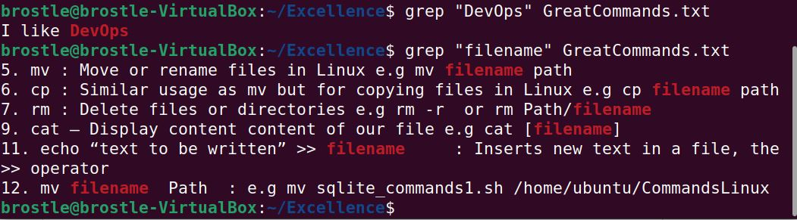

# My DevOps_Project 
## Project 1: Linux Pratice Project
## Darey.io DevOps Bootcamp


Linux Commands are the primary commands needed to communicate with the cloud devices

Requirements:
* 1. Download and install VirtualBox from <https://www.virtualbox.org/wiki/Downloads>
* 2. Download and install Linux Ubuntu Deskstop OS as a virtual Machine in VirtualBox from [Ubuntu](https://ubuntu.com/download/desktop)
* 3. Configure settings ofVirtual Machine with 2 processors and 4GB RAM
* 4. Install WSL Windows Subsystem for smooth dispaly and apprearance
* 5. Find and Open App, Terminal


Operations:
* ```sudo apt update``` : To update the dependencies
 

* ```sudo apt upgrade``` : To upgrade necessary packages
 

* ```pwd``` : To know your Present Working Directory
* ```ls```  : To list content of your presnt working directory
* ```cd```  : Change from directory from present working directory to another.
 

* ```mkdir Music```  : Creates a new directory called Music
 

* ```touch Achievement.txt``` : Creates a new file called Achievement
* ```cat Achievement.txt```: To view content of the file Achievement.txt


* ``` mv Achievement.txt Excellence```: Move the file Achievement.txt to a directory named Excellence


* ```echo “I like DevOps” >> Achievement.txt```  : Append with double operator to the last line of the file the text "I like DevOps"


* ```ls -a```: Displays all directories and files including .(dot) files i.e hidden files.


* ```rmdir -p Songs```: Removes the directory/folder called Songs and -p represent Parent, specifying removing all subdirectory ofthe parent directory.


* ```grep "filename" GreatCommands.txt```: Find "filename" in the file called GreatCommands.txt


```head greatCommands.txt```  : It displays the first 10 lines of the greatCommands.txt


```tail greatCommands.txt```:  It displays the last 10 lines of the greatCommands.txt


```diff 12GreatCommands.txt Achievement.txt``` : Displays the difference between content of 12GreatCommands.txt and Achievement.txt


```df -h```  : Displays human readable detials of file systems of Linux
