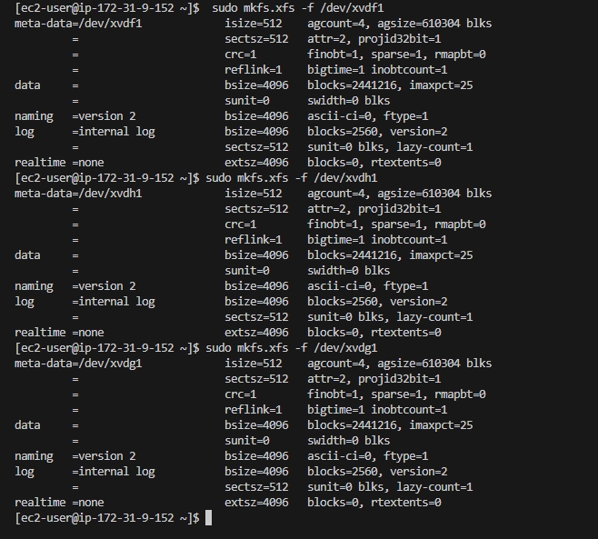
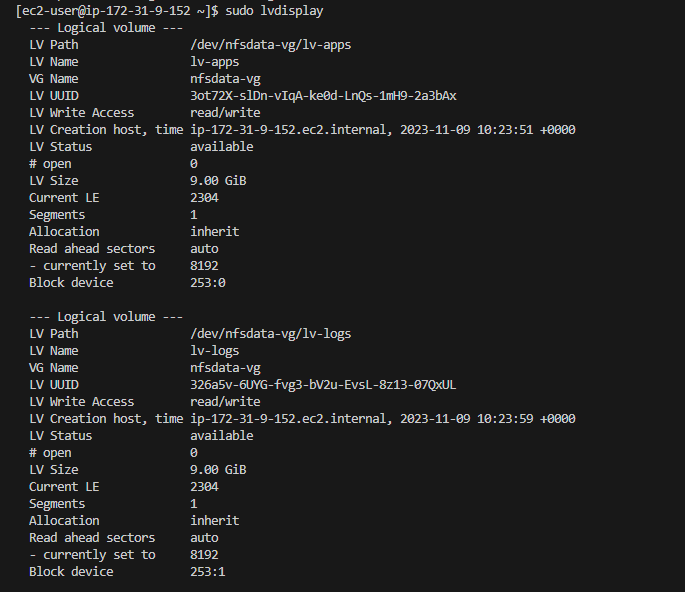
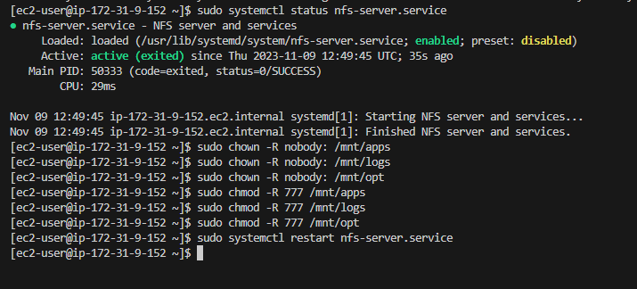
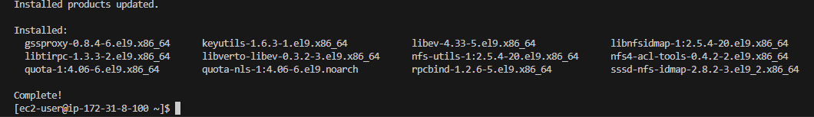
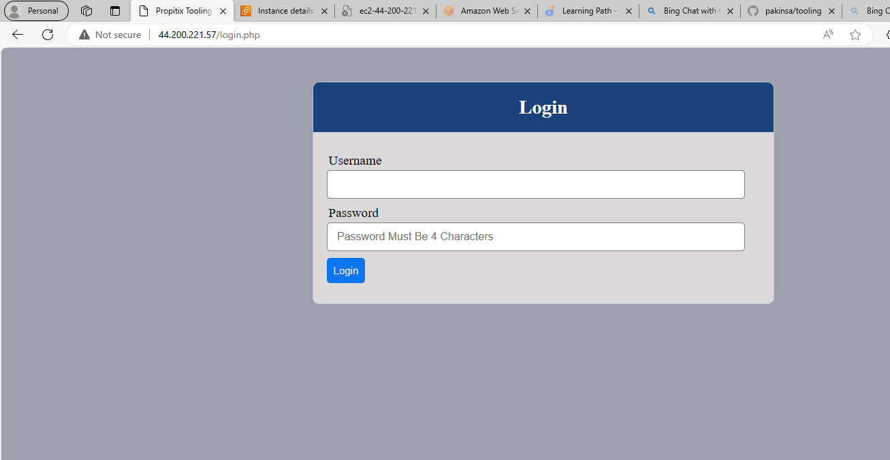

# My DevOps_Project 

## Project 10: Three Tier Arch with NFS

### Darey.io DevOps Bootcamp

### Purpose: Implement a Three Tier Architecture Tooling Website with LVN Storage, MySQLDB and NFS 


### Outlined Steps

1. Set up an NFS server on an EC2 instance and configure the NFS exports on the host server. You can use the nfs-utils package to install the NFS client and server on your EC2 instances.

2. Create a MySQL database on a different EC2 instance and configure the security group and network settings to allow access from the web servers

3. Create three web servers on EC2 instances and mount the NFS share on each of them using the mount command. You can also use the fstab file to make the mount persistent across reboots.

4. Connect the web servers to the MySQL database using the appropriate driver or library for your web application . You can use a load balancer or a DNS service to distribute the traffic among the web servers .


Project divided into 4 Parts


### Part 1: NTS Server

1. Set up an NFS server on an EC2 instance with RedHart 
2. Install and configure LVM with 3volumes. lv-opt, lv-app, and lv-logs 
3. Format with xfs
4. Mountpoints: lv-opt to /mnt/opt for Jenkins server, lv-apps on /mnt/apps for webserver, lv-logs on /mnt/logs for webserver
5. Install NFS server
6. Export by copying the cidr of NFS server for web servers cidr
7. Set permission on mount point on nfs for webserver access r/w/x
8. Configure and confirm access to NFS clients with same subnet
9. Configure Inbound rules for NTS TCP 111 and UDP 2049 respectively 


### Part 2: Database Server

1. Set up an EC2 instance with Ubuntu 

2. Install MYSQL Server

3. Create Database 'Tooling'

4. Create Root User

5. Create Database User 'Webaccess'

6. Grant 'Webaccess' to 'Tooling' database from web server 'cidr' only


### Part 3 Web Server

1. Launch 3 EC2 Instance with RedHart. 

2. Configure NFS client 

3. Mount /var/www/ and verify

4. Install Remi, Apache and Php

5. Mount log folder web to NTS log export


### Part 4  Website Configurations

1. Fork websource code from Darey.io Github

2. Deploy the web source code to the webserver

3. Restart httpd

4. Update website config to connect to database

5. Create a new admin user 'myuser'and password on Webserver

6. Visit tooling website/index.php and sigin in as 'myuser'


## Part1: NFS Server

1. Set up an NFS server on an EC2 instance with RedHart with External Volumes


2. Create Label, Partition, Format and Install LVM

   To achieve this we need to:

   A. Create a label for the attached disk/volume

        sudo parted -s /dev/xvdf mklabel msdos   

        sudo parted -s /dev/xvdg mklabel msdos

        sudo parted -s /dev/xvdh mklabel msdos


    
    B. Create Only One partition in each of the attached disk/volume using xfs

        sudo parted -s /dev/xvdf mkpart primary xfs 1 10G

        sudo parted -s /dev/xvdg mkpart primary xfs 1 10G

        sudo parted -s /dev/xvdh mkpart primary xfs 1 10G

    


    C. Format the partitions only with XFS not disks

        sudo mkfs.xfs -f /dev/xvdf1     //-f flag to overwrite the existing filesystem

        sudo mkfs.xfs -f /dev/xvdh1

        sudo mkfs.xfs -f /dev/xvdg1    

    !


    D. Install lvm

        sudo yum install lvm2     // Installs lvm for storage management and utility

        sudo lvmdiskscan

    
    
    
3. Create PVs, VG, LVs and Format

   In order to mount we need to:

   A. Create Phyical Volumes:

        sudo pvcreate /dev/xvdf1

        sudo pvcreate /dev/xvdg1

        sudo pvcreate /dev/xvdh1

    


    B. Create Volume Group:

        `sudo vgcreate nfsdata-vg /dev/xvdf1 /dev/xvdg1 /dev/xvdh1`  //Collate the physical volume into a volume group, which can be further divided into logical groups.

    


   C. Create 3 Logical Volumes in the VG with relevant properties 
      
        Divide into equal storage

        sudo lvcreate -n lv-apps -L 9.0G nfsdata-vg

        sudo lvcreate -n lv-logs -L 9.0G nfsdata-vg

        sudo lvcreate -n lv-opt -L 9.0G nfsdata-vg

        sudo lvs   // lists and describe logical volumes available

        sudo lvdisplay   // describes all available lvs with status and properties

    

    

    
    D. Format LVs

        sudo mkfs -t xfs /dev/nfsdata-vg/lv-apps

        sudo mkfs -t xfs /dev/nfsdata-vg/lv-logs

        sudo mkfs -t xfs /dev/nfsdata-vg/lv-opt
    
    

    


4. Mountpoints: lv-opt to /mnt/opt for Jenkins server, lv-apps on /mnt/apps for webserver, lv-logs on /mnt/logs for webserver

    A. Create Directory for Mountpoints

        sudo mkdir -p /mnt/apps    // For WebServer

        sudo mkdir -p /mnt/logs   // For WebServer
    
        sudo mkdir -p /mnt/opt  

    


    B. Mount LVs to Mountpoints

        sudo mount /dev/nfsdata-vg/lv-apps /mnt/apps

        sudo mount /dev/nfsdata-vg/lv-logs /mnt/logs

        sudo mount /dev/nfsdata-vg/lv-opt /mnt/opt

    


 
    C. Copy UUID and Update /etc/fstab 

        `sudo blkid`  // get UUID for each 
        
    

        lv--logs: UUID="887d30b6-8fc5-4453-a8a7-d330460cd2f2"
        lv--opt: UUID="79870429-2a69-4ff5-8565-be86d15ae78a"
        lv--apps: UUID="aa248eb4-d7e5-48c2-9fb9-45512a113df1"

        `sudo nano /etc/fstab`  // Paste or update the UUID of each LVs here

    


        ```sudo mount -a```  // To apply changes

        `sudo systemctl daemon-reload`  // To  reload the system

    

    Had to fix this error
     
    
    


5. Install NFS server
        
    sudo yum -y update
    sudo yum install nfs-utils -y
    sudo systemctl start nfs-server.service
    sudo systemctl enable nfs-server.service
    sudo systemctl status nfs-server.service


6. Export by copying the cidr of NFS server for web servers cidr
    
     CIDR: 172.31.0.0/20 for WebServers connect on the same Subnet
    


7. Set permission  To Allow WebServers

    To allow webservers to access same files acrss NTS Server to r/w/x especially inside the logical volumes

    sudo chown -R nobody: /mnt/apps
    sudo chown -R nobody: /mnt/logs
    sudo chown -R nobody: /mnt/opt

    sudo chmod -R 777 /mnt/apps
    sudo chmod -R 777 /mnt/logs
    sudo chmod -R 777 /mnt/opt

    sudo systemctl restart nfs-server.service




8. Configure and confirm access to NFS clients with same subnet
    sudo vi /etc/exports

    /mnt/apps 172.31.0.0/20(rw,sync,no_all_squash,no_root_squash)
    /mnt/logs 172.31.0.0/20(rw,sync,no_all_squash,no_root_squash)
    /mnt/opt 172.31.0.0/20(rw,sync,no_all_squash,no_root_squash)

    Esc + :wq!

    sudo exportfs -arv   // This command export all directories and apply changes made to /etc/exports file without restarrt the NFS service

 


9. Configure Inbound rules for NTS TCP 111 and UDP 2049 respectively  


## Part 2: Database Server

1. Set up an EC2 instance with Ubuntu 


2. Install MYSQL Server

    sudo apt update -y
    sudo apt install mysql-server -y

 
    sudo systemctl status mysqld 

    //if not running then

    sudo systemctl restart mysql
    sudo systemctl enable mysql

    
    sudo mysql_secure_installation  


3. Create Database 'Tooling'

    mysql> CREATE DATABASE Tooling;

4. Create Database User 'Webaccess'

    mysql> CREATE USER 'Webaccess'@'172.31.0.0/20' IDENTIFIED BY 'Willingly@123';  

5. Grant 'Webaccess' to 'Tooling' database from web server 'cidr' only

    mysql> GRANT ALL ON Tooling.* TO 'Webaccess'@'172.31.0.0/20'; 
    mysql> FLUSH PRIVILEGES;
    mysql> SHOW DATABASES;


## Part 3 : WebServers

1. Launch 3 EC2 Instance with RedHart as Webservers. 


2. Configure NFS client 

```sudo yum install nfs-utils nfs4-acl-tools -y```





3. Mount to /var/www, Update for Reboot

`sudo mkdir /var/www`
`sudo mount -t nfs -o rw,nosuid 172.31.9.152:/mnt/apps /var/www`    // ip here is the private ip address of NFS
`sudo mount -t nfs -o rw,nosuid 172.31.9.152:/mnt/logs /var/log/httpd`  // ip here is the private ip address of NFS
//sudo mount -t nfs -o rw,nosuid 172.31.9.152:/mnt/opt ???      // not stated in project intructions likely meant for next project


`sudo nano /etc/fstab`

`172.31.9.152:/mnt/apps /var/www nfs defaults 0 0`


4. Install Remi, Apache and Php

    sudo yum install httpd -y

    sudo dnf install https://dl.fedoraproject.org/pub/epel/epel-release-latest-8.noarch.rpm

    sudo dnf install dnf-utils http://rpms.remirepo.net/enterprise/remi-release-8.rpm

    sudo dnf module reset php

    sudo dnf module enable php:remi-7.4

    sudo dnf install php php-opcache php-gd php-curl php-mysqlnd

    sudo systemctl start php-fpm

    sudo systemctl enable php-fpm

    setsebool -P httpd_execmem 1   // set for reboot


5.  Verify Mount, Mount log folder web to NTS log export


 


Apache must be installed first before mounting on /var/log/httpd for WebServer2


## Part 4: Website Configurations

 

 

 

 




 


```sudo umount -d /var/www```         // unmount mountpoint with NFS share from webserver1
```sudo umount -d /var/log/httpd```  // unmount mountpoint with NFS share from Webserver2


 


    sudo umount -l /mnt/apps    // lazy unmount  device

    sudo umount -l /mnt/logs    // lazy unmount device


#### REFERENCES:

1. [Linux Handbook](https://linuxhandbook.com/umount-target-busy/)


