# My DevOps_Project 

## Project 10: Ansible Automate Project

### Darey.io DevOps Bootcamp

### Purpose: Automate the configuration of 2 Webservers, 1 DB Server, 1 NFS server and 1 LB server using Ansible and Jenkins 


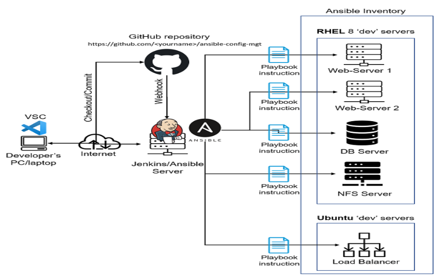


### Required Steps:

#### 1. Set up a webhook link from your source code repository (such as GitHub, Jira or Trello) to trigger a Jenkins job whenever there is a change in the code. This will allow to automate the deployment of your code to the managed nodes using Jenkins. This will help you to keep track of the history and status of your deployments.

    a. Create a new repo named ansible-config-mgt
    
    b. Create an EC2 server named "Jenkins-Ansible" and Install and configure with ansible and jenkins, and use Elastic Ip addressing to avoid change in IPs when you shut down instance

    c. Create a freestyle project named "ansible" on Jenkins

    d. Create a webhook link from Github repo to "Jenkins-ansible" server

    e. Allow and test Automatic job build to "Jenkins-ansible" server on main branch from your repo.


#### 2. Ansible Development

    a. Clone the jenkins-ansible repo down to your local machine

    b. Create a new branch
    
    c. Create in the new branch: 2 directories a. playbooks: to store playbooks  b. inventory: to store hosts

    d. Create "common.yml" file inside "playbooks" directories and create inventory fils dev.yml, uat.yml, staging.yml and prod.yml for different development stages.
    


#### 3. Let the Server named Jenkins-Ansible Server be Ansible Control Node, and then create 5 new EC2 Instances as managed/child ansible nodes
    
    a. Create 5 instances. 4 Redhart OS: 2 for webservers, 1 for NFS, 1 for DB. 1 Ubuntu Instance for Load Balancing
    b. Configure their ports according to their relevant protocols and port numbers at Security
    c. Configure the Jenkins-Ansible Control with SSH access to the managed nodes using SSH
    

#### 4. Create a playbook, that installs wireshark on the 2webservers, and commons tasks on commom.yml


#### 5. Git pull request.


##### 1. Set up a webhook link from your source code repository (such as GitHub, Jira or Trello) to trigger a Jenkins job whenever there is a change in the code. This will allow to automate the deployment of your code to the managed nodes using Jenkins. This will help you to keep track of the history and status of your deployments.

###### a. Create a new repo named ansible-config-mgt
    
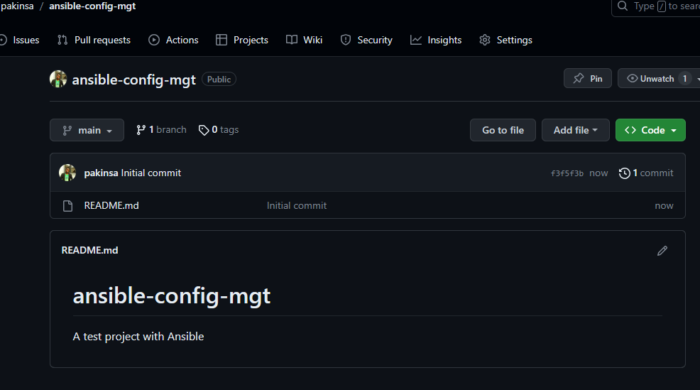 
    
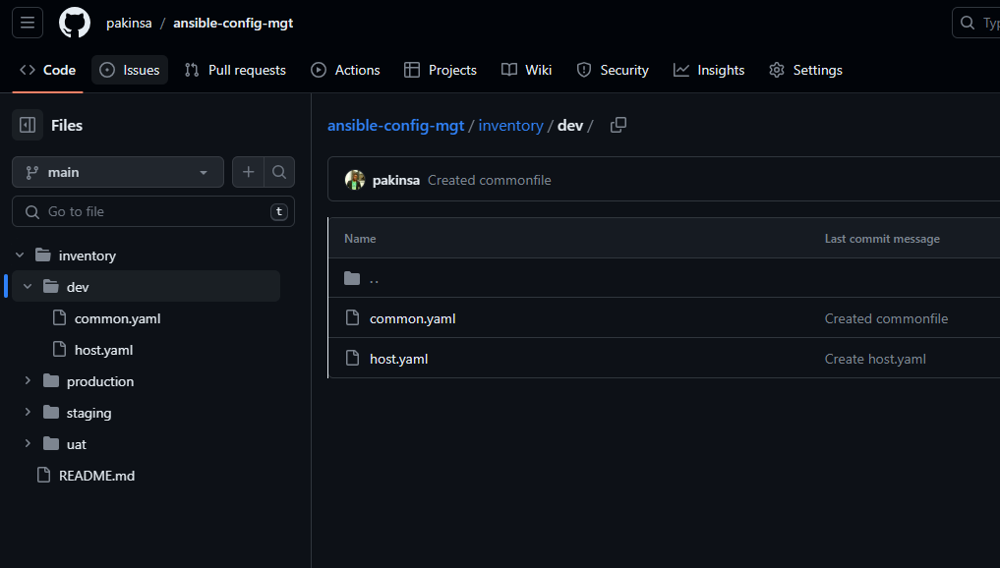 


###### b. Create an EC2 server named "Jenkins-Ansible" and Install and configure with ansible and jenkins, and use Elastic Ip addressing to avoid change in IPs when you shut down instance

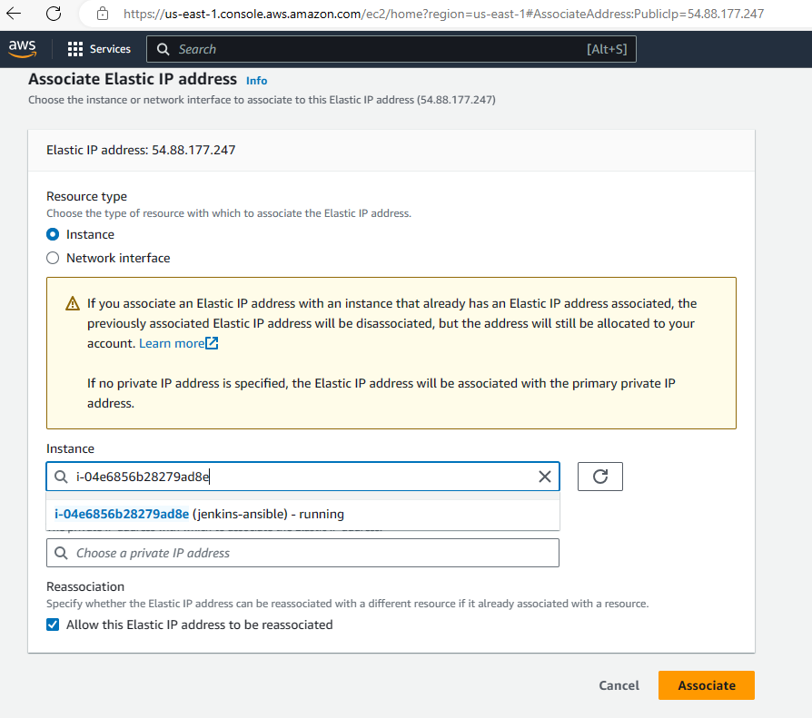 
    
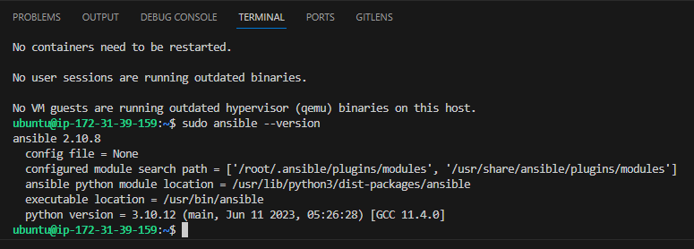

    sudo apt update && sudo apt install fontconfig openjdk-17-jre    # Update the package index and install latest Java 17, which is required by Jenkins. 
        
    sudo wget -O /usr/share/keyrings/jenkins-keyring.asc https://pkg.jenkins.io/debian/jenkins.io-2023.key   # Add the Jenkins repository key to your system.

    echo deb [signed-by=/usr/share/keyrings/jenkins-keyring.asc] https://pkg.jenkins.io/debian binary/ | sudo tee /etc/apt/sources.list.d/jenkins.list > /dev/null       # Add the Jenkins repository to your system
   

    sudo apt update && sudo apt install jenkins -y         # Update the package index again and install Jenkins
    
    sudo systemctl status jenkins
    
    sudo systemctl start jenkins
        
    sudo cat /var/lib/jenkins/secrets/initialAdminPassword   # Find admin intial password here

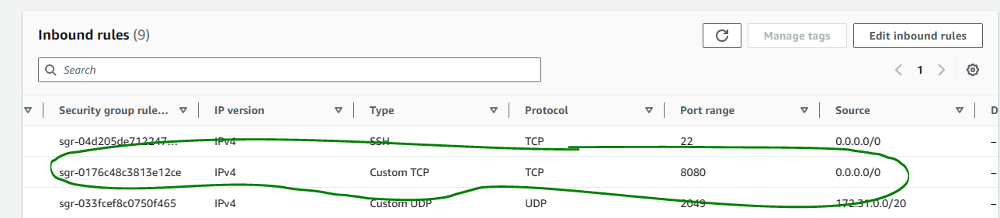

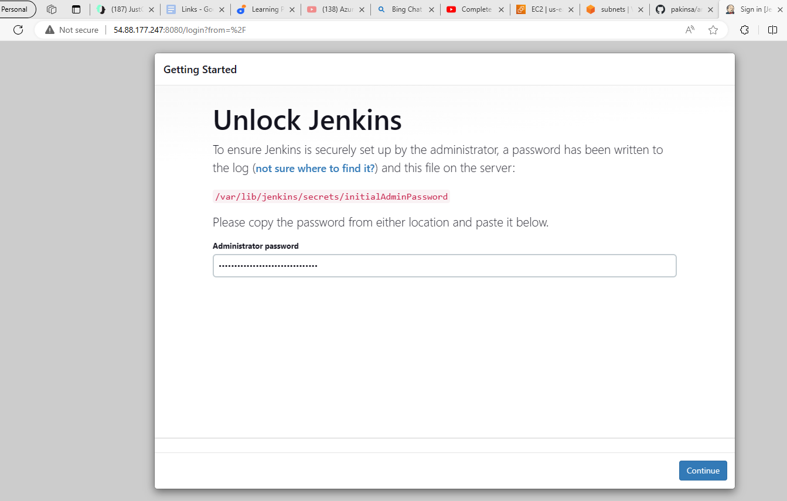
    
    Jenkins
    Username : admin password: 8606b5271584416384a3c7e769937f7a
    


###### c. Create a freestyle project named "ansible" on Jenkins

Encountered 403 crumb invalid error

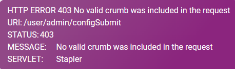 
    
To solve this, enable the CSRF Protection, allows forge request


Create a new admin user

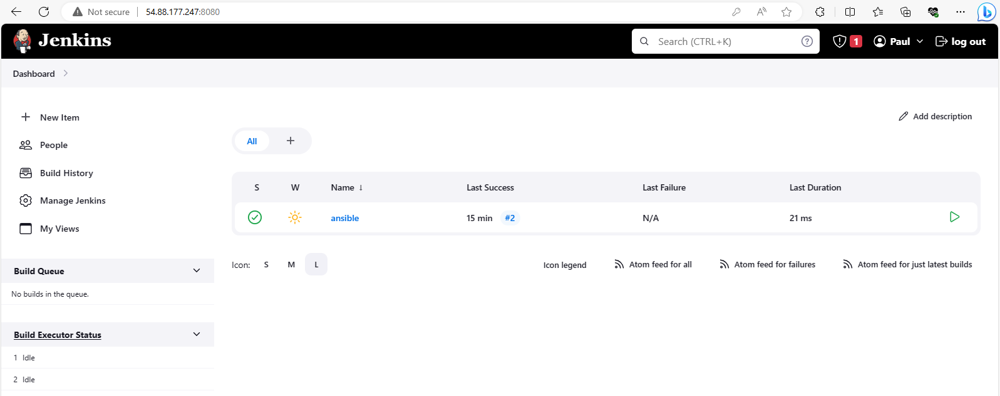 


    
###### d. Create a webhook link from Github repo to "Jenkins-ansible" server

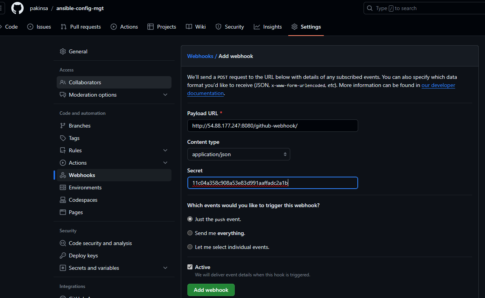 
    
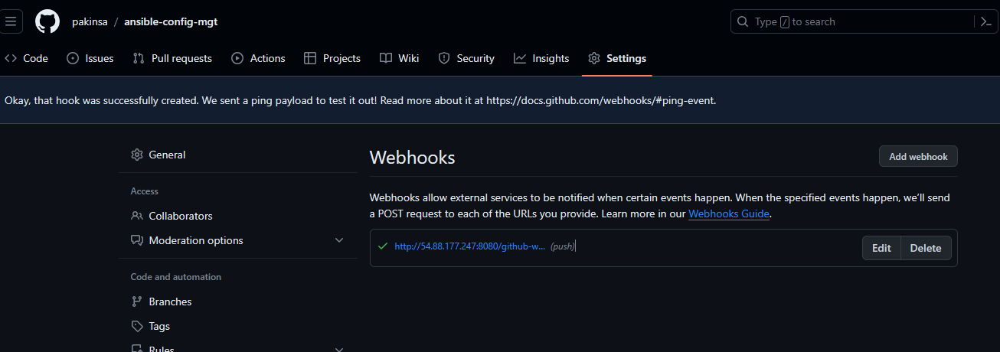 

Use wildcards or patterns to specify multiple files. Enter */ to save all files, or **/*.txt to save only text files.

Change Master to Main on the Build Configure menu

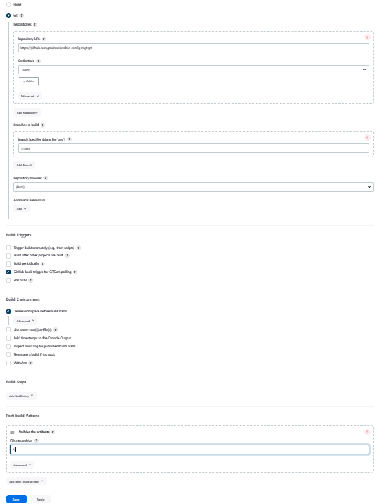 
    
   

###### e. Allow and test Automatic job build to "Jenkins-ansible" server on main branch from your repo.

First successful automatic job build and artifact archived


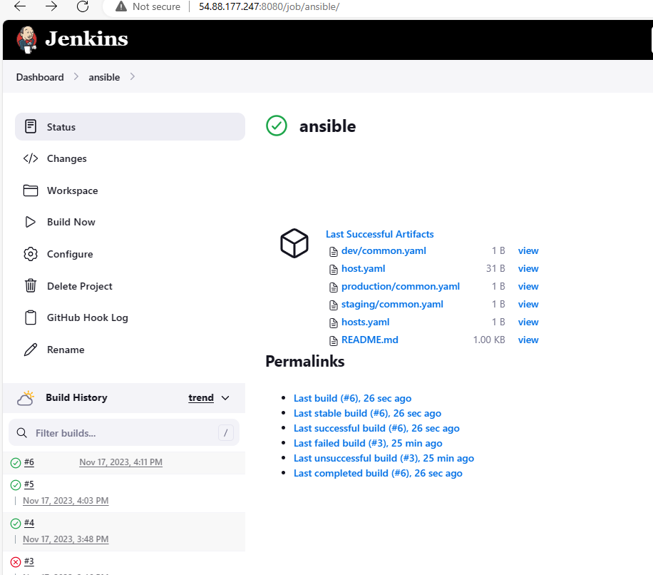 
      
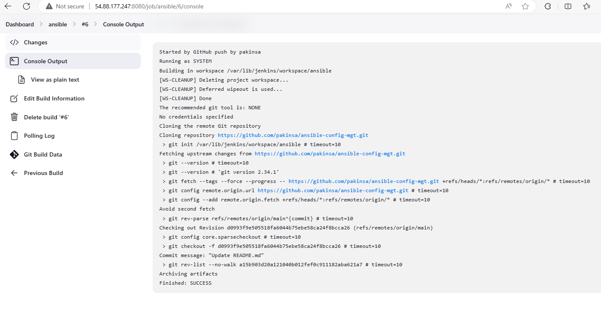 
    


    

##### 2. Ansible Development

###### a. Clone the jenkins-ansible repo down to your local machine


Install Remote Development plugin in order to access files in remote servers

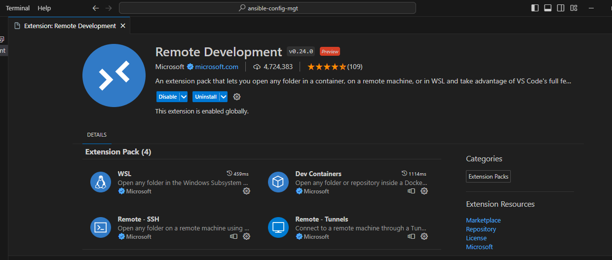


###### b. Create a new branch

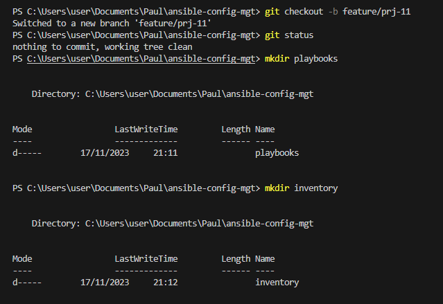 
    
       
    
###### c. Create in the new branch: 2 directories a. playbooks: to store playbooks  b. inventory: to configure ansible hosts
###### d. Create "common.yml" file inside "playbooks" directories and create inventory files nameely dev.yml, uat.yml, staging.yml and prod.yml for different development stages.

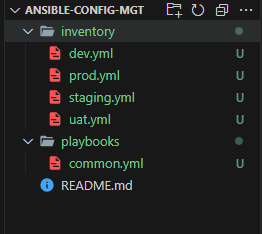


    
##### 3. Let the Server named Jenkins-Ansible Server be Ansible Control Node, and then create 5 new EC2 Instances as managed/child ansible nodes
    
###### a. Create 5 instances. 4 Redhart OS: 2 for webservers, 1 for NFS, 1 for DB. 1 Ubuntu Instance for load balancing

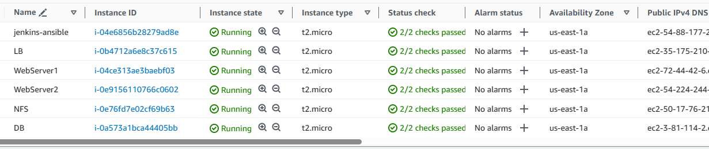


###### b. Configure their ports according to their relevant protocols and port numbers at Security

Pick individual subnets and configure ports

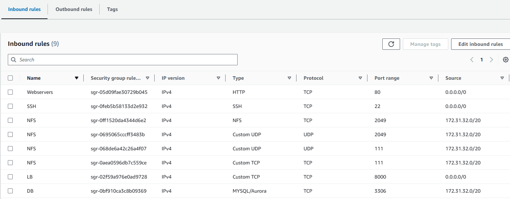


###### c. Configure and Connect the Jenkins-Ansible Control with SSH access to the managed nodes using SSH Agent

Ansible uses port 22 by default, which means it needs be SSH into managed nodes. Achieve this with SSH Agent  

1. Change permission of the pem file so that EC2 can accept it.
   Ensuring that the private pem file used on  Jenkins-Ansible is exact key used here for SSH agent.

   ```chmod 400 latestkeys2.pem```

   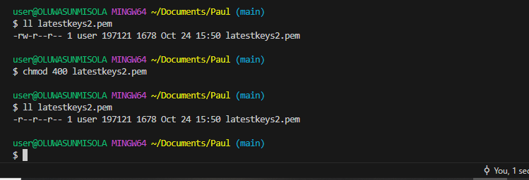

        
2. Copy by importing the pem key file from local machine to Jenkins-Ansible Server

   ``` eval `ssh-agent -s` ```      Ensuring that SSH agent is running
        
   ``` ssh-add latestkeys2.pem```   Add SSH Agent 

   But an error surfaced

   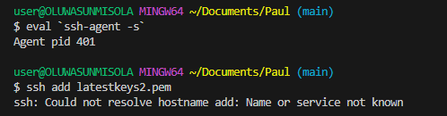  

            Need to install OpenSSH on local machine via PowerShell with Administrator

            Get-WindowsCapability -Online | Where-Object Name -like 'OpenSSH*'

            Add-WindowsCapability -Online -Name OpenSSH.Client~~~~0.0.1.0

            Add-WindowsCapability -Online -Name OpenSSH.Server~~~~0.0.1.0

            Start-Service sshd

            Set-Service -Name sshd -StartupType 'Automatic'


            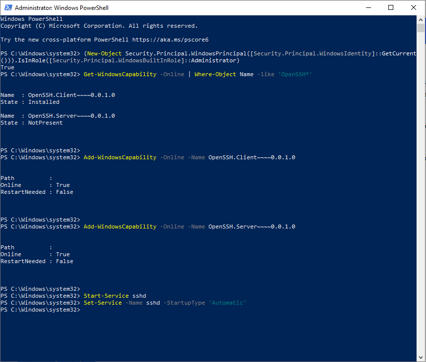 

    OpenSSH now installed, and SSH Agent Identity added

    ``` ssh-add latestkeys2.pem```  Add SSH Agent again

    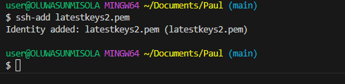


    SSH to Jenkins-Ansible server via Public IP now successful
        
    `ssh -A ubuntu@54.88.177.247`  Command connects to the Jenkins-Ansible server @public address

    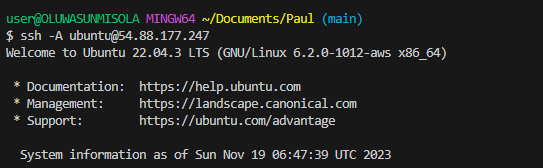 
       
        

    List available SSH keys on this Server

    `ssh-add -l`   command list available SSH keys on this server

    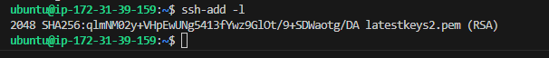


    Connect from Jenkins-Ansible control node to a managed node

    `ssh -A ec2-user@72.44.42.6`   Connect as an example via OpenSSH to a redhart webserver public Ip

    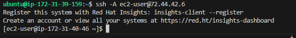


    `eval `ssh-agent -s` && ssh-add latestkeys2.pem && ssh-add -l`  # multipurose commmand to ssh agent.


    

##### 4. Create Playbook and Pull Request

###### a. Create a playbooks commom.yml and inventory.dev

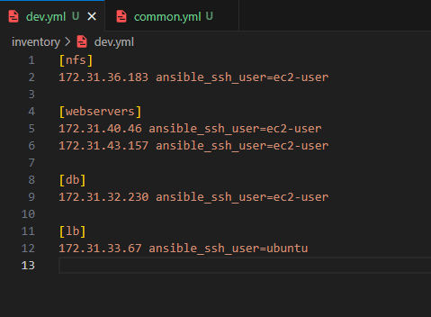 

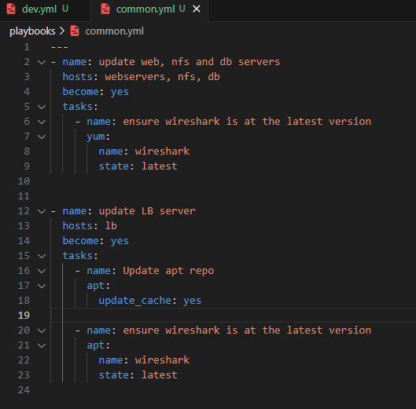 


###### b. Git pull request


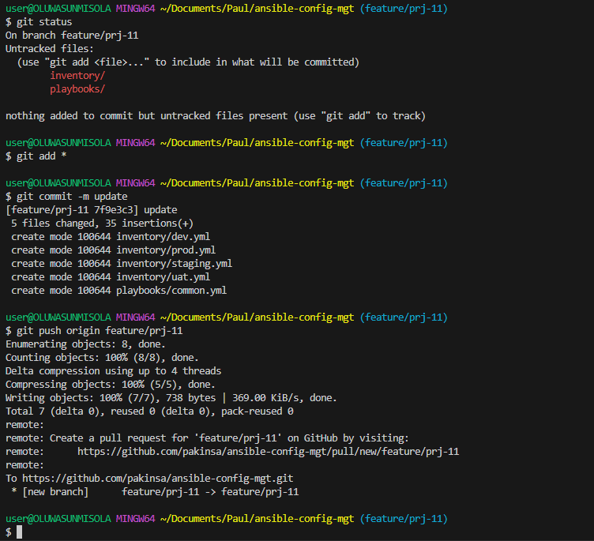 

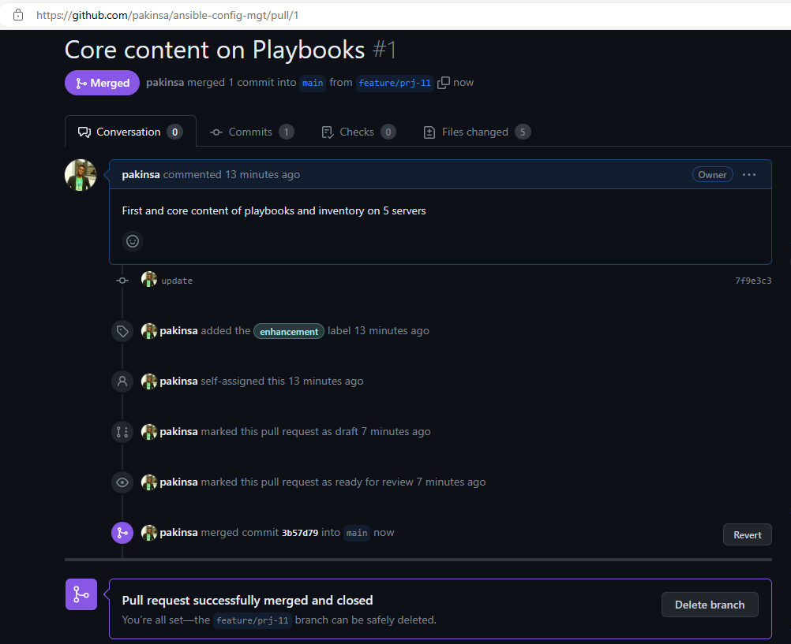 

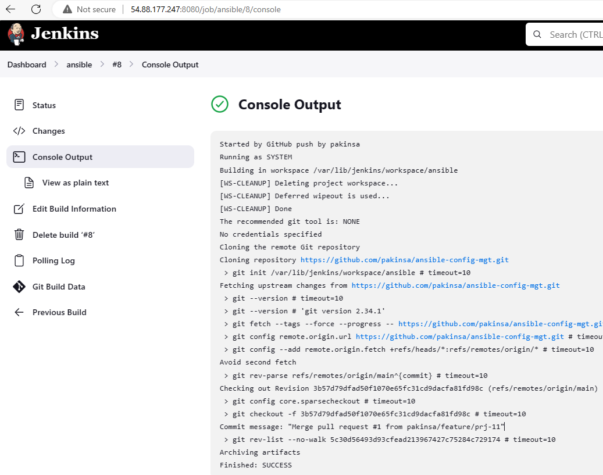  


##### c. Confirm latest artifact and Pull Git repo

`sudo ls /var/lib/jenkins/jobs/ansible/builds/8/archive` confirm latest artifact

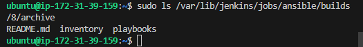


`git checkout main` change back to Main

`git pull`   sync main branch to the recent update

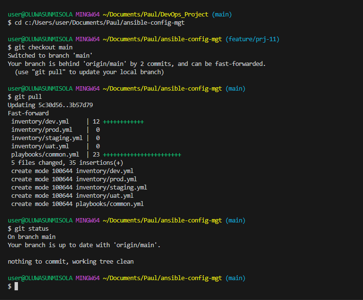


##### 5. Run the Ansible Playbooks and Connect to Remote Jenkins-ansible Server

###### a. Connect to Remote Jenkins-ansible Server

Had challenges connecting to the Jenkins server for hours. I had to uninstall remote development extension earlier, and then install the Remote-SSH extension only. The configuration too was very confusing for me as to where the pem file actually needs to be either a path to the localhost or the remote Jenkins server. At last it is localhost path

Host jenkins-ansible
  HostName 54.88.177.247
  User ubuntu
  IdentityFile /Users/user/Documents/Paul/latestkeys2.pem

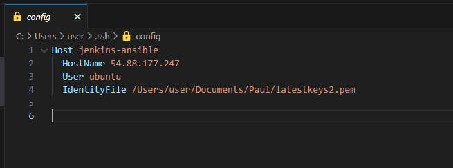


###### b. Run Ansble playbook

To run ansible playbooks first

    eval `ssh-agent -s` && ssh-add latestkeys2.pem && ssh-add -l

    CD into the archive where the latest artifact is to avoid playbook not found error then

    ansible-playbook -i inventory/dev playbooks/common.yml

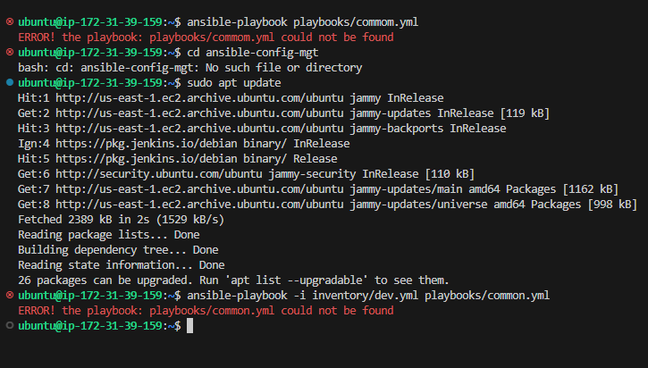

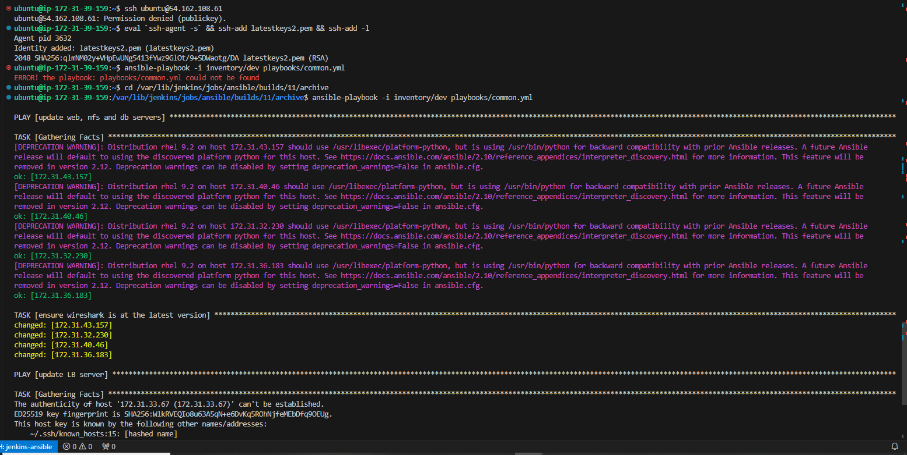 

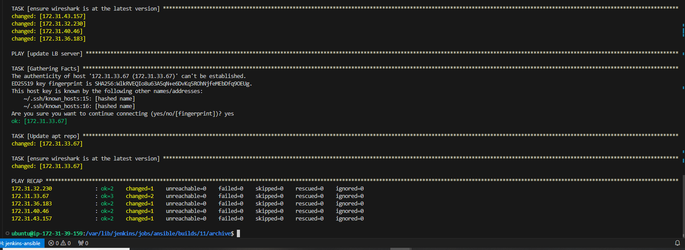 


###### c.Confirm Wireshark installation 

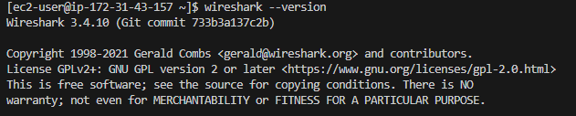 

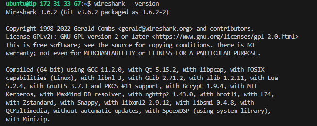


##### 6. More Task with Ansible Playbook and COnfirmation 

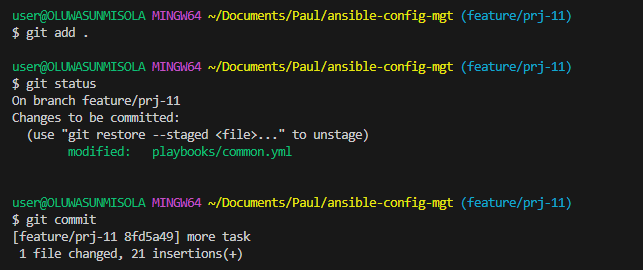 


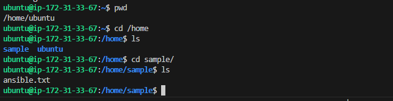 

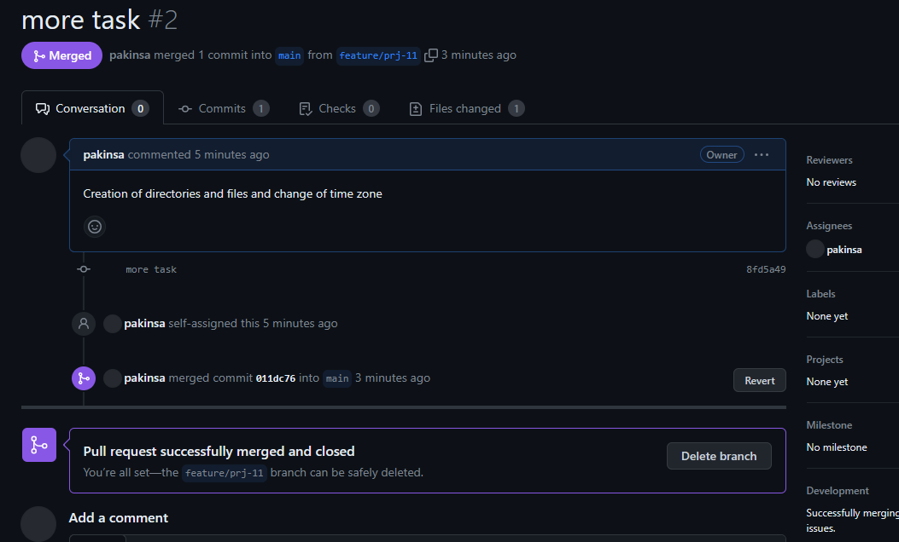 

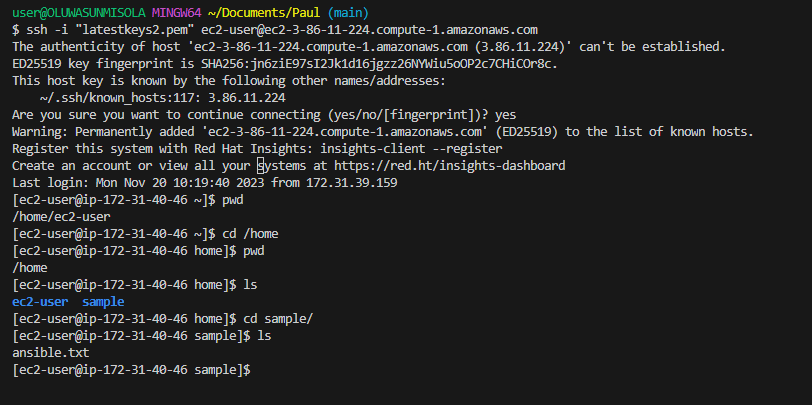


#### Key Lesson:

The name change from dev.yml to dev in in the ansible repo worked, as files that declares remote hosts doesnt have to end with .yml. Then connection using ssh agent has to be reconnected per session for smooth running of ansible playbook on jenkins-ansible server. SSH agent is not like the usual SSH client 


    


### REFERENCES

1. [Ansible: The Inside Playbook](https://www.ansible.com/blog/intro-to-automation-webhooks-for-red-hat-ansible-automation-platform)

2. [Jenkins: Linux](https://www.jenkins.io/doc/book/installing/linux/#debianubuntu)

3. [Darey.io: End To End Project 11 (SSH | Ansible)](https://www.youtube.com/watch?v=uuhhOhWTrrs)