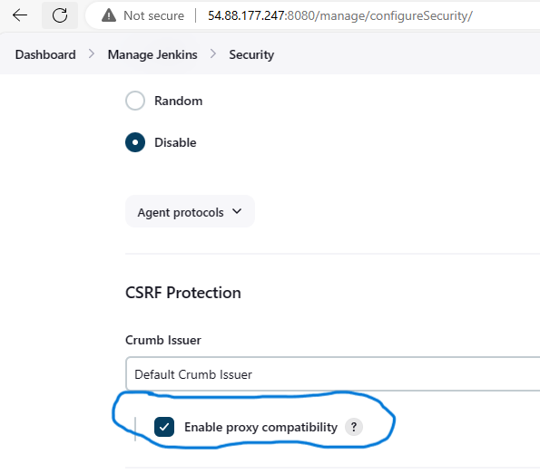

# My DevOps_Project 

## Project 10: Ansible Automate Project

### Darey.io DevOps Bootcamp

### Purpose: Automate the configuration of 2 Webservers, 1 DB Server, 1 NFS server and 1 LB server using Ansible and Jenkins 

### Required Steps:

1.  Set up a webhook link from your source code repository (such as GitHub, Jira or Trello) to trigger a Jenkins job whenever there is a change in the code. This will allow to automate the deployment of your code to the managed nodes using Jenkins. This will help you to keep track of the history and status of your deployments.

    a. Create a new repo named ansible-config-mgt
    
    b. Create an EC2 server named "Jenkins-Ansible" and Install and configure with ansible and jenkins, and use Elastic Ip addressing to avoid change in IPs when you shut down instance

    c. Create a freestyle project named "ansible" on Jenkins

    d. Create a webhook link from Github repo to "Jenkins-ansible" server

    e. Allow and test Automatic job build to "Jenkins-ansible" server on main branch from your repo.

2.  Ansible Development

    a. Clone the jenkins-ansible repo down to your local machine

    b. Create a new branch
    
    c. Create in the new branch: 2 directories a. playbooks: to store playbooks  b. inventory: to store hosts

    d. Create "common.yml" file inside "playbooks" directories and create inventory fils dev.yml, uat.yml, staging.yml and prod.yml for different development stages.
    

3. Let the Server named Jenkins-Ansible Server be Ansible Control Node, and then create 5 new EC2 Instances as managed/child ansible nodes
    
    a. Create 5 instances. 4 Redhart OS: 2 for webservers, 1 for NFS, 1 for DB. 1 Ubuntu Instance for load balancing
    b. Configure their ports according to their relevant protocols and port numbers.
    c. Configure the Jenkins-Ansible Control 
    d. Configure SSH access to the managed nodes.
    
    

3. Create a playbook that installs and configures Apache and PHP on the 2 web server nodes, a playbook that installs and configures NFS on the NFS server node, a playbook that installs and configures MySQL on the DB server node, and a playbook that installs and configures HAProxy on the load balancer node.

    a. Create an inventory folder in the github repo named: "ansible-config-mgt"
    b.
    

4. Optional steps

    a. Create a new branch on your main branch called
    b. Edit the soucre code in github repo "ansible-config-mgt"
    c. Confirm new soucr code automatically build into the "Jenkins-ansible" server

1. Set up a webhook link from your source code repository (such as GitHub, Jira or Trello) to trigger a Jenkins job whenever there is a change in the code. This will allow to automate the deployment of your code to the managed nodes using Jenkins. This will help you to keep track of the history and status of your deployments.

    a. Create a new repo named ansible-config-mgt
    
     
    
     

    b. Create an EC2 server named "Jenkins-Ansible" and Install and configure with ansible and jenkins, and use Elastic Ip addressing to avoid change in IPs when you shut down instance

     
    
    

        sudo apt update && sudo apt install fontconfig openjdk-17-jre     Update the package index and install latest Java 17, which is required by Jenkins. 
        
        sudo wget -O /usr/share/keyrings/jenkins-keyring.asc https://pkg.jenkins.io/debian/jenkins.io-2023.key   Add the Jenkins repository key to your system.

        echo deb [signed-by=/usr/share/keyrings/jenkins-keyring.asc] https://pkg.jenkins.io/debian binary/ | sudo tee /etc/apt/sources.list.d/jenkins.list > /dev/null       Add the Jenkins repository to your system
   

        sudo apt update && sudo apt install jenkins -y          Update the package index again and install Jenkins
        sudo systemctl status jenkins
        sudo systemctl start jenkins
        
        sudo cat /var/lib/jenkins/secrets/initialAdminPassword    Find admin intial password here

    

    
    
    Jenkins
    Username : admin password: 8606b5271584416384a3c7e769937f7a
    

    c. Create a freestyle project named "ansible" on Jenkins

    Ecountered 403 crumb invalid error

     
    
    To solve this, enable the CSRF Protection, allows forge request

    

    Create a new admin user

     

    
    d. Create a webhook link from Github repo to "Jenkins-ansible" server

     
    
     

    Use wildcards or patterns to specify multiple files. Enter */ to save all files, or **/*.txt to save only text files.

    Change Master to Main on the Build Configure menu

     
    
   

    e. Allow and test Automatic job build to "Jenkins-ansible" server on main branch from your repo.

    Successfully automatic job build and artifact archived

     
    
     
    
    

    

    

### REFERENCES

1. [Ansible: The Inside Playbook](https://www.ansible.com/blog/intro-to-automation-webhooks-for-red-hat-ansible-automation-platform)

2. [Jenkins: Linux](https://www.jenkins.io/doc/book/installing/linux/#debianubuntu)