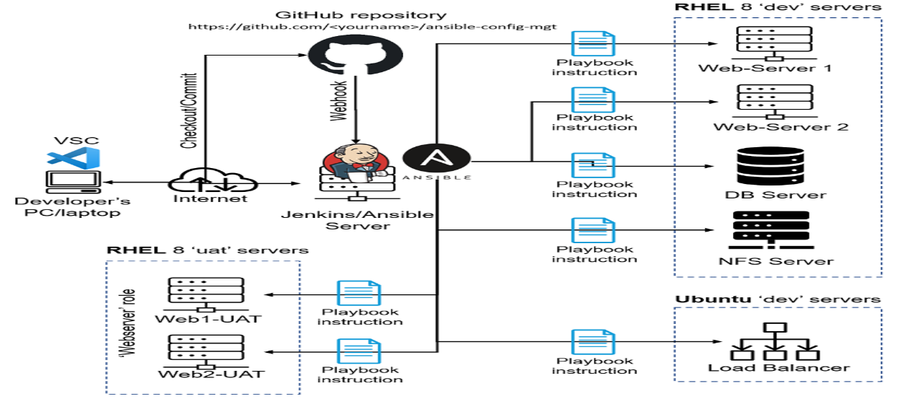
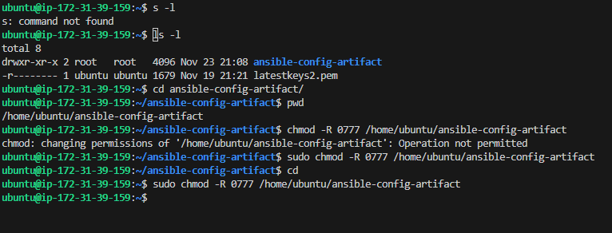
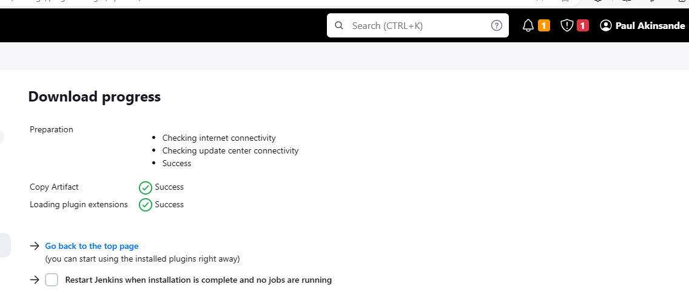
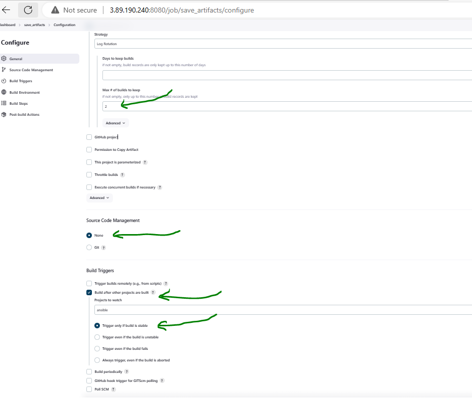
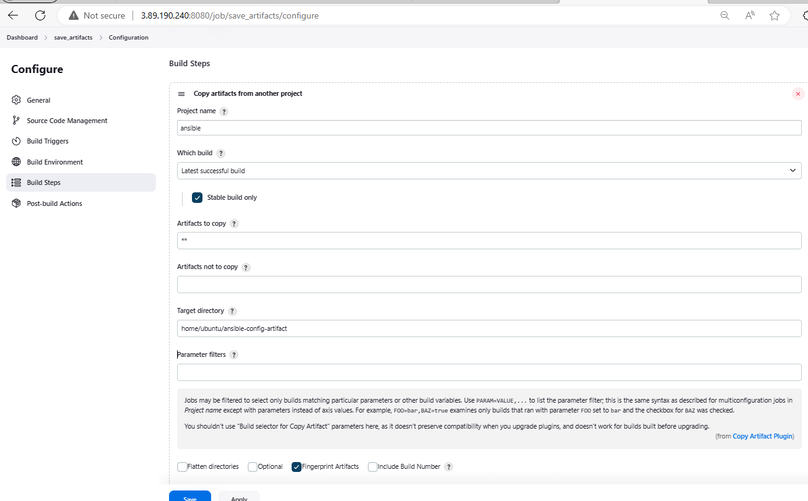
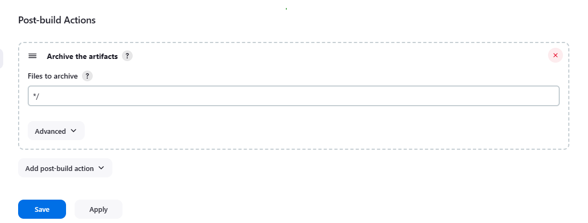
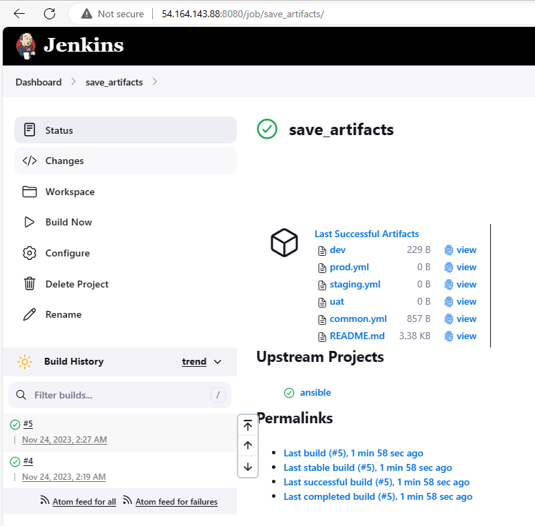
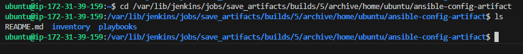

# My DevOps_Project 

## Project 12: Ansible Refactoring Project

### Darey.io DevOps Bootcamp

### Purpose: Automate using Ansible for Refactoring , Assignments and Imports 

Required Steps:

STEP 1
#### 1. Make a directory: 

`sudo mkdir /home/ubuntu/ansible-config-artifact` A directory to store artifacts in the Jenkins server

#### 2. Visit Avaliable-plugins section on jenkins to install "copy-artifacts plugin"

#### 3. Create a new freestyle project on Jenkins named "save_artifacts".
    
This project will be configured to get job automatically from ansible free style project not from any repo in Github

It would keep only 2 arfitacts per time

It would be triggered after ansible project completes it jobs

Instead of GitHub hook triggers for GITScm polling, it triggers when build is stable.

It would save all files to an artifacts at post-build

#### 4. The main idea of save_artifacts project is to save artifacts into /home/ubuntu/ansible-config-artifact directory. To achieve this, create a "Build step" that choose "copy artifacts from other project"  e.g ansible (freestyle project as source project) and /home/ubuntu/ansible-config-artifact directory as target directory

Wihtout the post build step configure there will be no artifacts stored:

Both jobs completed on Jenkins

Confirm if save_artifacts artifacts are in the specified directory : /home/ubuntu/ansible-config-artifact

`cd /var/lib/jenkins/jobs/save_artifacts/builds/3/archive/home/ubuntu/ansible-config-artifact`
`ls /var/lib/jenkins/jobs/save_artifacts/builds/3/archive/home/ubuntu/ansible-config-artifact`

   The /var directory in Jenkins is neither a root nor a home folder, but a subdirectory of the Jenkins installation directory. It contains various files and folders that are used by Jenkins, such as logs, plugins, jobs, etc. The /var directory has a parent folder, which is the Jenkins installation directory, which can vary depending on how Jenkins was installed and configured. For example, if Jenkins was installed using the Debian package, the installation directory would be /usr/share/jenkins, and the /var directory would be /usr/share/jenkins/var. If Jenkins was installed using the WAR file, the installation directory would be the location of the WAR file, and the /var directory would be a subdirectory of that location.

STEP 2:

Before run any ansible playbook
1. Ensure you connect to Jenkins-ansible server via OpenSSH
2. Open terminal
3. Ensure pem key is in the directory available in the remote config file
4. Run this command eval `ssh-agent -s` && ssh-add latestkeys2.pem && ssh-add -l
5. cd  /var/lib/jenkins/jobs/ansible/builds/19/archive or this cd /var/lib/jenkins/jobs/save_artifacts/builds/3/archive/home/ubuntu/ansible-config-artifact depending on where the latest artifact is.
6. Run a command like this ansible-playbook -i inventory/dev playbooks/site.yml
Note: If you have connection problems try shut down and restart the jenkins-ansible server