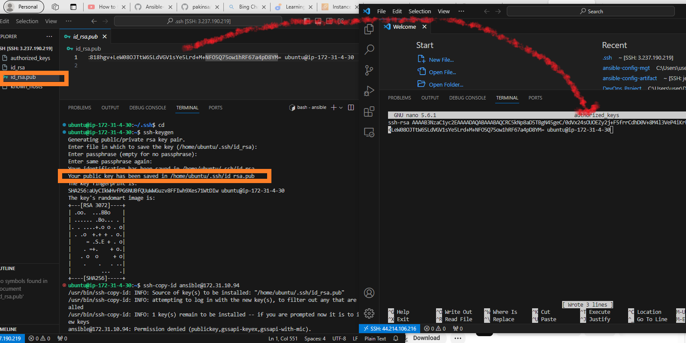
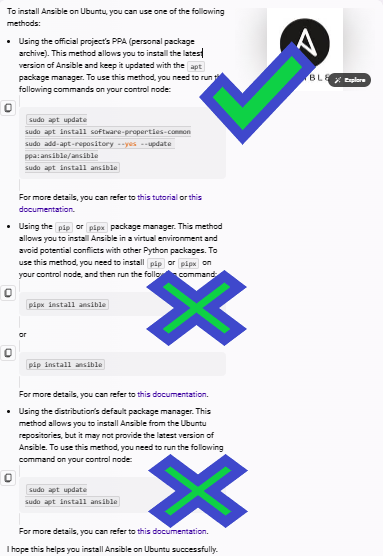
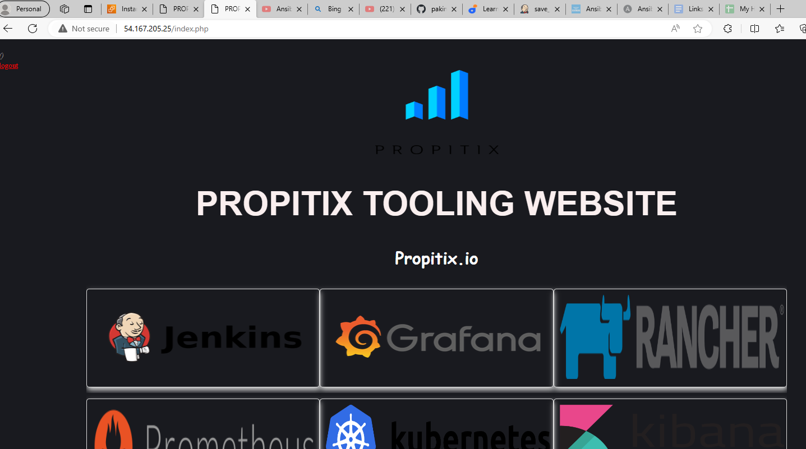

# My DevOps_Project 

## Project 12: Ansible Refactoring Project

### Darey.io DevOps Bootcamp

### Purpose: Automate using Ansible for Refactoring , Assignments and Imports 

Required Steps:

### STEP 1

#### 1. Make a directory: 

`sudo mkdir /home/ubuntu/ansible-config-artifact` A directory to store artifacts in the Jenkins server

#### 2. Visit Avaliable-plugins section on jenkins to install "copy-artifacts plugin"

#### 3. Create a new freestyle project on Jenkins named "save_artifacts".
    
This project will be configured to get job automatically from ansible free style project not from any repo in Github

It would keep only 2 arfitacts per time

It would be triggered after ansible project completes it jobs

Instead of GitHub hook triggers for GITScm polling, it triggers when build is stable.

It would save all files to an artifacts at post-build

#### 4. The main idea of save_artifacts project is to save artifacts into /home/ubuntu/ansible-config-artifact directory. To achieve this, create a "Build step" that choose "copy artifacts from other project"  e.g ansible (freestyle project as source project) and /home/ubuntu/ansible-config-artifact directory as target directory

Wihtout the post build step configure there will be no artifacts stored:

Both jobs completed on Jenkins

Confirm if save_artifacts artifacts are in the specified directory : /home/ubuntu/ansible-config-artifact

`cd /var/lib/jenkins/jobs/save_artifacts/builds/3/archive/home/ubuntu/ansible-config-artifact`
`ls /var/lib/jenkins/jobs/save_artifacts/builds/3/archive/home/ubuntu/ansible-config-artifact`

   The /var directory in Jenkins is neither a root nor a home folder, but a subdirectory of the Jenkins installation directory. It contains various files and folders that are used by Jenkins, such as logs, plugins, jobs, etc. The /var directory has a parent folder, which is the Jenkins installation directory, which can vary depending on how Jenkins was installed and configured. For example, if Jenkins was installed using the Debian package, the installation directory would be /usr/share/jenkins, and the /var directory would be /usr/share/jenkins/var. If Jenkins was installed using the WAR file, the installation directory would be the location of the WAR file, and the /var directory would be a subdirectory of that location.

### STEP 2: Refactoring Ansible Code by Importing Into Site.yml

Before running an ansible playbook
1. Ensure you connect to Jenkins-ansible server via OpenSSH
2. Open terminal
3. Ensure pem key is in the directory available in the remote config file
4. Run this command eval `ssh-agent -s` && ssh-add latestkeys2.pem && ssh-add -l
5. cd  /var/lib/jenkins/jobs/ansible/builds/19/archive or this cd /var/lib/jenkins/jobs/save_artifacts/builds/3/archive/home/ubuntu/ansible-config-artifact depending on where the latest artifact is.
6. Run a command like this ansible-playbook -i inventory/dev playbooks/site.yml
Note: If you have connection problems try shut down and restart the jenkins-ansible server

Create a new branch called Feature

Update and restructure directory tree on this branch

 

Push a branch 

 

Run ansible on servers to uninstall Wireshark

 

`ansible all -i inventory/dev -m command -a "wireshark --version"` Command to confirm WireShark uninstallation

### Step3 : Configuring UAT WebServers as RoleServers for User Acceptance Testing

#### 1. UAT WebServers 

#### 2. Preparing the UAT Environment

Input IP address of the 2 UAT Webservers into inventory/uat

 

#### 3. Ansible Roles Path Configuration

Ansible roles are a way of organizing your Ansible tasks into reusable and modular units. They allow you to define a common structure and behavior for a specific purpose, such as configuring a service or installing a package. Ansible roles can also help you manage the complexity and dependencies of your Ansible playbooks.

Ansible roles have a predefined directory structure that contains several YAML files and other resources. Each directory serves a different function and can contain one or more files. The main directories in an Ansible role are:

***defaults***: This directory contains the default values for the variables used in the role. These values can be overridden by other variables or parameters. The main file in this directory is defaults/main.yml.

***vars***: This directory contains the variables that are specific to the role. These values have a higher precedence than the default values and can be used to customize the role behavior. The main file in this directory is vars/main.yml.

***tasks***: This directory contains the main list of tasks that the role executes. These tasks are the core logic of the role and can use variables, modules, handlers, templates, and other resources. The main file in this directory is tasks/main.yml.

***files***: This directory contains the static files that the role copies or transfers to the remote hosts. These files can be used by the tasks or templates in the role. The files in this directory do not have any extension or format.

***templates***: This directory contains the Jinja2 templates that the role uses to generate dynamic files on the remote hosts. These templates can use variables, filters, expressions, and other features of the Jinja2 language. The files in this directory have the .j2 extension.

***handlers***: This directory contains the handlers that the role notifies when a task changes the state of a resource. These handlers are used to perform actions such as restarting a service or reloading a configuration. The main file in this directory is handlers/main.yml.
   
***meta***: This directory contains the metadata that describes the role. This metadata can include information such as the role name, author, license, dependencies, platforms, and other details. The main file in this directory is meta/main.yml.
   
***tests***: This directory contains the tests that verify the functionality of the role. These tests can use the Ansible modules, inventory, and playbooks to run the role against different scenarios and environments. The main files in this directory are tests/inventory and tests/test.yml.

By default, Ansible looks for roles in the following locations:
   * In collections, if you are using them.
   * In a directory called roles/, relative to the playbook file.
   * In the configured roles_path. The default search path is ~/.ansible/roles:/usr/share/ansible/roles:/etc/ansible/roles.
   * In the directory where the playbook file is located.

However, for this project a new ansible.cfg file has to be created and roles_path specified therein, as /etc/ansible/ansible.cfg was not found

 

   
#### 3. Write a task playbook in the main.yml of task

   1. Install and configure Apache
   2. Clone Tooling Website from my Github repo
   3. Ensure the tooling website is deployed to /var/www/html on the 2 UAT webservers
   4. Make Apache started service

### 4. Reference WebServer Role

1. Create uat-webserver host on the uatwebserver.yml with the code below in static_assignment folder:

   ---
   - hosts: uat-webservers
     roles:
      - webserver

2. Import uat-webserver host file into the site.yml with the code below:

   ---
   - hosts: all
   - import_playbook: ../static-assignments/common.yml

   - hosts: uat-webservers
   - import_playbook: ../static-assignments/uat-webservers.yml

 

 

#### 5 Run Ansible Playbooks

Before running an ansible playbook
1. Ensure you connect to Jenkins-ansible server via OpenSSH
2. Open terminal
3. Ensure pem key is in the directory available in the remote config file
4. Run this command at home directory on Jenkins: eval `ssh-agent -s` && ssh-add latestkeys2.pem && ssh-add -l
5. cd  /var/lib/jenkins/jobs/ansible/builds/20/archive or this cd /var/lib/jenkins/jobs/save_artifacts/builds/11/archive/home/ubuntu/ansible-config-artifact depending on where the latest artifact is.
6. In that same directory, run a ansible command: ansible-playbook -i inventory/dev playbooks/site.yml or ansible-playbook -i /inventory/uat.yml playbooks/site.yml depending

Note: If you have connection problems try shut down and restart the jenkins-ansible server

cd /var/lib/jenkins/jobs/save_artifacts/builds/8/archive/home/ubuntu/ansible-config-artifact

76ffc918ee7c44f5bc4fcb34963bb130

#### CONNECTION

   ansible all --list-hosts

   ansible -m ping all

To solve the connection problem to the managed nodes, use a passwordless connection. Which uses public/private key together

   step1

   ssh-keygen
   press Enter for passphrase (do not input any character or word)

    
   
    
   
    
   
    

   
   
   

   Copy the key from the .pub file into the nano authorized_keys of the managed ansible node

cd /home/ubuntu/ansible-config-mgt

ansible-playbook -i /inventory/uat.yml playbooks/site.yml  --syntax-check

#### KEY LESSONS:

#####

1. Ansible is not a service running on linux. So you cant do `systemctl status ansible`. It gives you an error.

2. How you install Ansible matters, as best to install with repository added, rather than simple package manager. This determines the result you have in ansible.

Install Ansible using the official Personal Package archive(PPA)

    sudo apt update
    sudo apt install software-properties-common
    sudo add-apt-repository --yes --update ppa:ansible/ansible
    sudo apt install ansible

So that you get this kind of result, where you use config file of ansible

And not this

3. However, there are some ways to improve the readability and style of this playbook, such as:

Use consistent indentation and spacing. According to the YAML specification, indentation must be consistent and use the same number of spaces for each level. You can also use spaces around colons and dashes to make the playbook more readable. For example, you can use something like this:

---
hosts: uat_webservers
become: yes
become_user: root
become_method: sudo
roles:
  - role: webserver

Use the name parameter to give a descriptive name to the playbook. This will help you identify the purpose and scope of the playbook, and also generate a meaningful output when you run the playbook. For example, you can use something like this:

---
- name: Deploy webserver role to uat_webservers hosts
  hosts: uat_webservers
  become: yes
  become_user: root
  become_method: sudo
  roles:
    - role: webserver

Use the include_role module instead of the role keyword to apply the webserver role. This will allow you to use variables, loops, conditionals, and tags with the role, and also make the playbook more modular and reusable. For example, you can use something like this:

---
- name: Deploy webserver role to uat_webservers hosts
  hosts: uat_webservers
  become: yes
  become_user: root
  become_method: sudo
  tasks:
    - name: Include webserver role
      include_role:
        name: webserver

#### EXECUTION

Since copy artifact job didnt work for our target directory "ansible-config-artifact", then we git clone from our reposiotry tour jenkins-ansible server with this command:  `git clone https://github.com/pakinsa/ansible-config-mgt.git`

2. Configure the config file in the /etc/ansible/ansible.cfg

 

#### References:

[AnsiblePilot: Ansibleroles log4shell](https://www.ansiblepilot.com/articles/ansible-troubleshooting-role-not-found-error/)

[DevOps Techstack: End to End Project 1](https://www.youtube.com/@devops-techstack)

[Galaxy Ansible](https://galaxy.ansible.com/ui/standalone/roles/lucab85/ansible_role_log4shell/)

