# AWS Cloud Manager - IAM Automation Project

**A Single Consolidated Project Encapsulating All Mini-Projects**  
*(Functions • Arrays • Environment Variables • Command-Line Arguments • Error Handling • AWS CLI • Secure Authentication • IAM Management)*

**Project Scenario**  
CloudOps Solutions has adopted AWS and needs to automate IAM resource management for new DevOps hires. We extended the existing `aws_cloud_manager.sh` script (from previous mini-projects) to create 5 IAM users, a "devOps_admin" group, attach the `AdministratorAccess` managed policy, and assign users to the group — all via shell scripting.


**Objectives Achieved in One Script**
1. Script enhancement with IAM functions  
2. IAM user names stored in an array  
3. Create users (iterative)  
4. Create "devOps_admin" group  
5. Attach AdministratorAccess policy  
6. Assign users to group  
7. Full error handling (idempotent – safe to re-run)  
8. Command-line argument validation + environment awareness  


## Prerequisites
- Linux machine (Ubuntu recommended)
- An AWS account (free tier works)  
- Good knowledge of Linux Foundations + Shell Scripting 
- Basic understanding of AWS IAM 

---

## Step-by-Step Guide

### Part A: Set Up Secure Authentication For Your Admin (Automation User)

1. Log into the AWS Management Console → IAM → Users → Create user  
   - User name: `automation_user`  
   - Access type: **Programmatic access**    
   Programmatic access means: The user can only interact with AWS via the CLI or code and not via the website console.

2. Attach policy: Search and attach `AdministratorAccess` (or at minimum `IAMFullAccess`).

3. Click on "Create User"

4. Get Keys: Create "Access Keys" for that user

5. On the last page, download the **.csv** containing:
   - AWS Access Key ID
   - AWS Secret Access Key

**Security Note**: Never commit these keys to Git or share them.

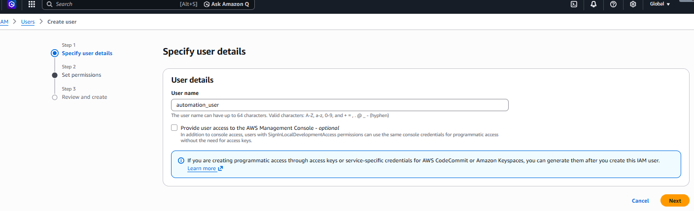 

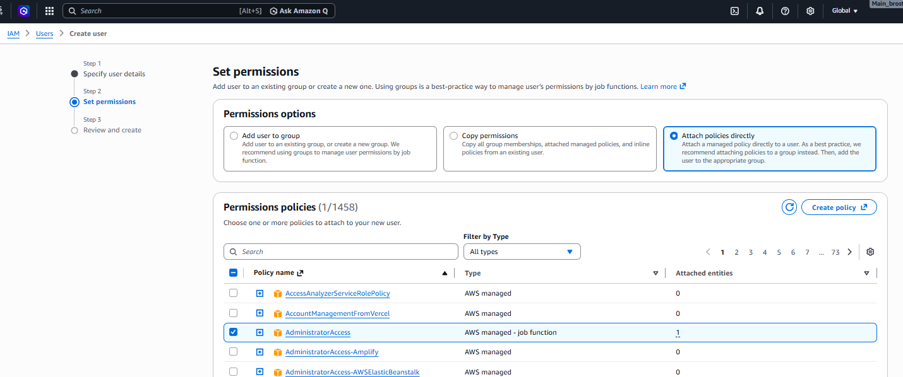 

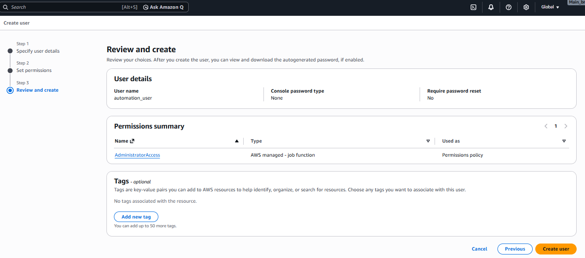 

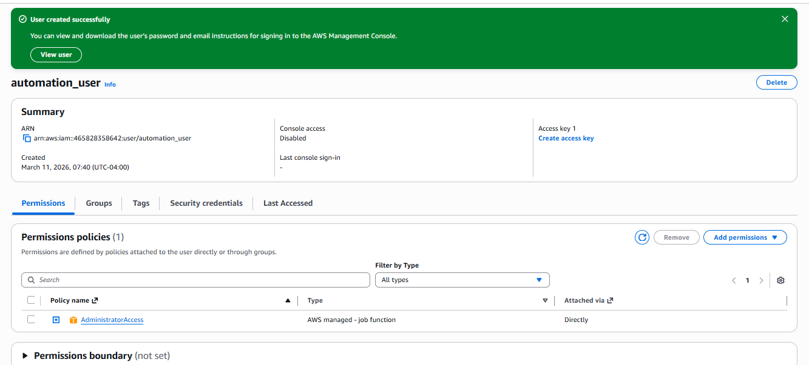 

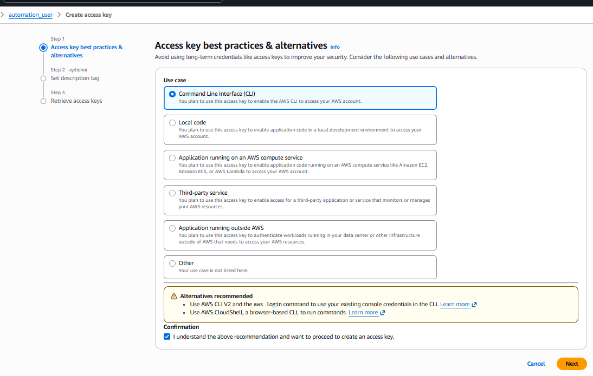 

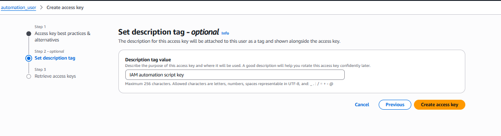 

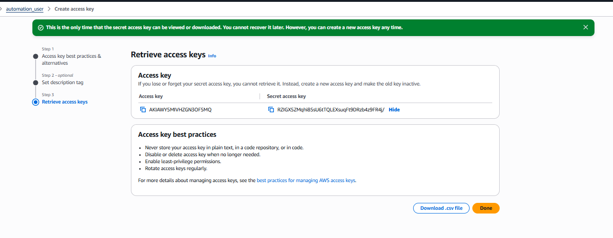


### PART B: Access AWS Console with the New Admin User Credentials(Automation User)

* Go to VS-CODE Terminal on your Laptop.

**Step 1: Install AWS CLI v2 (If On Linux OS or WSL on Windows)**
```bash
# 1. Download
curl "https://awscli.amazonaws.com/awscli-exe-linux-x86_64.zip" -o "awscliv2.zip"

# 2. Install unzip
sudo apt install unzip

# 3. Unzip
unzip awscliv2.zip

# 4. Install aws cli
sudo ./aws/install

# 5. Verify
aws --version
```


**Step 1: Install AWS CLI v2 (On Windows directly, most recommended method)**

```Powershell
# 1. Download the Windows MSI Installer
# In PowerShell, this downloads the installer directly to your current folder
Invoke-WebRequest "https://awscli.amazonaws.com/AWSCLIV2.msi" -OutFile "AWSCLIV2.msi"

# 2. Run the Installer
# This launches the installation wizard. Follow the on-screen prompts.
Start-Process msiexec.exe -Wait -ArgumentList "/i AWSCLIV2.msi"

# 3. Manually refreshed Path
$env:Path = [System.Environment]::GetEnvironmentVariable("Path","Machine") + ";" + [System.Environment]::GetEnvironmentVariable("Path","User")

# 4. Verify the installation
# (Note: You may need to close and reopen your terminal for the 'aws' command to be recognized)
aws --version
```


**Other OPTIONs for Step 1**
* **If you are on **macOS**
Terminal: Open your Terminal app.
Change Needed: Mac users should use the macOS PKG installer or Homebrew (brew install awscli) instead of the Linux .zip file. 


* **The "No-Installation" Alternative: **AWS CloudShell** 
If you want to skip the installation entirely, log into your AWS Management Console with the IAM Access keys and click the CloudShell at the top right. 

Benefit: AWS CLI is pre-installed and pre-authenticated, so you don't even need to run aws configure.
Action: You can simply paste your Bash script directly into CloudShell and run it immediately. 


**Step 2: Configure AWS CLI(Bash or Powershell works here now for aws configure)**
* On Vscode terminal enter this command :
```bash
# Bash or Powershell works here now
# You might need to close old terminals and re-open new for refresh
# And you can do this from any directory since it is awscli is installed globally
aws configure

# Enter the automation user access key
AWS Access Key ID: Paste the Access Key ID
AWS Secret Access Key: Paste the Secret Access Key
Default region name: us-east-1 (or your preferred region)
Default output format: json

# Test other aws commands 
aws ec2 describe-regions --output table  
# You should see a table of regions.
```

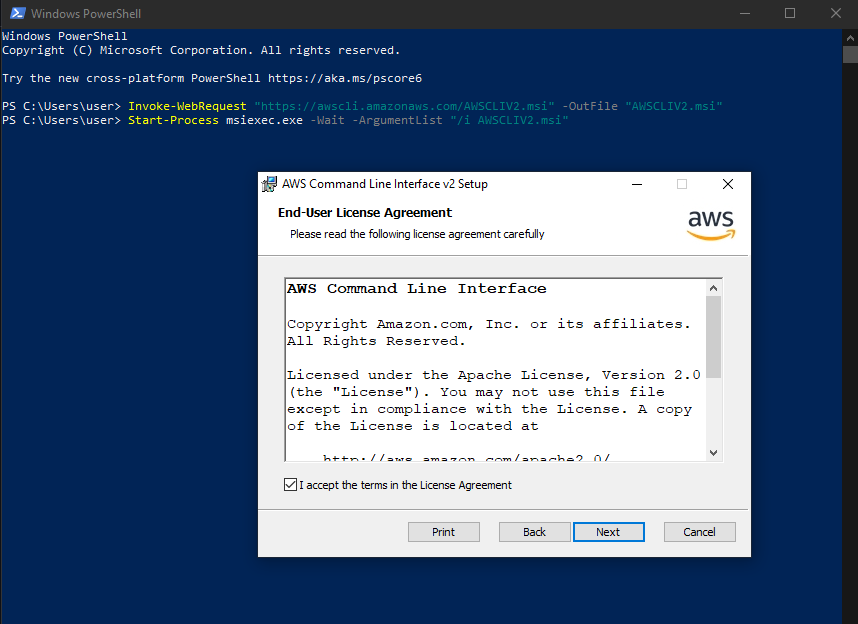 

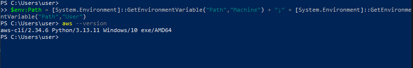 

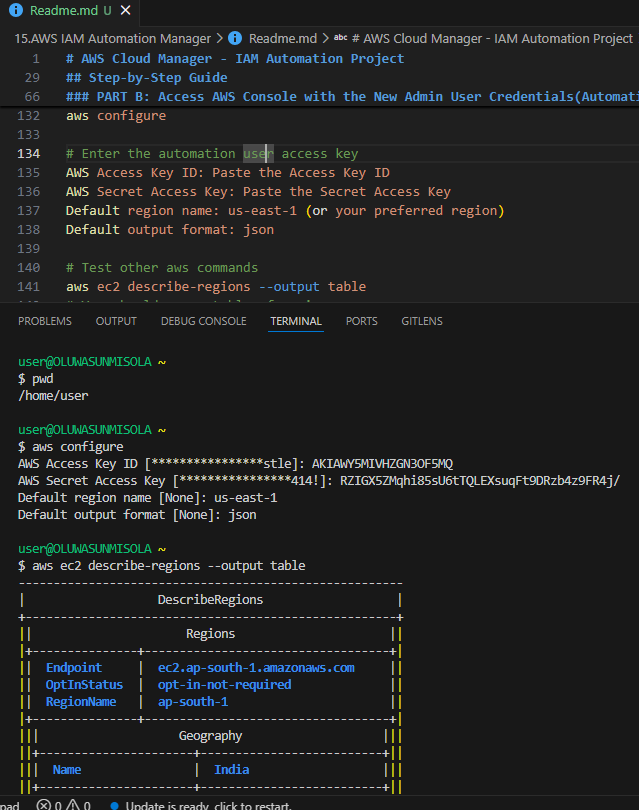


### Phase C: The Logic (Scripting Side)
**Step 1: Objective and structure of Script**
- I need to create by a script that does the following:
  * Define Variables: Create an array of 5 usernames.
  * The "Check" Logic: A function that asks AWS "Does user X exist?"
  * The "Action" Logic: The command to create the user only if the answer to last step was "No."
  * Loop: A for loop to run that logic for every name in your array.
  * Group Logic: Includes commands to Create Group and Attach Policy by applying permissions to groups rather than individuals. 


**Step 2: Create the Script & Run the script**

* Use these commands in your terminal but cd into the dirory where this script is going to live
* You can use Git bash OR WSL to operate & run the aws_cloud_manager.sh script.

```bash
# create the file aws_cloud_manager.sh
touch aws_cloud_manager.sh 

# open the file aws_cloud_manager.sh
nano aws_cloud_manager.sh

# Make executable
chmod +x aws_cloud_manager.sh 

# Test other environment by replacing production with testing or local as needed — the script validates it.
./aws_cloud_manager.sh production  # "I'm running this in the company's real AWS account. This is the final step."

./aws_cloud_manager.sh local # "I'm just checking if my script syntax is correct."

./aws_cloud_manager.sh testing # "I'm running this in a fake AWS account to see if it creates the 5 users correctly."

# Verification (Optional but Recommended)

# Check group
aws iam get-group --group-name devOps_admin

# Check one user
aws iam list-groups-for-user --user-name devops-user1

# Check one user if you change devops-user1 to say ayo in the script
aws iam list-groups-for-user --user-name ayo 

# List all attached policies
aws iam list-attached-group-policies --group-name devOps_admin
```


* Find my written ```./aws_cloud_manager.sh``` in this repo.


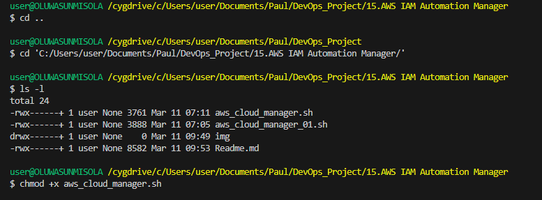 

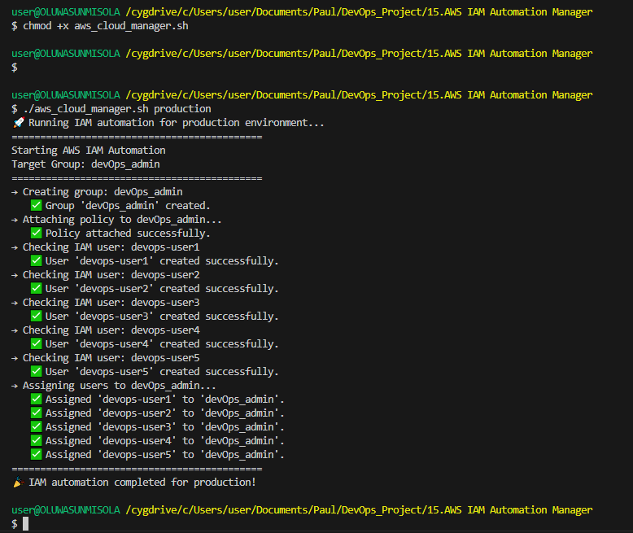 

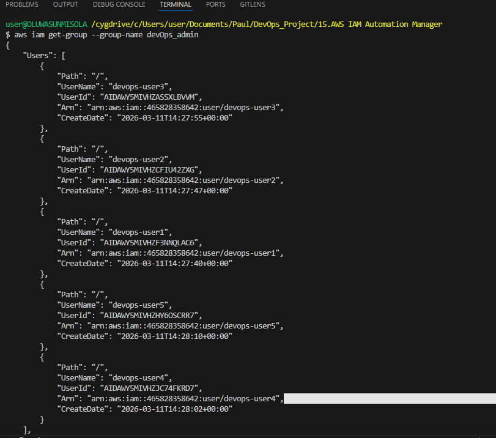 

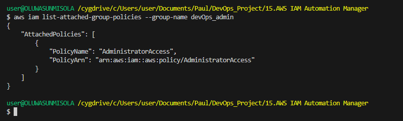 

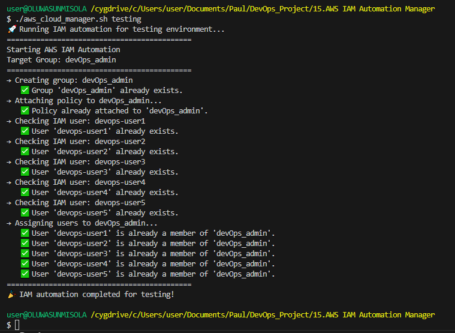 

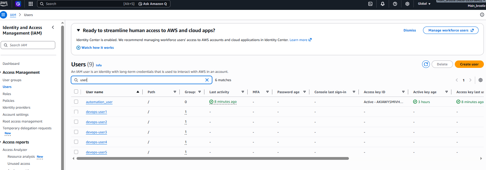


**Part D**

### My Thought Process & Design Decisions

1. **Why one single script?**  
   All the mini-projects were actually building toward this IAM automation goal. Splitting them would make maintenance harder, so I decided to consolidate everything.

2. **Idempotency was the biggest lesson for me**  
   I learned that in real automation you cannot assume "first run only". I added checks like `aws iam get-user` before creating because I once ran a script twice and got confusing errors.

3. **User array choice**  
   I chose meaningful names (devops-user1 → devops-user5) instead of random ones because it makes debugging easier when looking at the AWS console.

4. **Error handling style**  
   I decided to echo success/failure for every step instead of failing fast — this way even partial failures are visible and the script keeps going (better for learning).

5. **What was hardest?**  
   Understanding the difference between `attach-group-policy` vs `attach-user-policy`, and remembering that `AdministratorAccess` is an AWS-managed policy (ARN starts with `arn:aws:iam::aws:...`).


6. **What I realised**  
    In a real job at a company like Netflix or a small startup, I will never manually create 50 users for a new department. I will have use a script or a tool like Terraform.


7. **Future improvements I already see**  
   - Add password creation / console access: which creates a login password and forces a reset on first login.
   - Parameterize the group name & policy:  Moves names like "admin" into variables at the top. 
   - Add logging to a file: Saves every success/error message into a .log file

