# AWS VPC Peering Project

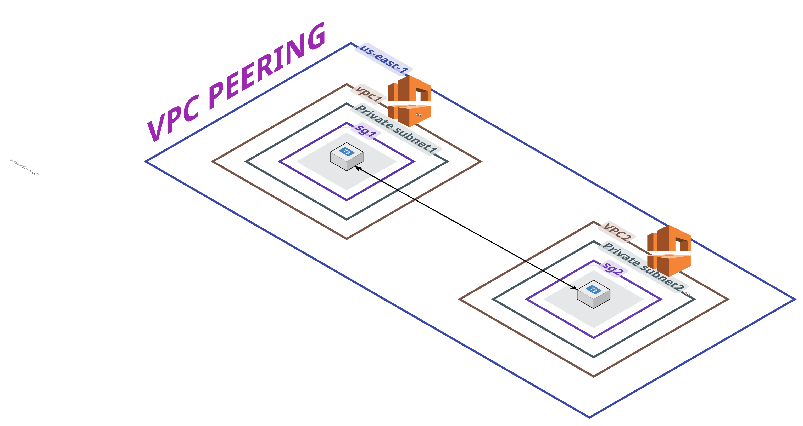

This README provides an overview of setting up VPC peering on AWS, including a step-by-step guide, testing instructions, and a real-world scenario.

## Overview
VPC peering enables private connectivity between two VPCs, allowing resources like EC2 instances to communicate as if they were in the same network. This is useful for secure, low-latency data transfer without using the public internet.

## Prerequisites
- AWS account with VPC creation permissions.
- Two VPCs with non-overlapping CIDR blocks (e.g., VPC A: 10.0.0.0/16, VPC B: 172.31.0.0/16).
- Basic knowledge of AWS console navigation.

## Step-by-Step Setup Guide
1. **Create Peering Request**:
   - Go to VPC console > Peering connections > Create.
   - Specify requester VPC, accepter VPC, and create.

   

   

   

   

2. **Accept Request**:
   - In accepter VPC's console, accept the pending connection.

   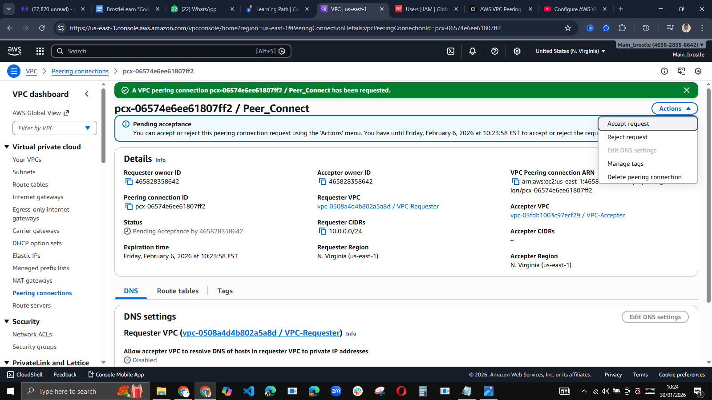

   

   

3. **Update Route Tables**:
   - Add routes in each VPC's route table pointing to the other's CIDR via the peering connection.

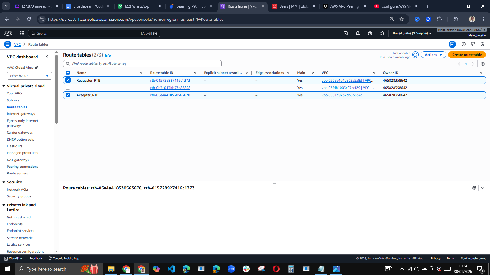

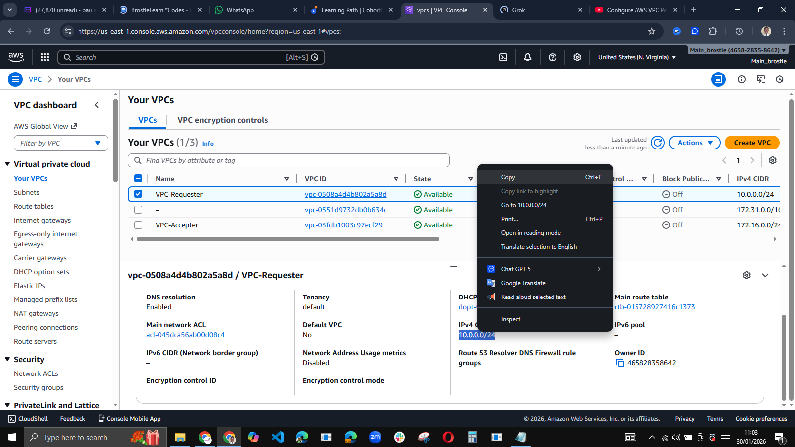

4. **Create Subnets and Update Security Groups**:
   - Allow inbound traffic (e.g., ICMP) from the peered VPC's CIDR.

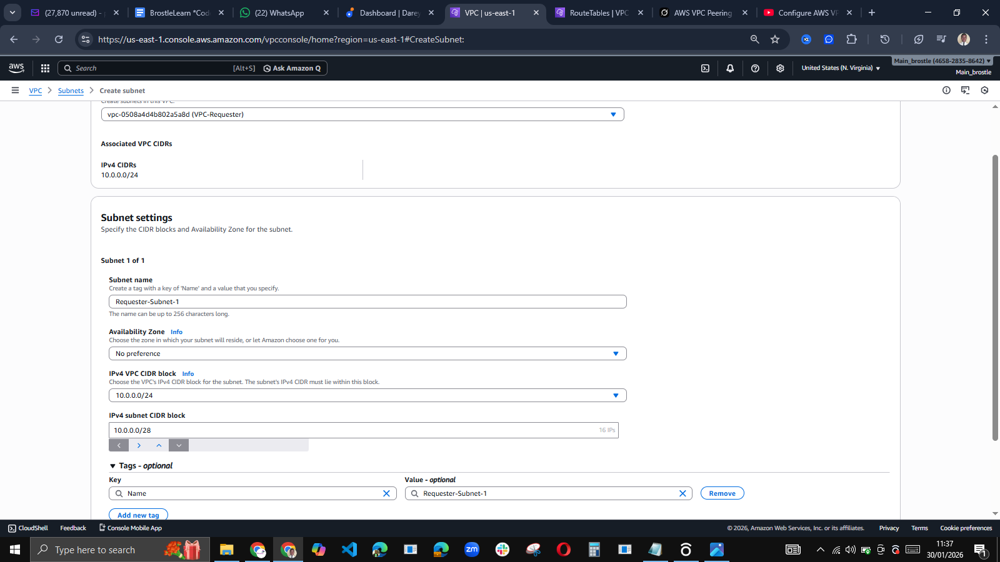

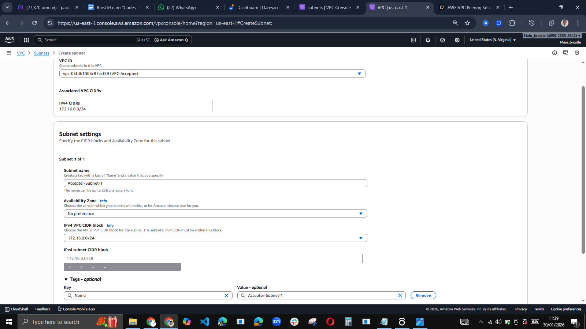

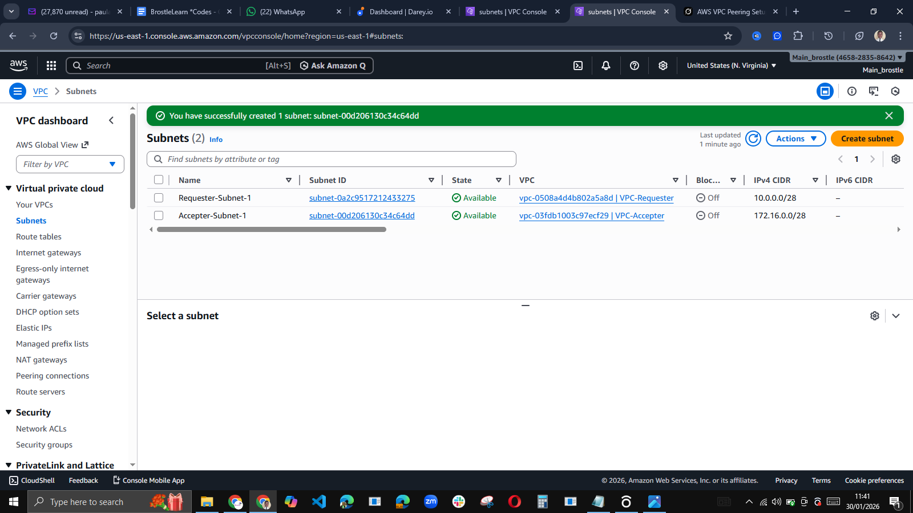

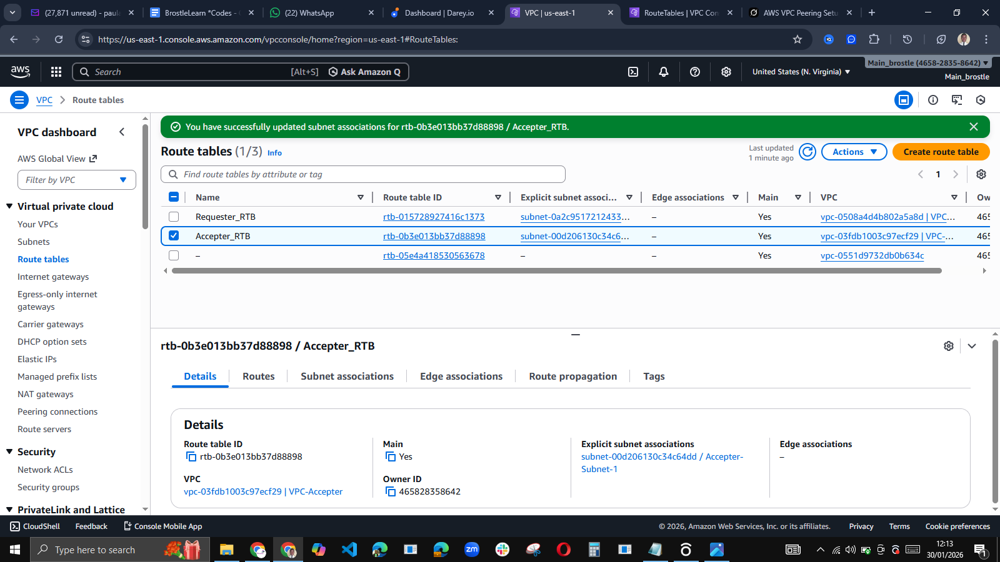

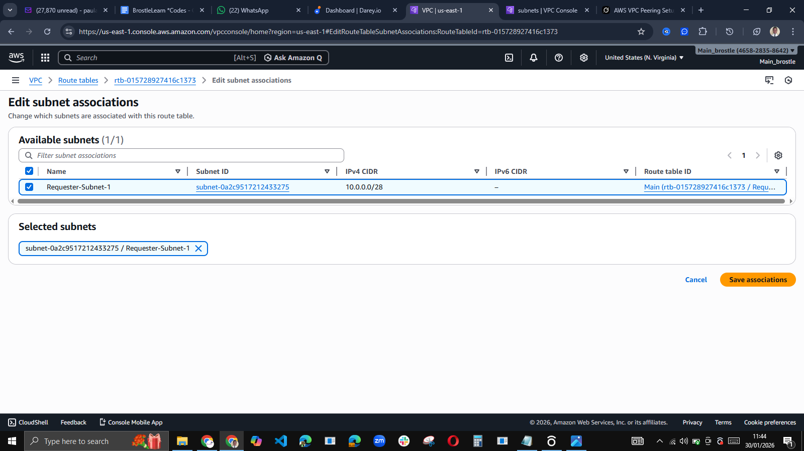

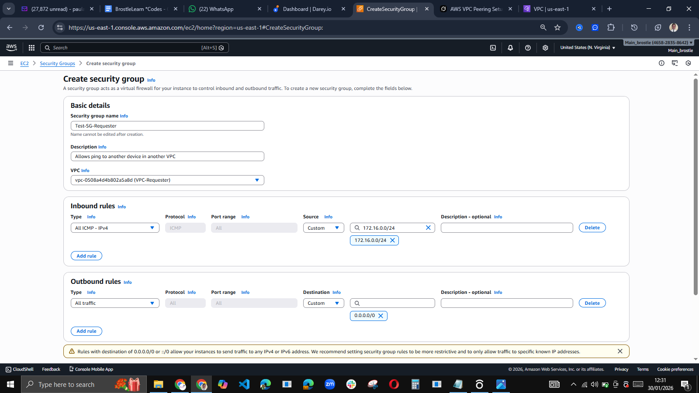

5. **Provision Test Instances**:
   - Launch EC2 instances in each VPC's subnet (e.g., t2.micro with Amazon Linux).

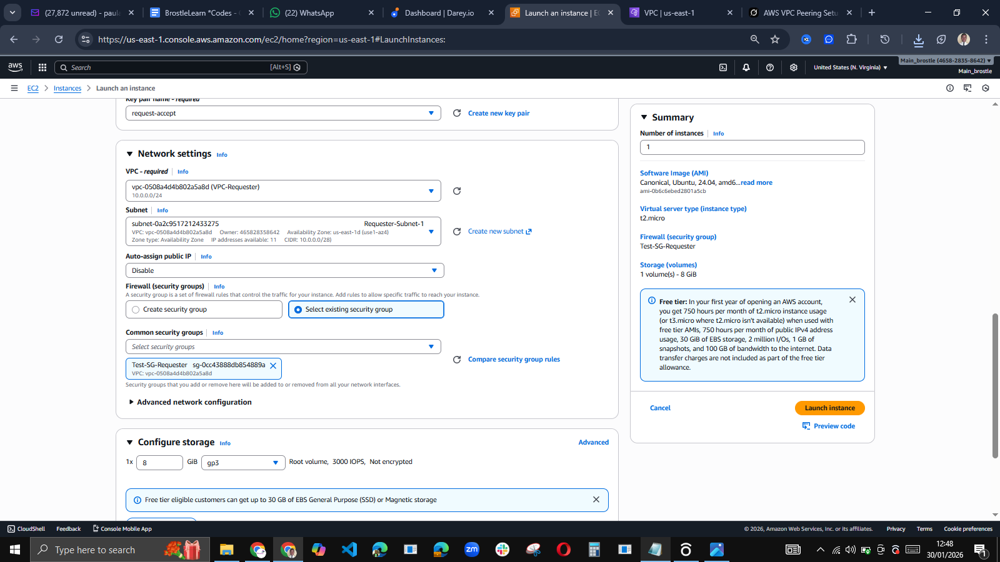

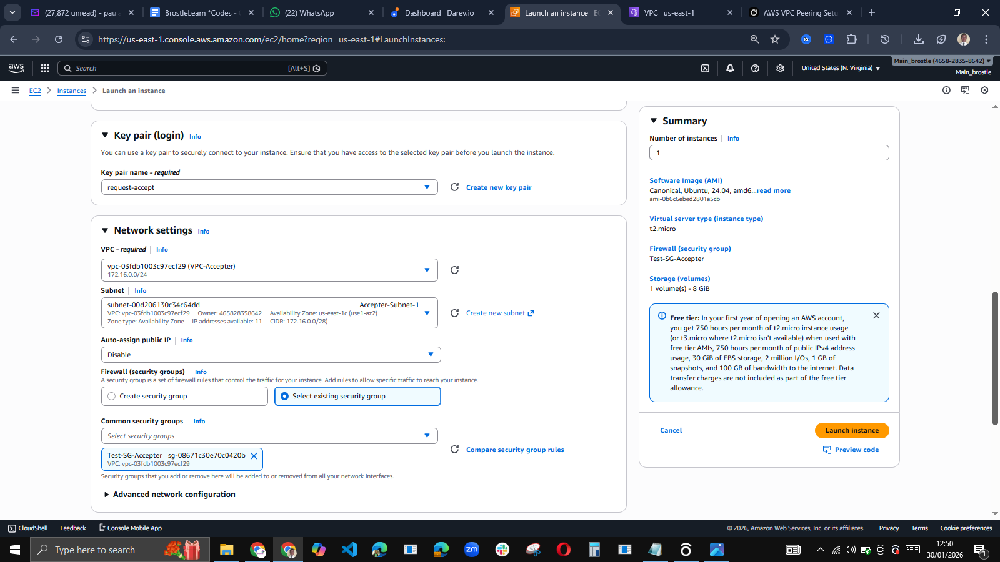

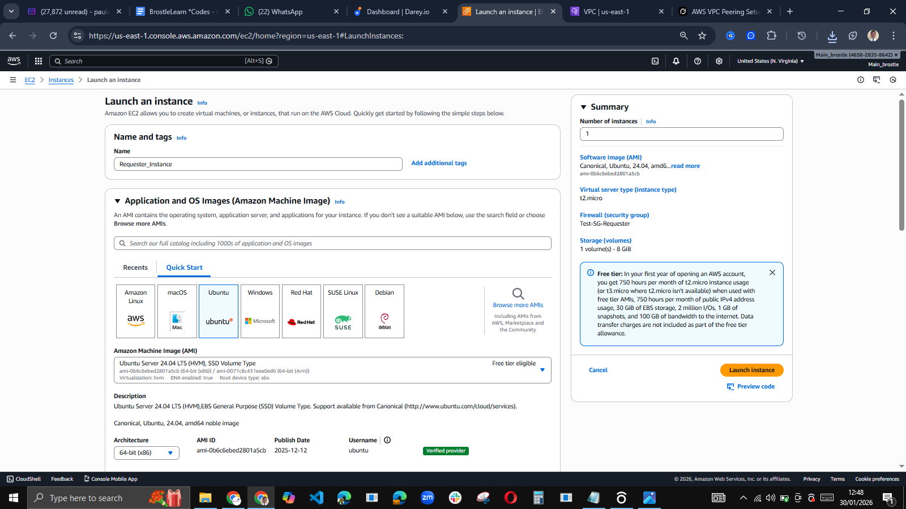

6. **Test Connectivity**:
If we are to keep everything private. The only option for testing is this: 

Add SSM VPC Endpoints (Preferred — Keeps Everything Private)
This creates private links to AWS Systems Manager services, allowing the SSM Agent to register without internet. Repeat for Accepter VPC if needed.

-  Create a Security Group for the Endpoints: EC2 console → Security groups → Create security group.
      Name: SSM-Endpoint-SG.
      VPC: Select Requester VPC (vpc-0508a4d4b802a5a8d).
      Inbound rules: Add HTTPS (TCP 443) with Source = your instance's security group ID (e.g., Test-SG-Requester) or subnet CIDR (e.g., 10.0.0.0/28).
      Outbound: Default (all allowed).
      Create.

-  Create the Three Interface Endpoints:
      VPC console → Endpoints → Create endpoint.
      For each service (one by one):
      Service: AWS services → Search and select:
      -  com.amazonaws.us-east-1.ssm
      -  com.amazonaws.us-east-1.ssmmessages
      -  com.amazonaws.us-east-1.ec2messages

-  VPC: Requester VPC.
   Subnets: Select your private subnet (e.g., Requester-Subnet-1).
   Security groups: Choose SSM-Endpoint-SG.
   Enable Private DNS names.
   Policy: Full access.
   Create.

Wait until all three show "Available" status (1–5 minutes).

-  Verify and Activate SSM:
   Reboot the Requester instance: EC2 console → select instance → Actions → Instance state → Reboot.
   Wait 5–30 minutes.
   Check in Systems Manager console → Fleet Manager → Managed nodes: Instance should show "Online".
   If not, verify IAM role, endpoints in correct subnet, and Private DNS enabled.

-  Connect and Test:
   EC2 console → select Requester instance → Connect → Session Manager → Connect.
   Run ping 172.16.0.11 (Accepter private IP) to test peering.

For detailed steps, refer to the AWS documentation on VPC peering.

## Real-World Scenario
VPC peering is essential for multi-account architectures. For example, consider a company with a "Shared Services" VPC in one AWS account (hosting centralized databases and monitoring tools) and a "Development" VPC in another account (for dev teams). Peering these VPCs allows developers to securely access shared resources without exposing them to the internet, reducing costs and enhancing security. This is common in enterprises for compliance (e.g., isolating prod/dev environments) while enabling collaboration, such as in mergers where integrating partner networks is needed without full VPC merging.

## References
- [AWS VPC Peering Documentation](https://docs.aws.amazon.com/vpc/latest/peering/what-is-vpc-peering.html)
- [Create VPC Peering Connection](https://docs.aws.amazon.com/vpc/latest/peering/create-vpc-peering-connection.html)

## How to Bridge Test → Prod in Your VPC Peering Project
A good flow looks like this:

1. **Quick validation (what you've mostly done so far)**
- Two tiny subnets, two t3.micro instances
- ICMP allowed both ways
- Ping succeeds → basic peering/routing works

2. **Tighten to "pre-prod" / staging-like**
- Replace ICMP with real application ports (e.g., 443, 3306)
- Use security group referencing instead of broad CIDR
- Disable public IPs, use Session Manager for access
- Add basic NACL deny rules
- Enable VPC Flow Logs (to CloudWatch)
- Test real traffic (curl, telnet, app-level checks)

3. **Go full production**
- Multi-AZ subnets
- Auto Scaling Groups / ECS / EKS instead of single instances
- IAM roles, least-privilege policies
- CloudTrail + Config + GuardDuty monitoring
- PrivateLink or Transit Gateway if scale grows
- Automated IaC (Terraform / CDK / CloudFormation)
- Approval gates, change management