# S3 Upload Alert System Using AWS EventBridge and SNS


This project implements a simple, serverless notification system that sends email alerts to team members whenever a file (e.g., an inventory/stock spreadsheet) is uploaded to a specific S3 bucket.

The purpose is to notify managers or procurement staff quickly when updated stock information becomes available, without requiring manual polling or complex applications.

### Architecture Overview

```
Staff / User
     ↓
     Upload file (e.g. stock_sheet.xlsx)
     ↓
Amazon S3 Bucket (alertmangerstockfiles)
     ↓ (Object Created event)
Amazon EventBridge (default bus)
     ↓ (Rule matches pattern)
Amazon SNS Topic (AlertManager)
     ↓ (email protocol)
Manager / Team Emails
```

Main components:
- **S3 Bucket**: Stores uploaded inventory files
- **EventBridge Rule**: Detects object creation events from the bucket
- **SNS Topic**: Publishes notifications to subscribed email addresses
- **Execution Role**: Allows EventBridge to publish messages to SNS

### Features
- Real-time email notifications on every file upload (ObjectCreated events: Put, Post, Copy, CompleteMultipartUpload)
- Two email recipients supported (can be extended)
- Serverless — no EC2, Lambda, or containers required
- Low cost (typically pennies per month for low-volume alerts)
- Uses native AWS event-driven architecture

### Prerequisites
- AWS account with permissions to create:
  - S3 buckets
  - EventBridge rules
  - SNS topics & email subscriptions
  - IAM roles & policies

### Setup Instructions (Manual via AWS Console)


1. **Create SNS Topic**
   - Name: `AlertManager`
   - Type: Standard
   - Create two email subscriptions (e.g. your Gmail and manager's email)
   - Confirm both subscriptions via the confirmation emails

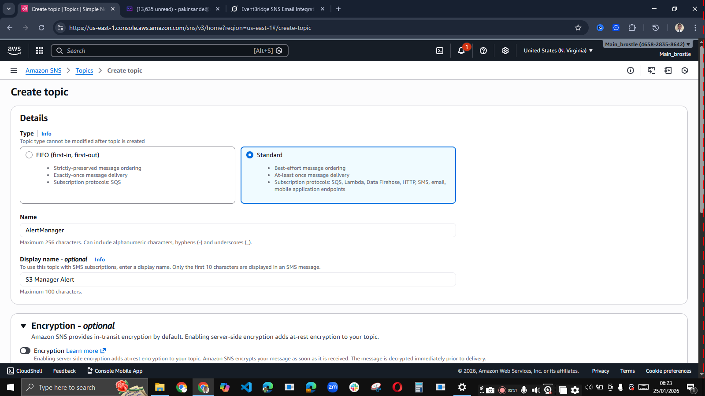


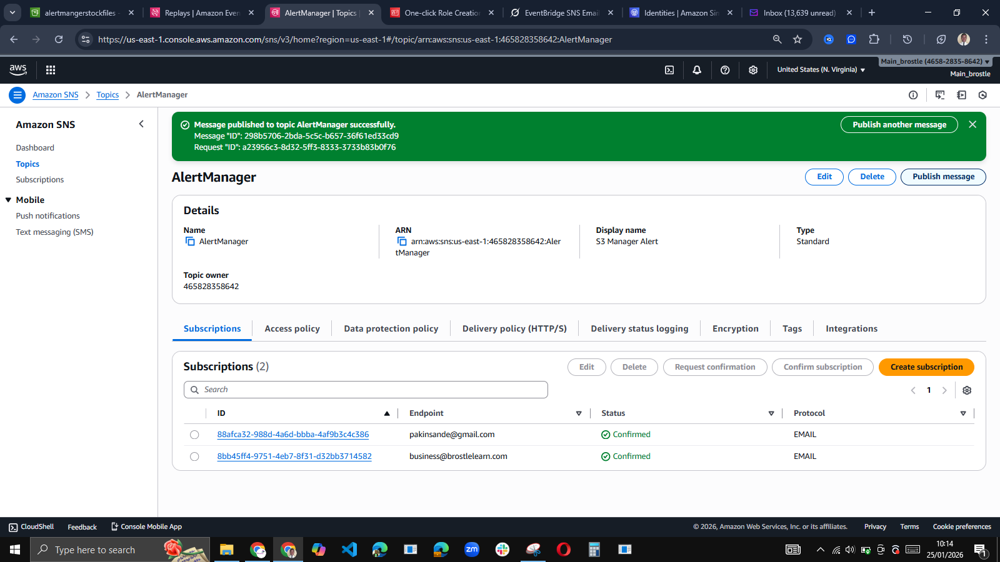


2. **Create S3 Bucket**
   - Name: `alertmangerstockfiles` (or your preferred name)
   - Region: us-east-1 (or adjust all resources to your region)
   - Keep Requester Pays **disabled**
   - Enable **Amazon EventBridge** notifications (Properties → Event notifications → Amazon EventBridge → On)


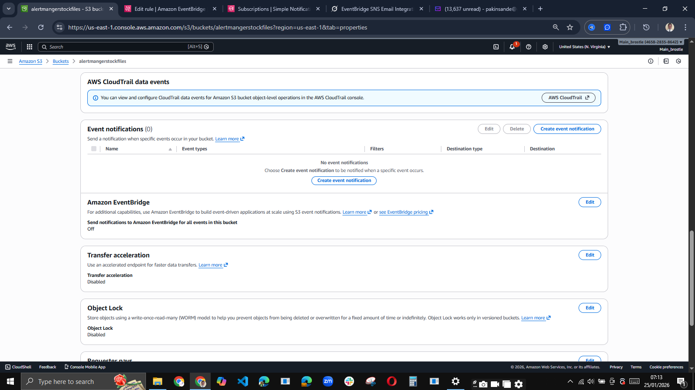


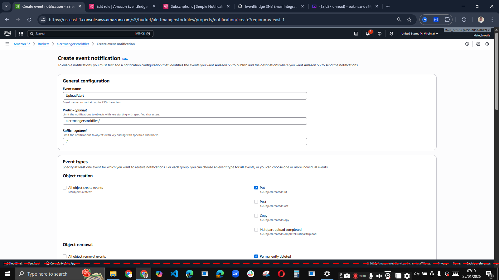

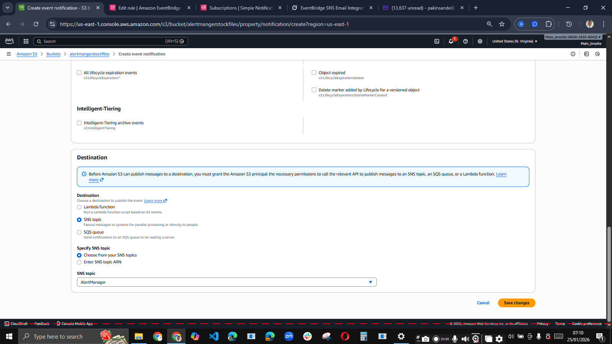


3. **Create IAM Role for EventBridge**
   - Name: `Amazon_EventBridge_Invoke_Sns_New` (or similar)
   - Trusted entity: Service → EventBridge (`events.amazonaws.com`)
   - Permission: inline policy with
     ```json
     {
         "Version": "2012-10-17",
         "Statement": [
             {
                 "Effect": "Allow",
                 "Action": "sns:Publish",
                 "Resource": "arn:aws:sns:us-east-1:YOUR_ACCOUNT_ID:AlertManager"
             }
         ]
     }
     ```
   - Trust policy (recommended secure version):
     ```json
     {
         "Version": "2012-10-17",
         "Statement": [
             {
                 "Effect": "Allow",
                 "Principal": { "Service": "events.amazonaws.com" },
                 "Action": "sts:AssumeRole",
                 "Condition": {
                     "StringEquals": {
                         "aws:SourceAccount": "YOUR_ACCOUNT_ID",
                         "aws:SourceArn": "arn:aws:events:us-east-1:YOUR_ACCOUNT_ID:rule/S3_alertmanager_rule"
                     }
                 }
             }
         ]
     }
     ```

4. **Create EventBridge Rule**
   - Name: `S3_alertmanager_rule`
   - Event bus: default
   - Event pattern:
     ```json
     {
       "source": ["aws.s3"],
       "detail-type": ["Object Created"],
       "detail": {
         "bucket": {
           "name": ["alertmangerstockfiles"]
         }
       }
     }
     ```
   - Target: SNS topic → `AlertManager`
   - Execution role: select the role you created above


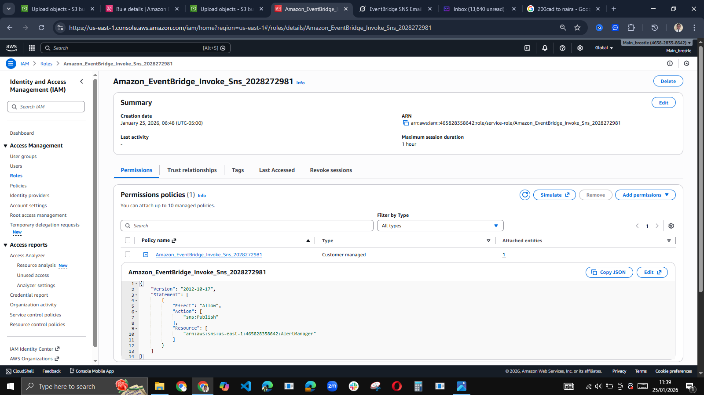

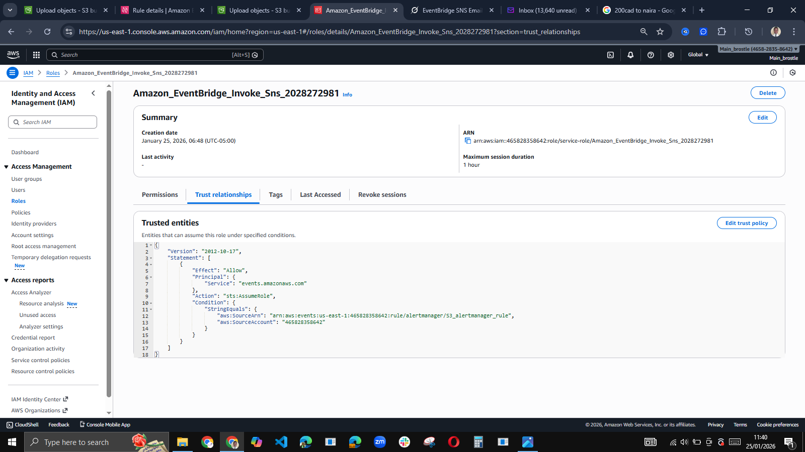

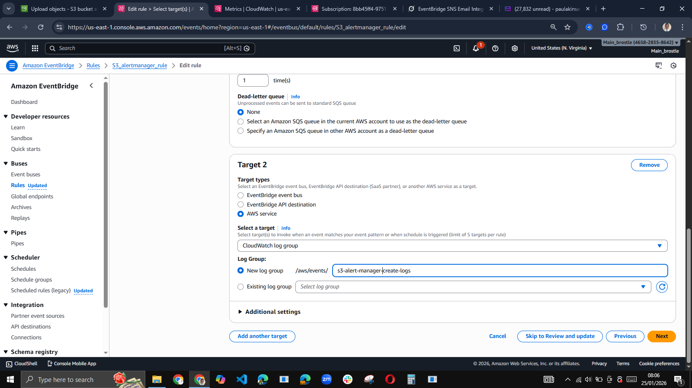


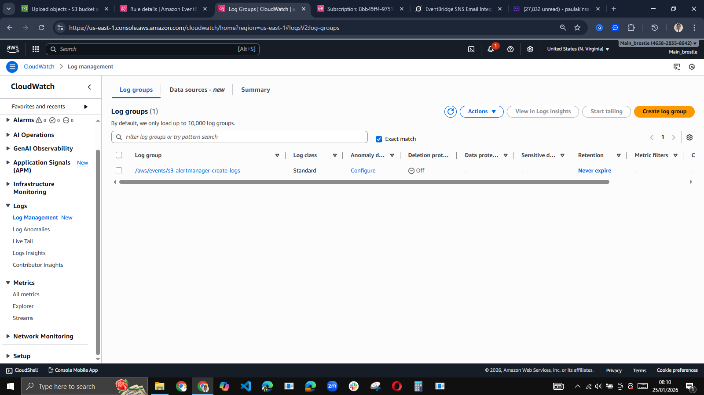

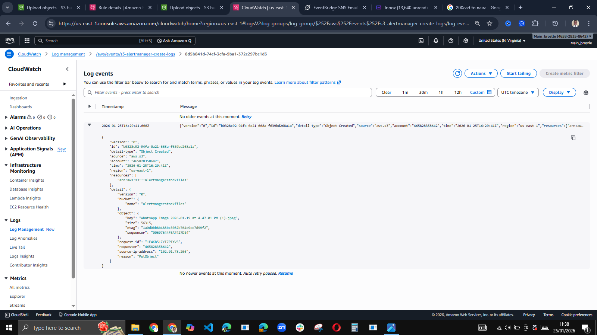


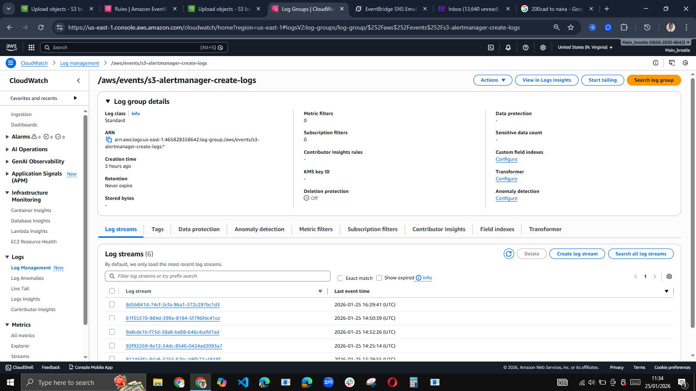


5. **Test**
   - Upload any file (e.g. `stock_sheet.xlsx`) to the bucket
   - Wait 10–60 seconds
   - Check both subscribed email inboxes (including spam/junk)


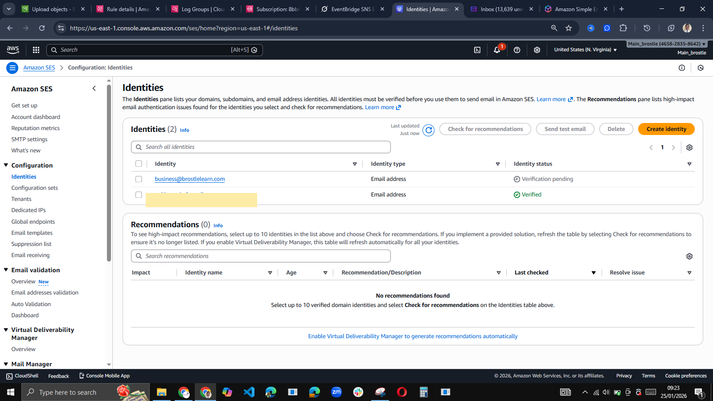


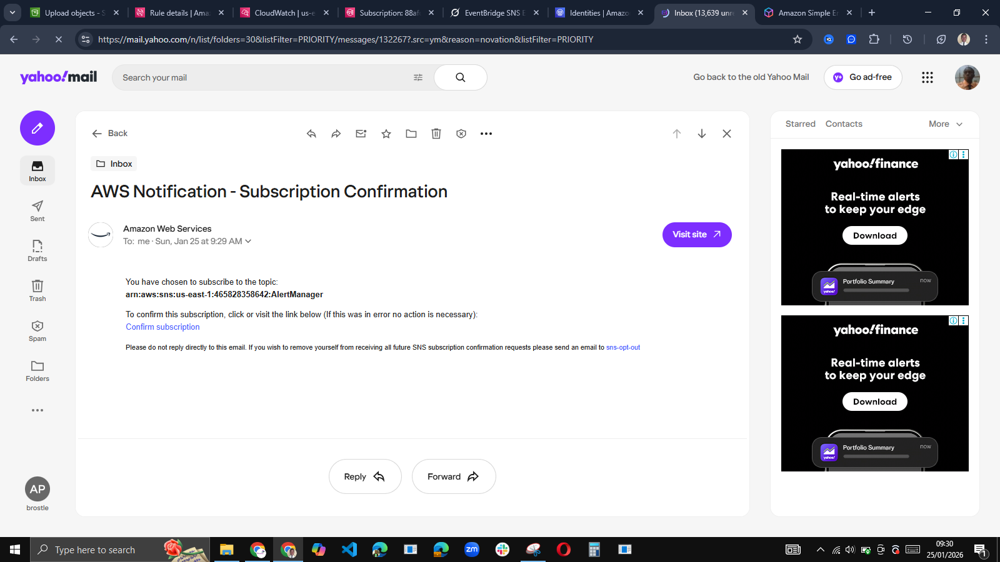

### Usage
- Staff simply upload or overwrite files in the bucket using:
  - AWS Management Console
  - AWS CLI: `aws s3 cp stock_sheet.xlsx s3://alertmangerstockfiles/`
  - Any S3-compatible tool
- Every upload triggers an email with the default JSON payload containing bucket name, object key, event time, etc.

### Cost Considerations
- Extremely low for typical use (a few uploads per day):
  - S3: ~$0.023/GB/month storage + tiny request fees
  - EventBridge: ~$1 per million events
  - SNS: ~$0.50 per million publishes + $0.02 per 100 email deliveries
- Monitor via AWS Cost Explorer (filter by service: S3, SNS, Events)


### Cleanup (To Avoid Any Charges)
1. Delete EventBridge rule `S3_alertmanager_rule`
2. Delete SNS topic `AlertManager` (deletes subscriptions)
3. Empty and delete S3 bucket `alertmangerstockfiles`
4. Delete IAM role(s) used (`Amazon_EventBridge_Invoke_Sns_New`, etc.)
5. Delete related CloudWatch log groups (if created)


### Optional Enhancements (Future Ideas)
- Add input transformer to make emails human-readable
- Filter to only trigger on `.xlsx` files (add suffix filter)
- Add dead-letter queue for failed deliveries
- Replace manual uploads with DynamoDB + streams for real-time stock updates
- Add SMS notifications via another SNS subscription

