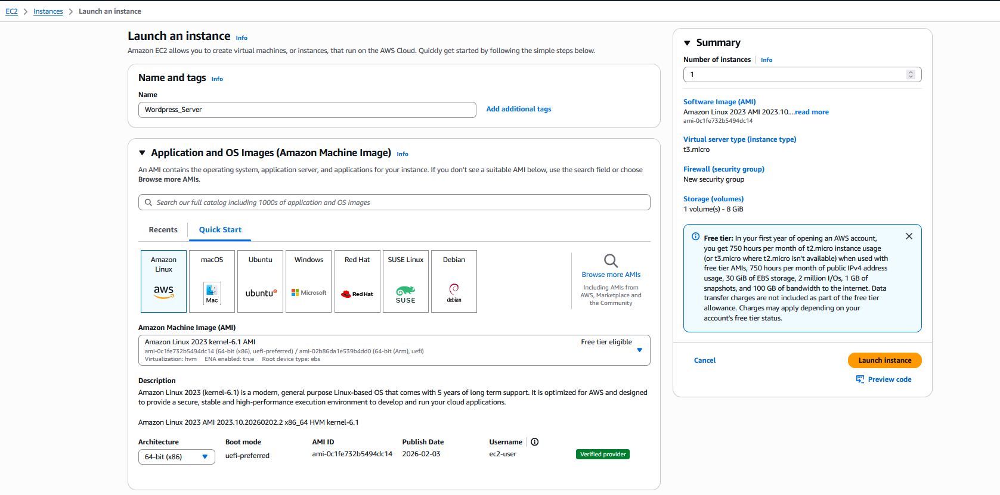
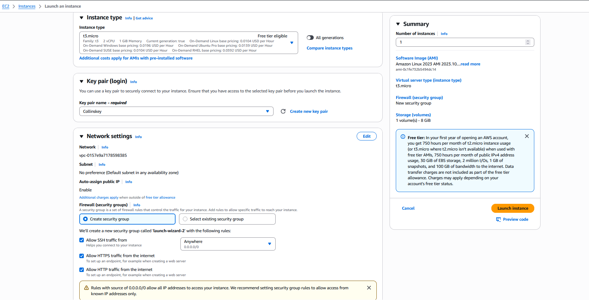
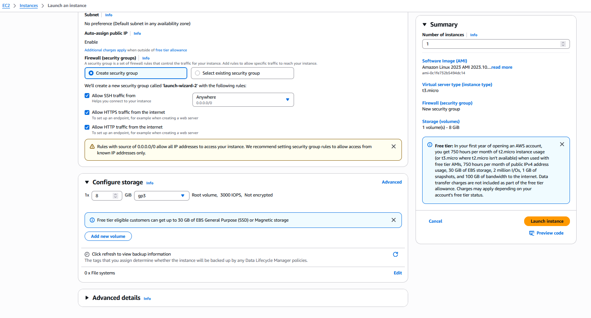
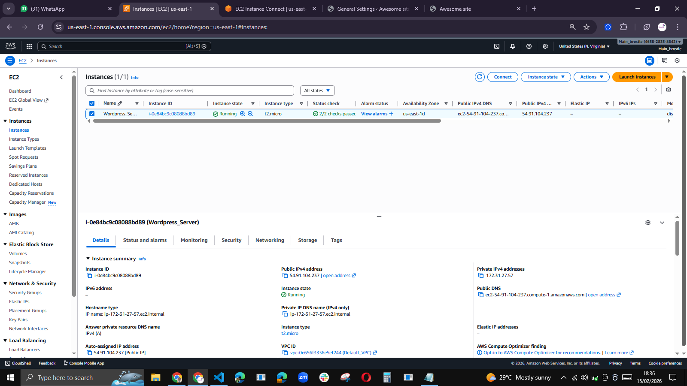
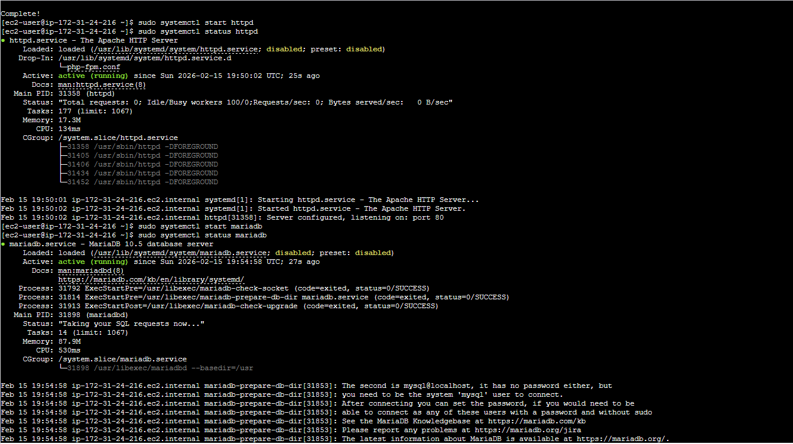
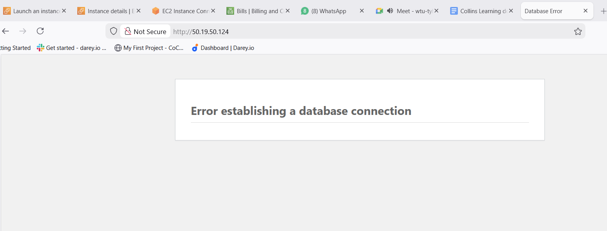

### Monolithic Arch WordPress Website_LAMP


In this architecture the frontend, backend and DB are constructed on a Single Server

#### 1. Launch an EC2 Instance

*   Log in to the AWS Management Console and navigate to the EC2 Dashboard.
    - Click Launch Instance.
    - Name and Tags: Give your instance a name, e.g., "WordPress-Server".
        Application and OS Images (Amazon Machine Image): Search for and select "Amazon Linux 2023 AMI" (it's based on Fedora and uses dnf for packages).
        Instance Type: Select t3.micro (free-tier eligible, 2 vCPUs, 1 GiB memory).
    - Key Pair (Login): Under "Key pair", click Create new key pair. Name it (e.g., "wp-key"), select .pem format, and download the file. Keep it secure (chmod 400 on your local machine).
    - Network Settings: Under "Firewall (security groups)", create a new security group or edit the default.
        Allow inbound rules:
        SSH: Type "SSH", Port 22, Source "My IP" (or 0.0.0.0/0 for anywhere, but restrict for security).
        HTTP: Type "HTTP", Port 80, Source 0.0.0.0/0.
        HTTPS: Type "HTTPS", Port 443, Source 0.0.0.0/0.


    - Configure Storage: Default 8 GiB gp3 volume is fine.
    - Review and click Launch Instance. Wait for the instance to reach "Running" status.
    - Note and copy the Public IPv4 address (e.g., 3.123.45.67) from the instance details.











#### 2. Connect to the EC2 Instance via SSH

    - Open a terminal on your local machine.
    - Navigate to the directory where your .pem key is saved.
    - Make the key read-only:textchmod 400 your-key.pem
    - Connect using SSH (replace with your key name and public IP):text 
```ssh -i "your-key.pem" ec2-user@your-instance-public-ip``` . For Amazon Linux, the default user is ec2-user.
    Accept the host key fingerprint if prompted.


#### 3. Install the LAMP Stack

```bash
# Update the system packages
sudo dnf update -y

# Install Apache (httpd), PHP, and MariaDB (MySQL-compatible), This installs Apache 2.4, PHP 8.x, and MariaDB 10.5
sudo dnf install -y httpd wget php-fpm php-mysqli php-json php php-devel mariadb105-server

# Start the Apache and MariaDB services:
sudo systemctl start httpd
sudo systemctl start mariadb

# Enable them to start on boot:
sudo systemctl enable httpd
sudo systemctl enable mariadb

# Verify Apache is running: Open a browser and visit http://your-instance-public-ip. You should see the Apache test page.

# Secure MariaDB (optional but recommended for production):

# Follow prompts: 
# - Enter current password(press enter), 
# - Switch to unix_socket(press N, if this shows, else it can create a conflict at wordpress script), 
# - Change/set root password(press Y, then enter new Master Passwod 2x, e.g MySuperSecureRootPass2026!), 
# - Remove anonymous users(Press Y), 
# - Disallow remote root login(Press Y), 
# - Remove test DB(Press Y), reload privileges(Press Y).

sudo mysql_secure_installation
``` 








#### 4. Configure the Database for WordPress

```bash
# Log in to MariaDB as root (if you set a password in the secure installation, use -p and enter it, and if not then use sudo mysal -u root):
sudo mysql -u root -p

# Create the WordPress database, :
CREATE DATABASE wordpress_db;

# Create a database user for wordpress database and set a strong password (replace 'StrongPassword' with your own):
CREATE USER 'wp_user'@'localhost' IDENTIFIED BY 'StrongPassword';

# Grant privileges to the user:
GRANT ALL PRIVILEGES ON wordpress_db.* TO 'wp_user'@'localhost';

# Apply changes and exit:
FLUSH PRIVILEGES;
SHOW DATABASES;
EXIT;
```


#### 5. Install WordPress

```bash
# Navigate to the web root directory:
cd /var/www/html

# Download the latest WordPress:
sudo wget https://wordpress.org/latest.tar.gz

# Extract the archive:
sudo tar -xzf latest.tar.gz

# Move WordPress files to the web root:
sudo cp -r wordpress/* /var/www/html/

# Clean up:
sudo rm -rf wordpress latest.tar.gz

# Set permissions for Apache to own the files (Apache runs as 'apache' user/group on Amazon Linux):
sudo chown -R apache:apache /var/www/html/
sudo chmod -R 755 /var/www/html/
# sudo nano /etc/selinux/config
# Find the line SELINUX=enforcing and change it to: SELINUX=permissive

# Create a WordPress configuration file from the sample:
sudo cp /var/www/html/wp-config-sample.php /var/www/html/wp-config.php

# Edit the config file to add database details (use nano or vim):
sudo nano /var/www/html/wp-config.php

# Find and update these lines:
define('DB_NAME', 'wordpress_db');
define('DB_USER', 'wp_user');
define('DB_PASSWORD', 'StrongPassword');
define('DB_HOST', 'localhost');
# Save and exit (Ctrl+O, Enter, Ctrl+X for nano).
```


#### 6. Finalize WordPress Setup

* Open a web browser and navigate to your EC2 instance's public IP: http://your-instance-public-ip.
* You'll see the WordPress setup wizard.
* Select your language and click Continue.
* Enter site details: Site Title, Username (admin), Password (strong one), Email.
    The details you enter in the WordPress Setup Wizard (Site/Admin Credentials)
    These are the WordPress admin user details — what you (and only you, or other admins you create later) use to log in to the WordPress dashboard (/wp-admin).

    Site Title → Just the name of your website (e.g., "Paul's Blog" or "My Awesome Site").
    Username → The login username for your admin account (e.g., admin, paul, superuser — avoid plain "admin" for security reasons if possible).
    Password → A strong password for that admin account (generate a long, random one — different from your database password).
    Email → Your email address (used for admin notifications, password recovery, etc.).

    These get stored inside the database (in the wp_users and wp_usermeta tables) after installation. They have nothing to do with the database connection itself.

* Click Install WordPress.
* Log in at http://your-instance-public-ip/wp-admin with your new credentials into your wordpress dashboard.
* Now visit to see your wordpress site: http://your-instance-public-ip


* For HTTPS (recommended): Install a free SSL certificate using Certbot (requires domain name pointed to your IP). 
    -   First, install Certbot: 
        ```sudo dnf install -y certbot python3-certbot-apache```
        ```sudo certbot --apache```
* Follow prompts to configure SSL.


#### References:

1. https://www.youtube.com/watch?v=8Uofkq718n8 


