3-Tier Infrastruture, RDS, SSM, Cloudwatch, no NAT Gateway, no bastion. 

### Architecture

### Infrastructure setup


### Setup VPC

* Create VPC: Name = three-tier-vpc, IPv4 CIDR = 10.0.0.0/16
* Create 4 subnets (2 public + 2 private, spread across 2 AZs):
* Create Internet Gateway: Name = three-tier-igw, attach to VPC
* Create Route Tables:
* Public-rt: Add route 0.0.0.0/0 → Internet Gateway; associate both public subnets
* Private-rt: No default route (no NAT); associate both private subnets
* Attach private & public subnet route tables to S3 gateway endpoints


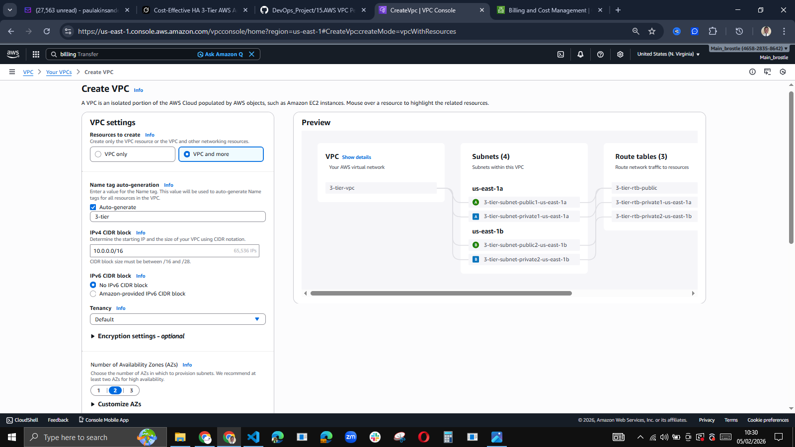

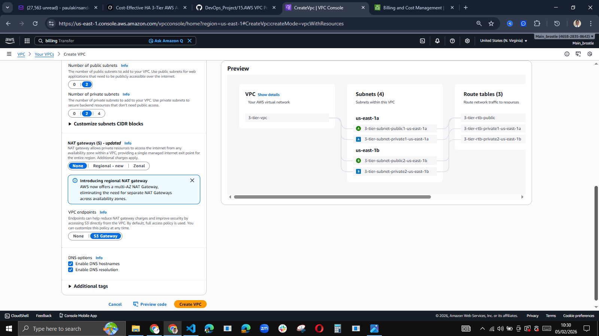


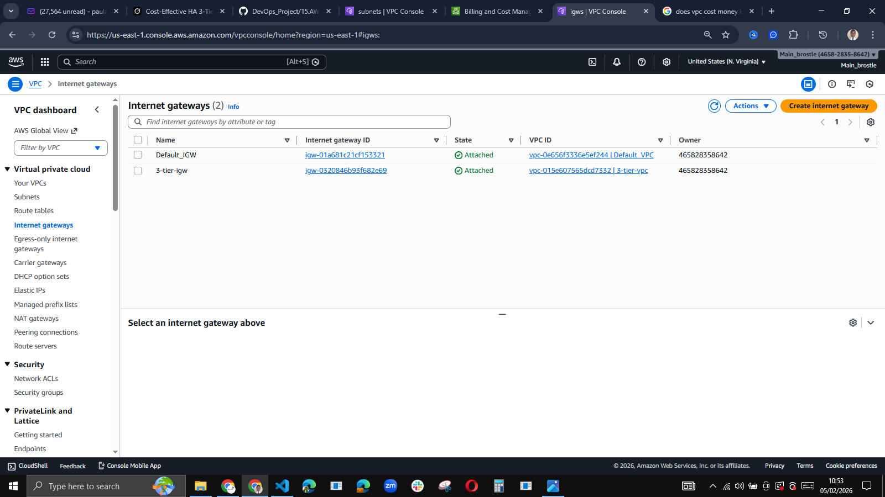


### Create Security Group & Edit Inbound/Outbound Rule

You need create them accordingt o this order due to reference to other security group

* **web_alb_sg**
  - Inbound rules: HTTP 80 ← 0.0.0.0/0
  - Outbound rules: HTTP 80 → 10.0.0.0/16 (VPC CIDR) 
                              

* **web_ec2_sg**
  - Inbound rules: HTTP 80 ← web_alb_sg 
  - Outbound rules: Custom TCP 3000 → app_alb_sg
                    HTTPS (TCP 443) → 0.0.0.0/0 (for GitHub, npm, HTTPS repos)
                    HTTP (TCP 80) → 0.0.0.0/0 (fallback for some HTTP mirrors/repos)
                    

* **app_alb_sg**
  - Inbound rules: Custom TCP 3000 ← web_ec2_sg (no internet inbound)
  - Outbound rules: Custom TCP 3000 → 10.0.0.0/16 (VPC CIDR)
                                      

* **app_ec2_sg**
  - Inbound rules: Custom TCP 3000 ← app_alb_sg (no internet inbound)
  - Outbound rules: MySQL/Aurora TCP 3306 → data_sg
                    HTTPS (TCP 443) → 0.0.0.0/0 (for GitHub, npm, HTTPS repos)
                    HTTP (TCP 80) → 0.0.0.0/0 (fallback for some HTTP mirrors/repos)

* **data_sg**
  - Inbound rules: MySQL/Aurora TCP 3306 ← app_ec2_sg
  - Outbound rules: None(confirm)


* **ssm_endpoint_sg**
  - Inbound rules: HTTPS 443 ← 10.0.0.0/16 (VPC CIDR)
  - Outbound rules: All traffic → 0.0.0.0/0


Create all 6 groups with only the non-referencing rules (e.g., inbound from CIDR, outbound to ssm_endpoint_sg or data_sg where possible).
Then in a second pass, edit each one to add the cross-SG references (they'll all exist by then).

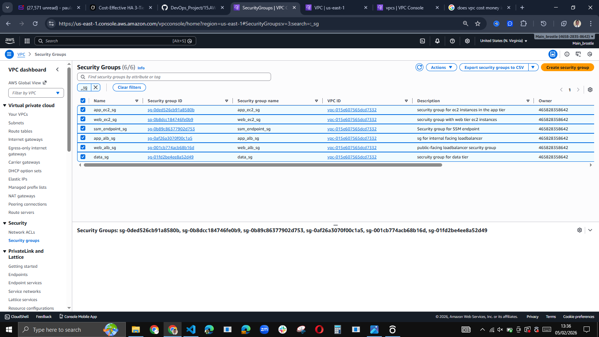


### Create IAM Role, Instance Profile for SSM & Endpoints
This is required so instances can register with SSM and allow Session Manager connections (no SSH/bastion needed). Do this before creating launch templates. Attach permissions: Search and attach the AWS managed policy: AmazonSSMManagedInstanceCore (this is the standard, minimal policy for SSM Agent + Session Manager)

* Create SSM Instance role


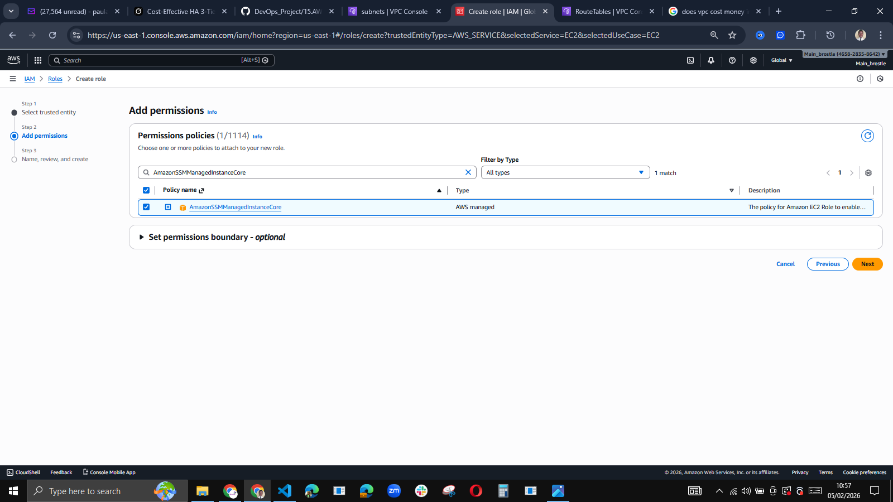


* Create SSM endpoints
  Go to VPC → Endpoints → Create endpoint (Interface type, repeat 3 times):
  -  Service name = com.amazonaws.us-east-1.ssm
  -  Service name = com.amazonaws.us-east-1.ssmmessages
  -  Service name = com.amazonaws.us-east-1.ec2messages


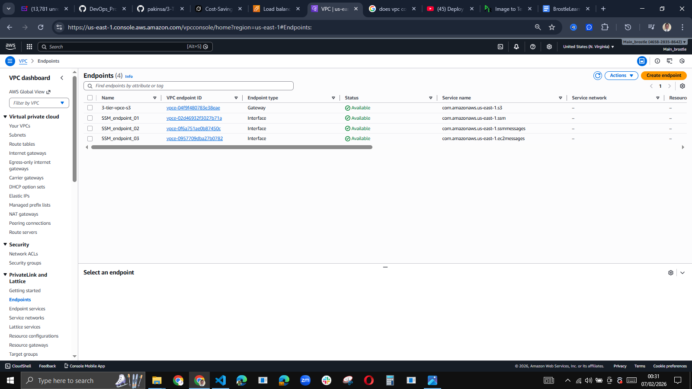


### Create Target Group

* EC2 → Target groups → Create target group (repeat twice):

- web-tg:
  Target type = Instances
  Protocol = HTTP, Port = 80
  VPC = three-tier-vpc
  Health checks: Protocol = HTTP, Path = / or /health, Success codes = 200–399, Time out = 6s, Interval = 30s, Healthy threshold = 3, Unhealthy = 2


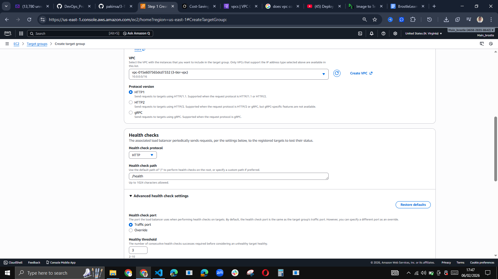


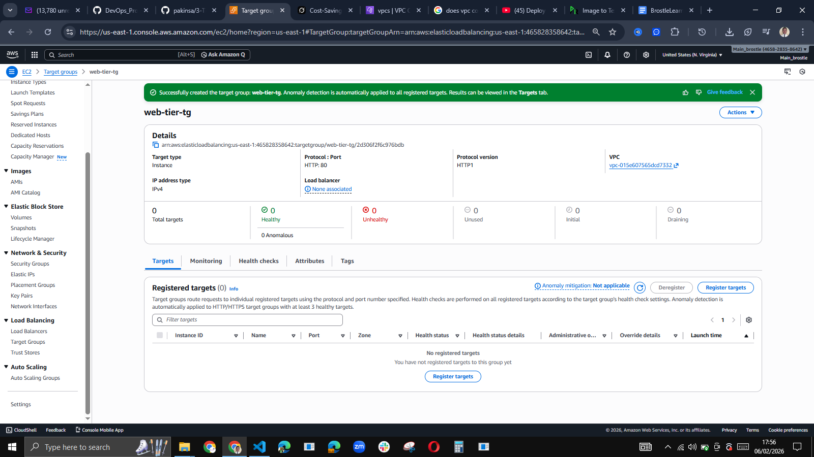


- app-tg:
  Target type = Instances
  Protocol = HTTP, Port = 3000 (match your Node.js listen port)
  VPC = three-tier-vpc
  Health checks: Protocol = HTTP, Path = /health (add this route in your Node.js app), Success codes = 200, Time out = 6s, Interval = 30s, Healthy threshold = 3, Unhealthy = 2

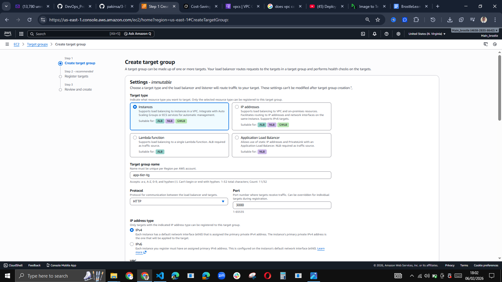

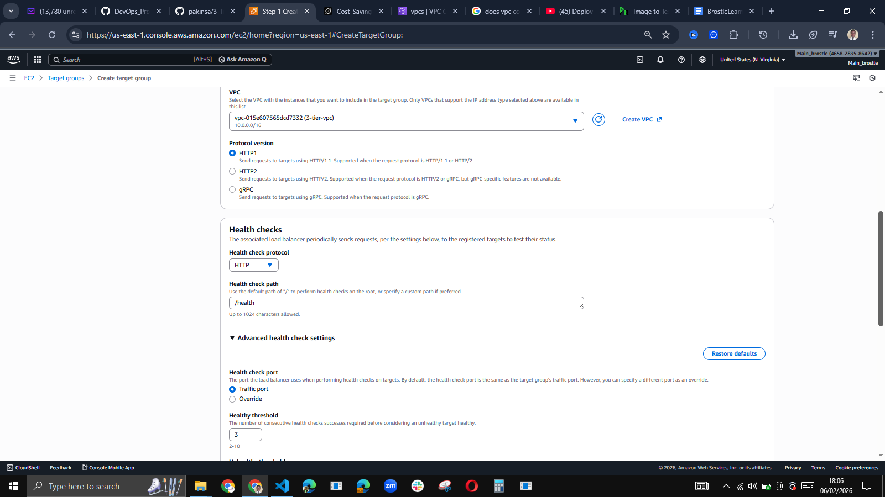

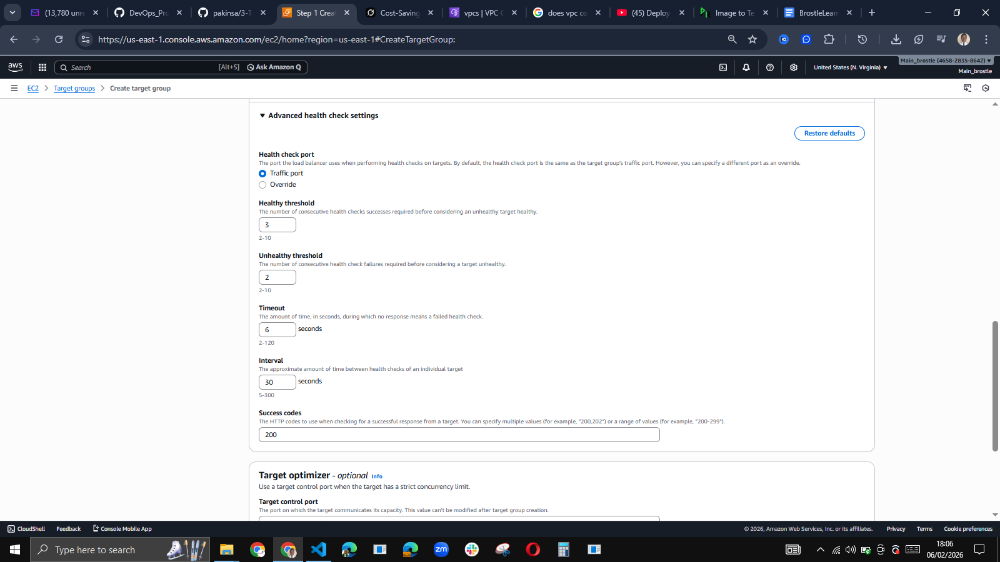


### Create Load Balancers
EC2 → Load Balancers → Create Application Load Balancer (repeat twice):
web-alb: Internet-facing, subnets = both public, SG = web-alb-sg, Listener HTTP:80 → forward to web-tg
app-alb: Internal, subnets = both public, SG = app-alb-sg, Listener HTTP:3000 → forward to app-tg


### ### Create S3

* Git clone repo, Build, & upload code Zip file to S3 

```bash
    git clone https://github.com/pakinsa/react_node_rds.com    
    
    cd frontend/
    npm install && npm run build
    zip -r frontend-build.zip .
    aws s3 cp frontend-build.zip s3://paul-3tier-artifacts/ # you can upload via S3 console

    cd backend/
    npm install
    zip -r backend-build.zip .
    aws s3 cp backend-build.zip s3://paul-3tier-artifacts/ # you can upload via S3 console
```


 


### Create RDS (Data tier)

  * Create db subnet group


  * Create database:
    RDS → Create database
    Engine = MySQL, Multi-AZ = Yes
    Instance = db.t3.micro, Storage = 20 GiB
    DB name, username, password
    VPC = your VPC, subnet group = new group with both private subnets
    SG = db-sg, Public access = No
    Advanced config: db_name


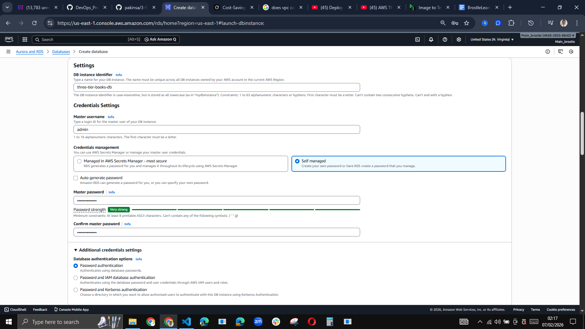


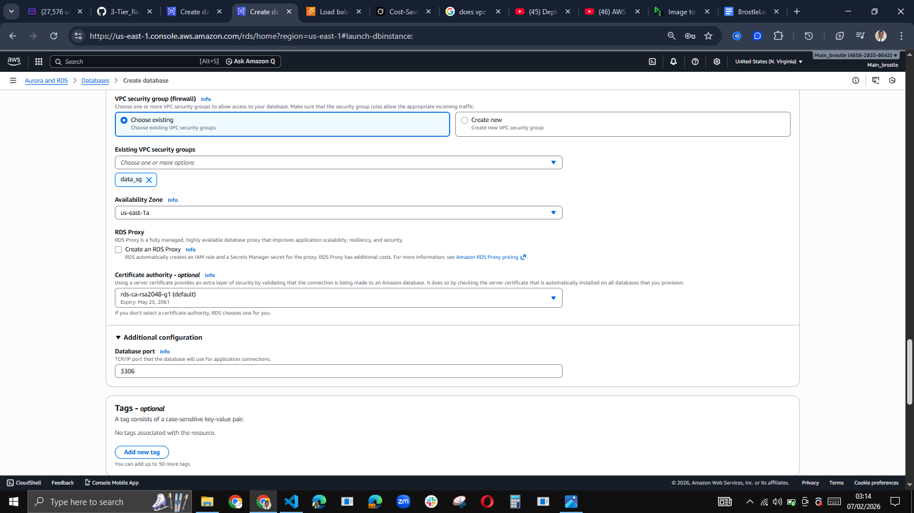


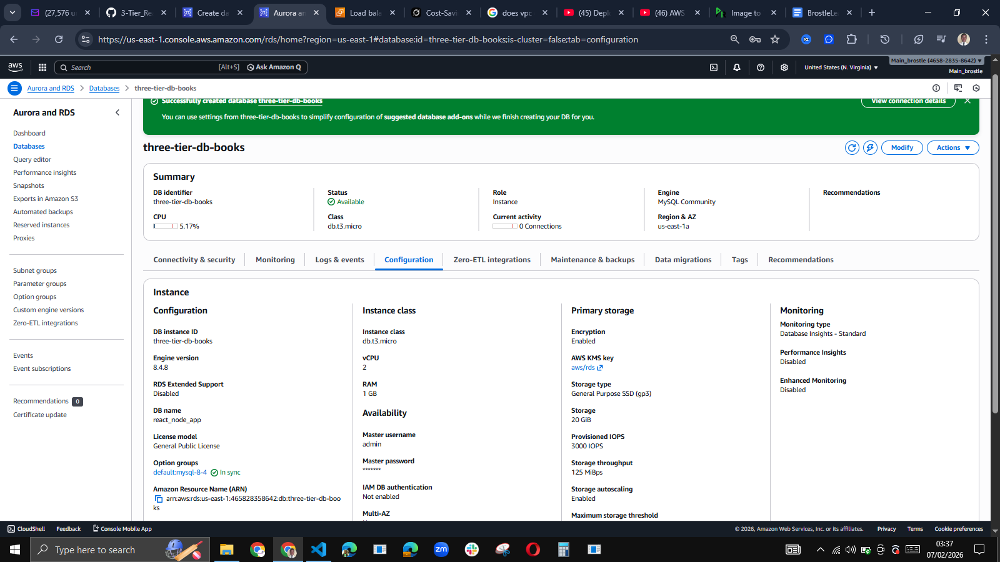

  
    


### Create ASG
* **Create Launch Templates** (EC2 → Launch Templates → Create launch template):

  * **UserData for Web Tier Launch Template**
  **web-tier-lt**: AMI = Amazon Linux 2023, t2.micro, SG = web-sg, Public IP = Enable, User data = (input right credentials where necessary into userdata above before copy & paste)
  **Both**: IAM instance profile/role with AmazonSSMManagedInstanceCore policy attached

```bash
#!/bin/bash
set -euo pipefail

# 1. Install dependencies
sudo dnf update -y
sudo dnf install -y nginx unzip awscli

# 2. Variables
S3_BUCKET="paul-3tier-artifacts"
ZIP_FILE="frontend-build.zip"
APP_ALB_DNS="internal-app-tier-alb-2037459119.us-east-1.elb.amazonaws.com"  # ensure you remove this internal dns and replcace with yours

# 3. CONFIGURE MAIN NGINX (Core Settings)
sudo mv /etc/nginx/nginx.conf /etc/nginx/nginx.conf.bak
sudo tee /etc/nginx/nginx.conf << 'EOF'
user nginx;
worker_processes auto;
error_log /var/log/nginx/error.log notice;
pid /run/nginx.pid;

events {
    worker_connections 1024;
}

http {
    include       /etc/nginx/mime.types;
    default_type  application/octet-stream;
    sendfile        on;
    keepalive_timeout  65;
    include /etc/nginx/conf.d/*.conf;
}
EOF

# 4. Download and Extract Frontend
sudo aws s3 cp "s3://${S3_BUCKET}/${ZIP_FILE}" /tmp/${ZIP_FILE}
sudo unzip -o /tmp/${ZIP_FILE} -d /usr/share/nginx/html/

# 5. Immediate fix for the 'dist' subfolder
if [ -d "/usr/share/nginx/html/dist" ]; then
    sudo mv /usr/share/nginx/html/dist/* /usr/share/nginx/html/
    sudo rm -rf /usr/share/nginx/html/dist
fi

# 6. THE CRITICAL FIX: Replace hardcoded Localhost with Relative Path
sudo find /usr/share/nginx/html/ -type f -name "*.js" -exec sed -i 's|http://localhost:3000/api|/api|g' {} +

# 7. NEW: Create Dynamic test.html with Metadata (Using Absolute Path)
TOKEN=$(curl -X PUT "http://169.254.169.254" -H "X-aws-ec2-metadata-token-ttl-seconds: 21600")
INSTANCE_ID=$(curl -H "X-aws-ec2-metadata-token: $TOKEN" -s http://169.254.169.254)
AVAIL_ZONE=$(curl -H "X-aws-ec2-metadata-token: $TOKEN" -s http://169.254.169.254)

sudo tee /usr/share/nginx/html/test.html <<EOF
<!DOCTYPE html>
<html>
<head>
    <title>Server Info</title>
    <style>
        body { font-family: sans-serif; display: flex; justify-content: center; align-items: center; height: 100vh; margin: 0; background: #232f3e; color: white; }
        .card { background: #ffffff; color: #333; padding: 2rem; border-radius: 12px; box-shadow: 0 4px 20px rgba(0,0,0,0.3); text-align: center; }
        h1 { color: #ec7211; }
        .data { font-family: monospace; background: #eee; padding: 2px 6px; border-radius: 4px; color: #d13212; }
    </style>
</head>
<body>
    <div class="card">
        <h1>EC2 Metadata</h1>
        <p><strong>Instance ID:</strong> <span class="data">$INSTANCE_ID</span></p>
        <p><strong>AZ:</strong> <span class="data">$AVAIL_ZONE</span></p>
        <hr>
        <p><small>Served by Nginx on Amazon Linux 2023</small></p>
    </div>
</body>
</html>
EOF

# 8. Fix Permissions
sudo chown -R nginx:nginx /usr/share/nginx/html/
sudo find /usr/share/nginx/html/ -type d -exec chmod 755 {} +
sudo find /usr/share/nginx/html/ -type f -exec chmod 644 {} +

# 9. Create Server-Specific Configuration (With explicit /test.html block)
cat << 'EOF' | sudo tee /etc/nginx/conf.d/default.conf
server {
    listen 80 default_server;
    server_name _;
    root /usr/share/nginx/html;
    index index.html;

    # EXPLICIT RULE for test.html to prevent React Router from hijacking it
    location = /test.html {
        try_files /test.html =404;
    }

    # Forward API calls to the App ALB
    location /api/ {
        proxy_pass http://REPLACE_ME_ALB_DNS:3000;
        proxy_set_header Host $host;
        proxy_set_header X-Real-IP $remote_addr;
        proxy_set_header X-Forwarded-For $proxy_add_x_forwarded_for;
        proxy_set_header X-Forwarded-Proto $scheme;
    }

    # Handle React/Vite Routing
    location / {
        try_files $uri $uri/ /index.html;
    }

    location /assets/ {
        include /etc/nginx/mime.types;
        types {
            application/javascript js;
            text/css css;
        }
    }

    location /health {
        return 200 'OK';
        add_header Content-Type text/plain;
    }
}
EOF

# 10. Inject ALB DNS and Start
sudo sed -i "s|REPLACE_ME_ALB_DNS|${APP_ALB_DNS}|g" /etc/nginx/conf.d/default.conf
sudo nginx -t
sudo systemctl enable nginx
sudo systemctl restart nginx
```
  
  
  

  

  

  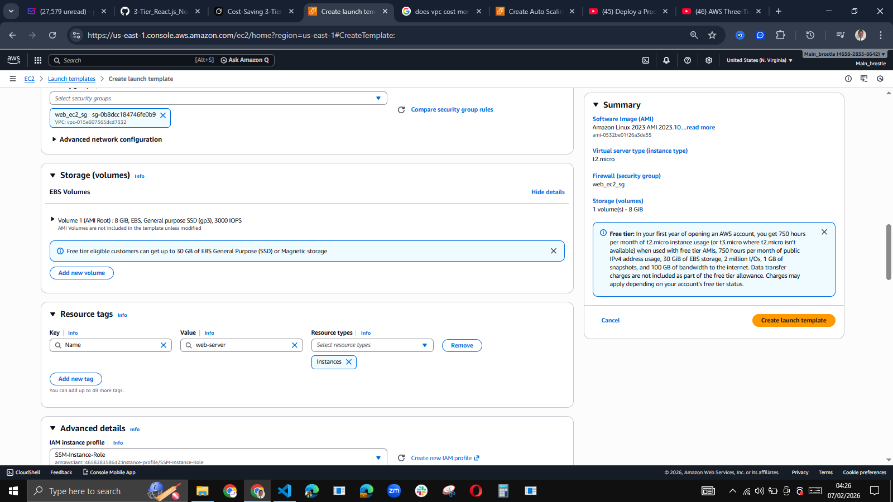

  

  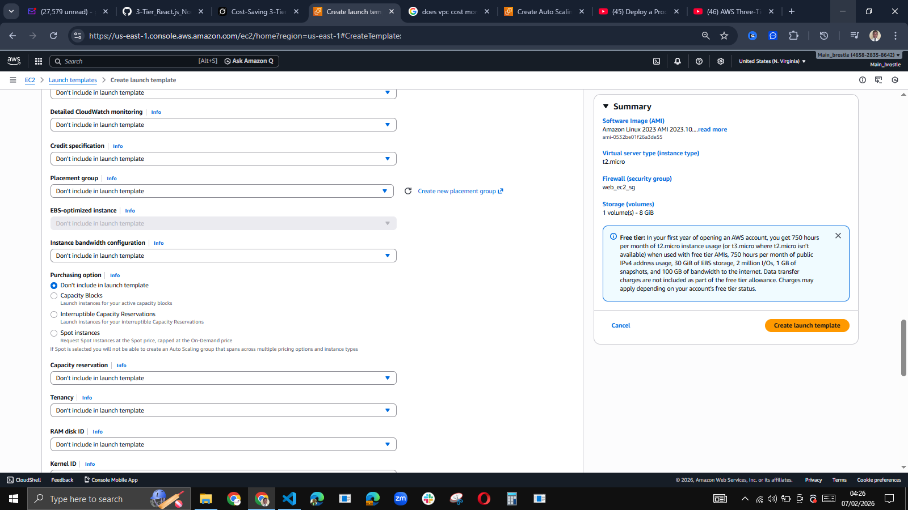

  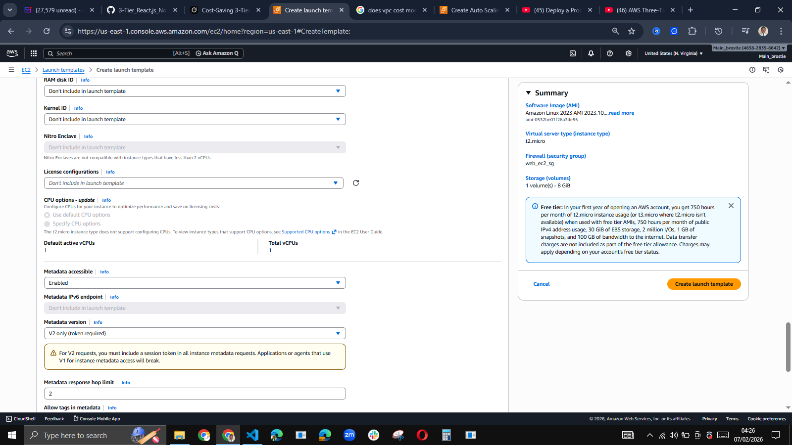

  


  * **UserData for App Tier Launch Template**
   **app-tier-lt**: AMI = Amazon Linux 2023, t2.micro, SG = app-sg, Public IP = Enable, User data = (input right credentials where necessary into userdata above before copy& paste)
    **Both**: IAM instance profile/role with AmazonSSMManagedInstanceCore policy attached
    DB_HOST=three-tier-db-books.c4j4kiq2ck9b.us-east-1.rds.amazonaws.com
    DB_PORT=3306
    DB_USER=admin
    DB_PASSWORD=BROSTLE2026!
    DB_NAME=react_node_app
  
```bash
#!/bin/bash
set -euo pipefail

# 1. Install Node.js, PM2 & MariaDB Client (to run SQL)
sudo dnf update -y
sudo dnf install -y nodejs npm unzip awscli mariadb105

# 2. Install PM2 globally
sudo npm install -g pm2

# 3. Variables
S3_BUCKET="paul-3tier-artifacts"
ZIP_FILE="backend-build.zip"
APP_DIR="/home/ec2-user/app"
DB_HOST="three-tier-db-books.c4j4kiq2ck9b.us-east-1.rds.amazonaws.com" # ensure you remove this RDS endpoint and replcace with yours
DB_USER="admin"
DB_PASS="BROSTLE2026!"
DB_NAME="react_node_app"

# 4. Download and Extract
mkdir -p "$APP_DIR"
aws s3 cp "s3://${S3_BUCKET}/${ZIP_FILE}" /tmp/${ZIP_FILE} --region us-east-1
unzip -o /tmp/${ZIP_FILE} -d "$APP_DIR"

# 5. Environment Config
cat > "$APP_DIR/.env" << EOF
DB_HOST=$DB_HOST
DB_PORT=3306
DB_USER=$DB_USER
DB_PASSWORD=$DB_PASS
DB_NAME=$DB_NAME
PORT=3000
EOF

# 6. Fix Permissions and Install dependencies
chown -R ec2-user:ec2-user "$APP_DIR"
cd "$APP_DIR"
sudo -u ec2-user npm install --production
sudo -u ec2-user npm install dotenv mysql2

# 7. REWRITE server.js (The "Smoking Gun" Fix)
sudo -u ec2-user tee "$APP_DIR/server.js" << 'EOF'
require('dotenv').config();
const app = require('./app');
const port = process.env.PORT || 3000;
app.listen(port, '0.0.0.0', () => {
  console.log(`Server is running on port ${port}`);
});
EOF

# 8. REWRITE db.js (Ensures RDS connection)
mkdir -p "$APP_DIR/configs"
sudo -u ec2-user tee "$APP_DIR/configs/db.js" << 'EOF'
const mysql = require('mysql2');
require('dotenv').config();
const db = mysql.createConnection({
   host: process.env.DB_HOST,
   port: process.env.DB_PORT,
   user: process.env.DB_USER,
   password: process.env.DB_PASSWORD,
   database: process.env.DB_NAME
});
db.connect((err) => {
    if (err) { console.error('Error connecting to MySQL:', err); return; }
    console.log('Connected to RDS MySQL Database!');
});
module.exports = db;
EOF

# 9. DYNAMIC DATABASE INITIALIZATION
# This runs your SQL schema and seeds the data automatically
SQL_DATA=$(cat <<EOF
CREATE TABLE IF NOT EXISTS authors (
  id int NOT NULL AUTO_INCREMENT,
  name varchar(255) NOT NULL,
  birthday date NOT NULL,
  bio text NOT NULL,
  createdAt date NOT NULL,
  updatedAt date NOT NULL,
  PRIMARY KEY (id)
) ENGINE=InnoDB;

CREATE TABLE IF NOT EXISTS books (
  id int NOT NULL AUTO_INCREMENT,
  title varchar(255) NOT NULL,
  releaseDate date NOT NULL,
  description text NOT NULL,
  pages int NOT NULL,
  createdAt date NOT NULL,
  updatedAt date NOT NULL,
  authorsId int DEFAULT NULL,
  PRIMARY KEY (id),
  CONSTRAINT FK_authors FOREIGN KEY (authorsId) REFERENCES authors (id)
) ENGINE=InnoDB;

-- Only insert if the table is empty to avoid duplicate errors
INSERT INTO authors (id, name, birthday, bio, createdAt, updatedAt) 
SELECT 1, 'J.K. Rowling', '1965-07-31', 'British authors...', '2024-05-29', '2024-05-29'
WHERE NOT EXISTS (SELECT 1 FROM authors WHERE id = 1);

INSERT INTO books (id, title, releaseDate, description, pages, createdAt, updatedAt, authorsId)
SELECT 1, 'Harry Potter and the Sorcerer''s Stone', '1997-07-26', 'Magical powers...', 223, '2024-05-29', '2024-05-29', 1
WHERE NOT EXISTS (SELECT 1 FROM books WHERE id = 1);
EOF
)

mysql -h "$DB_HOST" -u "$DB_USER" -p"$DB_PASS" "$DB_NAME" -e "$SQL_DATA"

# 10. Start with PM2
sudo -u ec2-user pm2 delete all || true
sudo -u ec2-user pm2 start "$APP_DIR/server.js" --name "backend" --update-env
sudo -u ec2-user pm2 save
sudo env PATH=$PATH:/usr/bin /usr/lib/node_modules/pm2/bin/pm2 startup systemd -u ec2-user --hp /home/ec2-user
```
 
  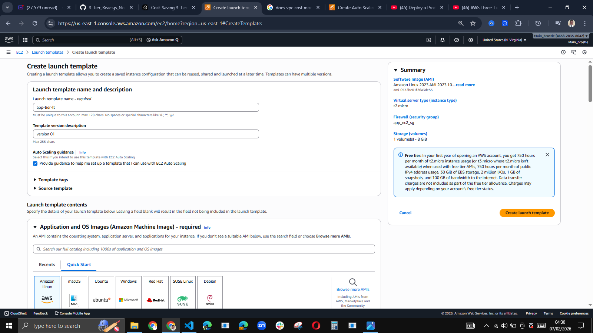
  
  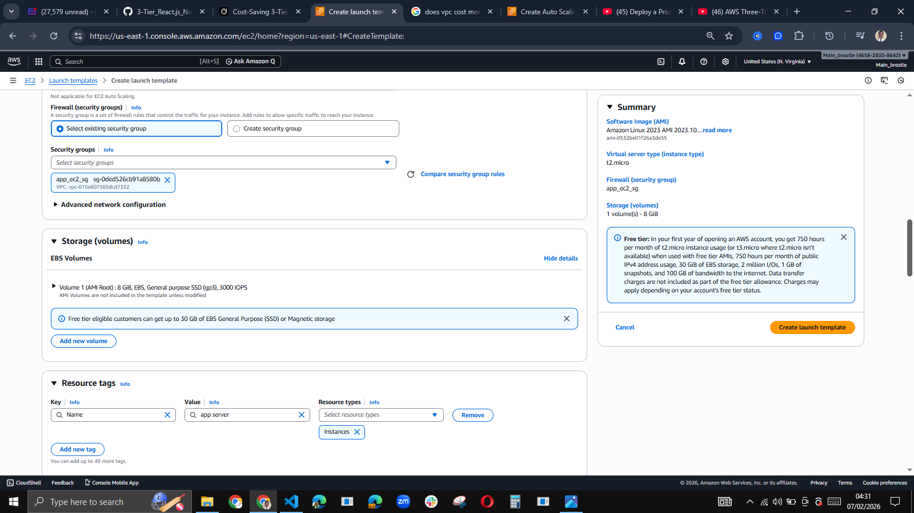
  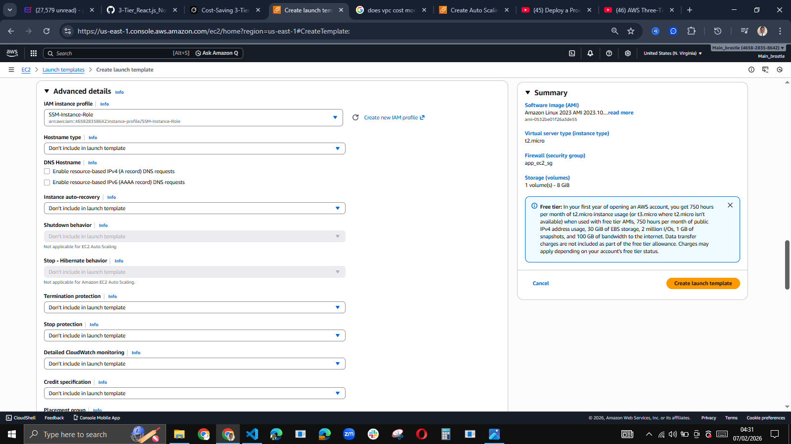
  


  
* **Create Autoscaling groups**
  Auto Scaling groups (EC2 → Auto Scaling Groups → Create):
  
  * web-asg:
    Launch template = web-lt (latest)
    VPC/subnets = both public subnets
    Attach to target group = web-tg
    Group size: Min = 2, Desired = 2, Max = 3   # formerly max=4 but due unstablity we reduced to 3
    Scaling policies: Target tracking → CPU utilization = 70%


  

  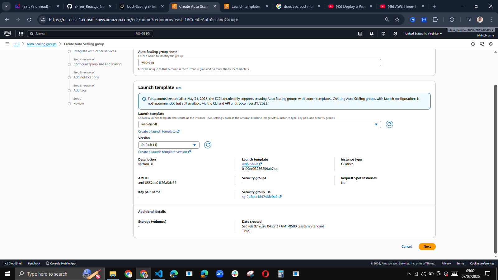

  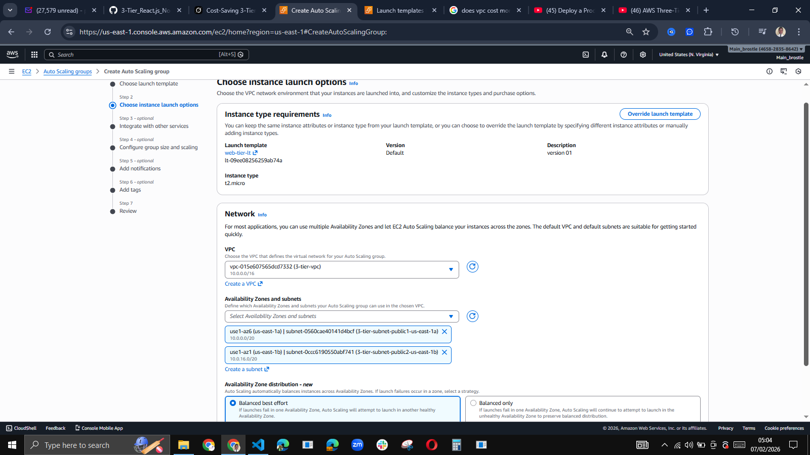

  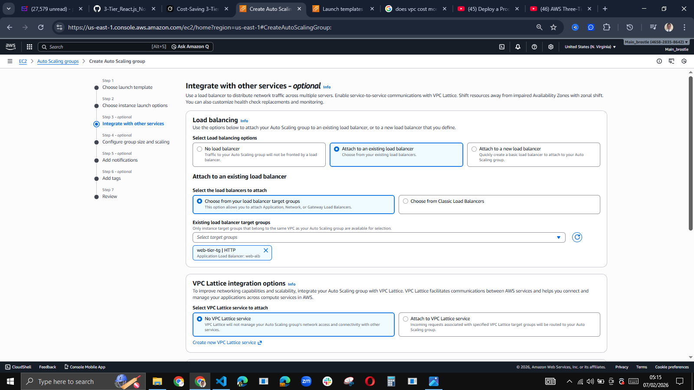

  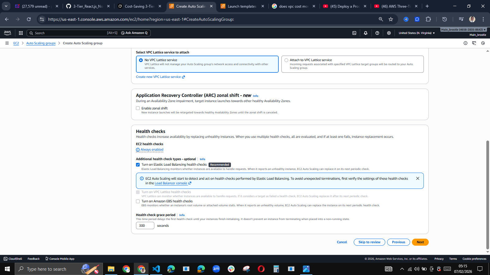

  

  

  

  

  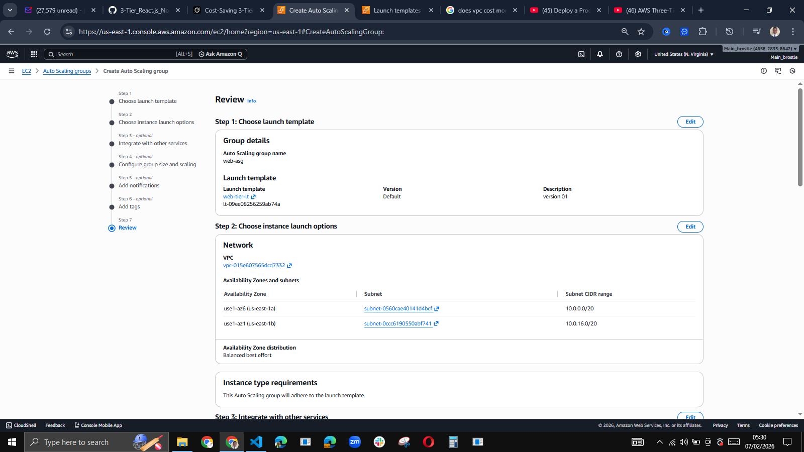

  

  

  

        
  * app-asg:
    Launch template = app-lt
    Subnets = both public subnets
    Target group = app-tg
    Group size: Min = 2, Desired = 2, Max = 3  # formerly max=4 but due unstablity we reduced to 3.
    Scaling policies: Target tracking → CPU utilization = 70%

    

    

    

    

    

 

    

    

    

    

  


#### Errors, Troubleshootings & Solution

##### * **Error 1:  Infrastructure Instability**
    
   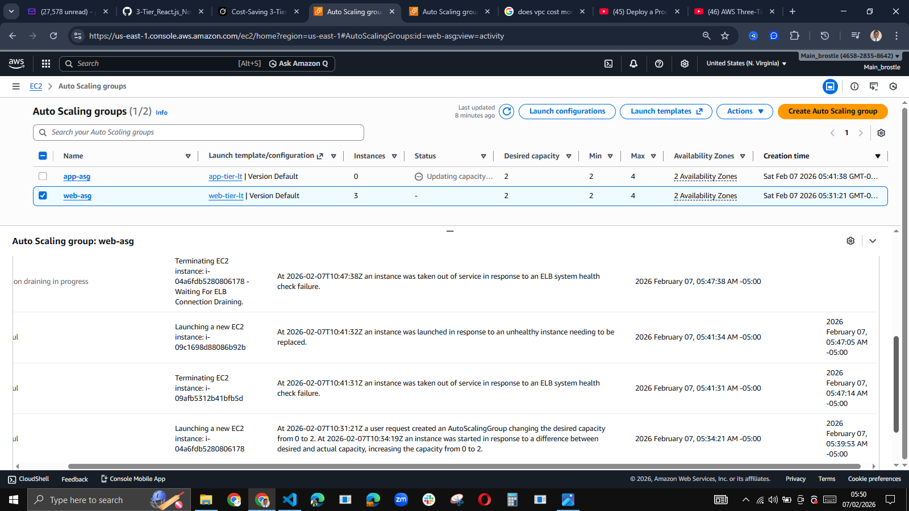

   

   

   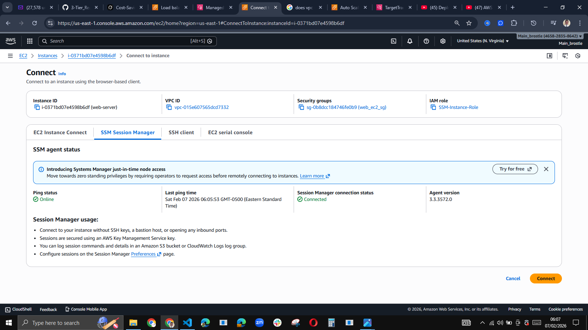

   

   


  * **Solution to Error 1:**
    Solution: Thank Goodness. The system is now at 2 instances each, now stable.. I reduced max capacity from 4 to 3. and remove elb health check by deactivating, elastic Elastic Load Balancing health checks but maintained 300s for warm up, cooling etc. But up till now the web loadbalancer shows bad gateway 502

    - We uncheck ELastic LoadBalancer Health Checks
    
    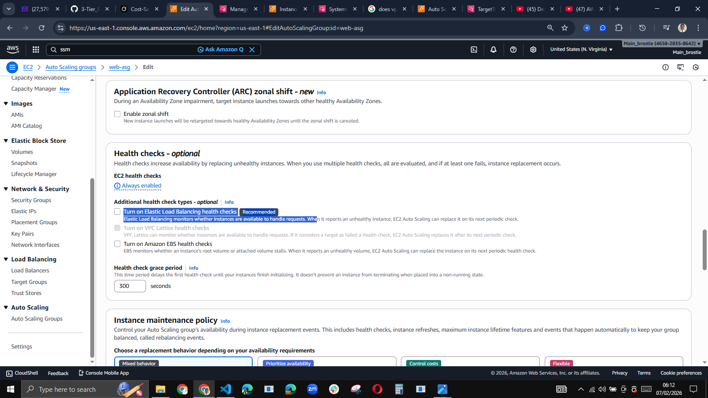

    - We reduced Max capacity from 4 to 3 in app-asg

    

    


##### * **Error 2:** Nginx not found on Web Servers & Bad Gateway

  

  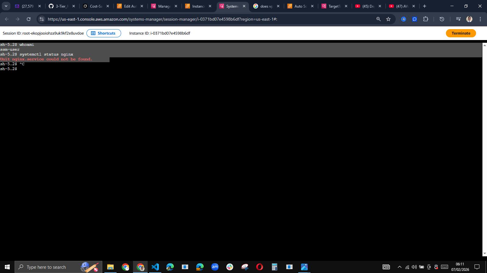


  * **Solution to Error 2:**

    -  We updated wlaunch tier template to start the install and enable Nginx at launch
    
      

    


##### * **Error 3:** App Tier Tg & Instances Unhealthy

    

  

 
  * **Solution to Error 3:**

    - We had to ensure app instances can connect to internet by activating network interface
      for app-tier public subnets security group only in the launch template of app tier.
      SO as to download and install PM2

    - We therefore updated app tier userdata launch templates. 

    - We have to ensure our app instances could connect to the database

    - We reconfigured, app tg health checks, from /health to /api/books which was based on the
      developer, hardcoded configuration.
      
    - We had to add public subnets route table to the s3 gateway route table

```bash
    # Check if backend is running
    pm2 list
    pm2 logs backend   # or pm2 logs backend --lines 50

    # Check .env was created correctly
    cat /home/ec2-user/app/backend/.env

    # Test locally on instance
    curl http://localhost:3000   # or whatever route exists
    curl http://localhost:3000/health.txt   # if using the static file

    # Check logs directory
    ls -l /home/ec2-user/app/backend/logs
```


For Web
##### Check if the Dashboard file exists locally
```ls -l /usr/share/nginx/html/index.html```  

```cat /usr/share/nginx/html/index.html```

```sudo systemctl status nginx```

```sudo systemctl enable nginx```

```sudo systemctl restart nginx```


##### Check if Nginx is serving the Dashboard (should show HTML)
```curl -i http://localhost/```

##### Check if Nginx is correctly proxying to the App ALB (should show JSON)
```curl -i http://localhost/health```   

##### Check the port listened to
```sudo ss -tulpn | grep LISTEN```   
```sudo nginx -t```


For App
##### Check if the Node.js app is alive
```curl -i http://localhost:3000/health```

##### Check if the Database connection is working
```curl -i http://localhost:3000/api/books```

##### To see the port app tier is listening
```sudo netstat -tunlp | grep 3000```
```sudo ss -tulpn | grep :3000```


  

  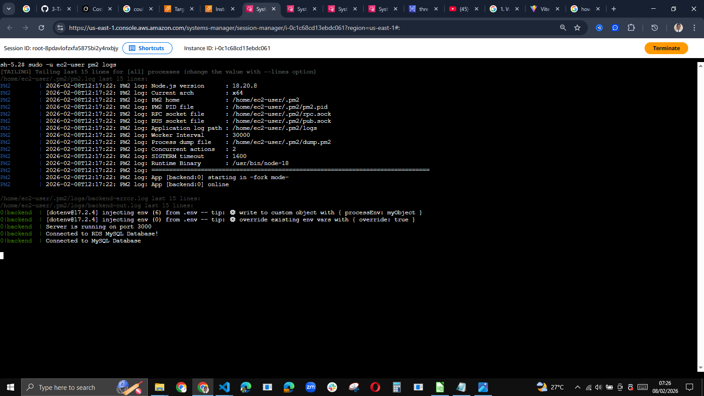

  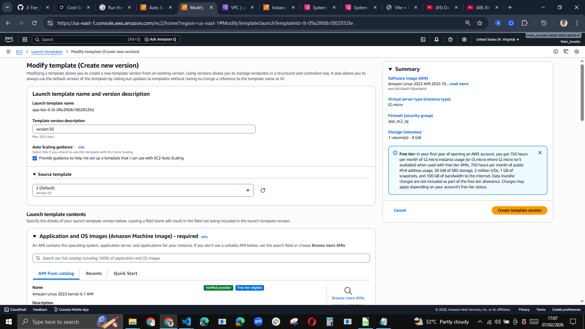

  


##### Error 4: git clone fails/timeout
Solution 4: remove outbound https 443 to SSM endpoint and allow 0.0.0.0 for web-ec2-sg & app-ec2-sg


##### Error 5: App tier tg not healthy

Solution 5a: We had to change from /health to /api/books as the developers setting for health check in the app
is /api/books

Solution 5b: The Traffic Port is the port where the ALB sends actual user requests (the "work"). 
The Health Check Port is where the ALB sends "pings" to check if the server is alive.
In a standard setup, they are usually the same. However, using the Override Port (3000) works because it explicitly forces the Load Balancer to look at that specific door, bypassing any confusion if the Target Group was accidentally looking for Port 80 by default. 
AWS Target Group Health Checks explain that the health check port defaults to the traffic port, but an override ensures total clarity for the ALB.


##### Error 6: App tier Instances cant get dependencies & intallations
Solution 6: Enabled public ipv4 in app-tier-LT, at network configuration, add interface,
we enabled public ipv4 at public ip and select the app-tier-sg so that eventhough the web tier and
app tier are in the same public subnet, only app tier has public ip address for the time been.

So after the installations, from internebt, we Created an AMI of that instance.
Update the LT to use that AMI and Disable the Public IP.
Terminate the instance, transfer to ASG, so we might not need the internet for a long time.


- **Solution to error 3, 4, 5, & 6**


#### Result

  

  

  

  

  

  

  


### Cleanup (very important – avoid surprise bills)

1. Delete Auto Scaling Groups → force delete instances
2. Delete Launch Templates
3. Delete Target Groups
4. Delete both ALBs
5. Delete RDS instance (final snapshot optional)
6. Delete EC2 instances (Bastion)
7. Delete Security Groups
8. Delete VPC (detach & delete Internet Gateway first)


### Recommendations

#### How your Instances can get internet updates without NAT Gateway ($32/mo)

If you want to stay in your "Private" setup but need to run updates:

* The S3 Gateway Endpoint (Free): As mentioned, this lets your instances "see" the Amazon Linux Repositories privately. This covers 90% of your update needs for free.

* The "Flip" Method($0.01/hr): If you need to download something from the open web (like a specific Node.js library), you can temporarily assign a Public IP to that instance, run your update, and then remove the IP. This costs you maybe $0.001 for a few minutes of work and this was what we did.

* SSM Patch Manager: SSM "Patch Manager" can trigger an update, but instances still needs a way to download the actual files.
If the instance has no NAT Gateway and no Public IP, the yum command will simply time out, even if you triggered it through an SSM terminal.


#### What if we dont want to use Amazon Linux, SAY Ubuntu Linux

If we use Ubuntu, our current "No NAT" plan will prevent us from running 'apt install' or 'apt upgrade'. We shall have 3 three choices to fix this:
* Option A (Cheapest): Switch to Amazon Linux 2023. It works with your S3 Gateway for free updates, which also have SSM agent pre-installed. And that is what we implemented.
* Option B (Budget Ubuntu): Launch a tiny t4g.nano as a NAT Instance (not a NAT Gateway) to act as a bridge. This costs ~$3/month, which is fair. But then this can  be seen as a Bastion host, as it is a little bit different in usage, which we have decided to avoid. So we went back to option A 
* Option C (The Manual Way): Temporarily assign a Public IP to your Ubuntu instance just when you need to run updates, then remove it to stop the $0.005/hr charge. Which is doable for testing or dev but not production grade level. So we went back to option A.


#### Summary of our Build

* OS: Amazon Linux
* Access: Handled via SSM Session Manager (Free) though endpoints at charges
* Updates: Handled via S3 Gateway Endpoint (Free) though data transfer at charges
* DB Management: Handled via SSM Port Forwarding (Free)
* Security: No public IPs except web tier devices, no open ports, no NAT Gateway fees.


#### How this project would look with Containers:
* Web Tier: You’d use an nginx:alpine image. You’d copy your dist folder into it once, and it’s ready.
* App Tier: You’d use a node:20-slim image. You’d run npm install during the build.
* Deployment: Instead of EC2 UserData, you would likely use AWS ECS (Elastic Container Service) or AWS Fargate. These services are designed specifically to run containers without you ever having to manage the underlying "server" or write UserData.


#### Other Ways Code is Deployed to the Cloud 
While UserData is great for simple setups, professional teams often use more advanced methods for speed and reliability:
* Containers (Docker/Kubernetes): Instead of installing everything on a server, you package your app into a "container image" that runs exactly the   same everywhere.
* Serverless (AWS Lambda): You provide just the code (the function), and the cloud provider handles all server management, scaling it only when someone visits your site.
* Configuration Management (Ansible/Chef/Puppet): These tools use "playbooks" or "recipes" to manage hundreds of servers at once without needing to rebuild them from scratch like UserData often requires.
* Platform-as-a-Service (PaaS): Services like AWS Elastic Beanstalk or Heroku let you just "upload code," and they handle the load balancers, databases, and scaling for you. 


#### Generate Terraform or cloud formation code

* We can use FORMER2 generate Terraform template for our deployed insfrasture

* The Terraform Variable structure needed to make the code "portable."

* Instead of just capturing what we have now, we moved our installation commands into a Shell Script. Then, when we ve generated the Terraform code, we put that script into the user_data attribute. This makes the entire deployment "One-Click," which is exactly what organizations are willing to pay for.

* Selling Pitch: A Production-Ready, 3-Tier Amazon Linux architecture that uses Zero-Cost SSM Tunnels instead of Bastions and S3 Gateway Endpoints to eliminate $400/year in NAT Gateway fees."


### References

[Learn it Right](https://github.com/Learn-It-Right-Way/lirw-react-node-mysql-app)

https://youtu.be/6rsJlfpwnP4?si=xarWsxArSgk13JkF 
