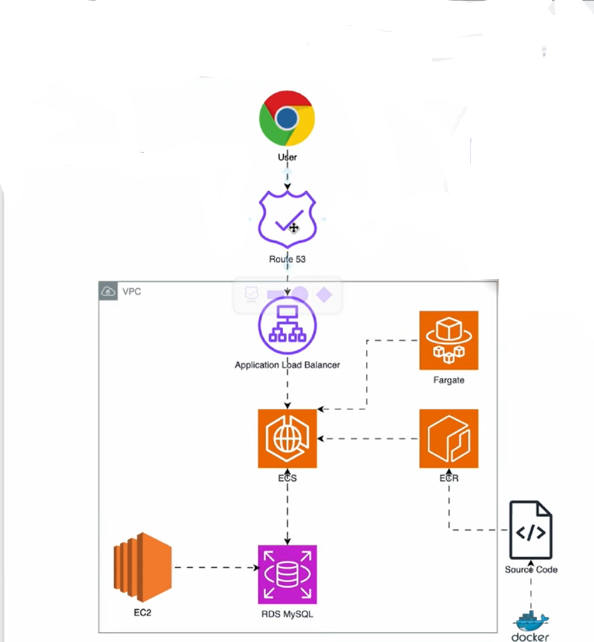

## A 3-Tier Serverless Arch_Docker_Fargate_ECR_ECS_ALB_RDS_CloudFront_no NAT Gateway




#### Prerequisites

Before starting, ensure you have:

- An AWS account with sufficient permissions (e.g., IAM role for ECS, S3, CloudFront, ALB, Aurora, and SSM).
- AWS CLI installed and configured with credentials.
- Session Manager Plugin for AWS CLI installed (for SSM tunneling).
- Basic familiarity with AWS services like VPC, subnets, security groups.
- Your application code: Frontend (static HTML/JS/CSS), Backend (containerized, e.g., Docker image for Node.js/Express or similar), and Database schema.
- Docker installed if building your backend image locally.
- ECR repository for your backend image (create one if needed).


#### 1. VPC & Subnets (already assumed done)
- At least 2 public subnets (for ALB).
- At least 2 private subnets (for Fargate + Aurora).
- No Internet Gateway attached if you want fully private outbound (but ALB still needs public subnets with IGW for inbound internet traffic).
- Route tables:
    -   Public route table: 0.0.0.0/0 → Internet Gateway (for ALB).
    -   Private route table(s): Only local VPC route initially (pl- prefix for S3 will be added later).


- VPC Endpoints (Critical for private Fargate — do this before Fargate/ECR push)
Gateway endpoint for S3 (com.amazonaws.[region].s3):
Create in VPC Console → Endpoints → Create endpoint → Gateway → S3.
Associate with private subnet route table(s) (not public).
AWS auto-adds a route: pl-xxxxxxxx (S3 prefix list) → vpce-xxxx (gateway endpoint ID).


#### 2. Security Groups (create early — many resources reference them)
- EC2-SG(sg-ec2-admin):TCP 22 (SSH) → Your IP address (e.g., your home/office public IP or CIDR). Outbound All traffic (0.0.0.0/0)
If using private subnet + SSM Session Manager: no SSH rule needed (SSM uses HTTPS outbound), but we plan to use ec2 instance connect at all times.
- ALB SG(sg-alb-public): Inbound HTTP/HTTPS (80/443) from anywhere (0.0.0.0/0); Outbound: All traffic (0.0.0.0/0)
- Fargate SG(sg-fargate-app): Inbound HTTP (80) only from ALB SG; Outbound to Aurora SG (3306), & to All traffic (0.0.0.0/0) VPC endpoints if needed.
- Aurora DB SG(sg-aurora-db): Inbound TCP MySQL (3306) only from Fargate SG & EC2-SG; No outbound


#### 3. Launch EC2 Instance (for Docker build + RDS access)
EC2 Console → Launch instance.
AMI: Amazon Linux 2023 or Ubuntu (your choice — Amazon Linux is fine for Docker).
Instance type: t3.micro or t4g.micro (cheap).
Subnet: Public subnet (easiest — gets public IP, SSH directly from laptop).
Alternative: Private subnet + SSM Session Manager (no public IP, connect via AWS CLI: aws ssm start-session --target i-0123456789abcdef0).

Security group: EC2-SG.
Key pair: Create/download for SSH.
User data (optional): Install Docker automatically.

```bash
sudo yum update -y```
sudo yum install docker -y
sudo systemctl start docker
sudo systemctl enable docker
sudo usermod -aG docker ec2-user   # Log out and SSH back inVerify:textdocker --version
docker run hello-world   # Quick test — pulls and runs a tiny image
```


#### 3. S3 Bucket (Presentation Tier)
Create private bucket.
Upload frontend files.
(You can do this very early — no dependencies on other tiers.)


#### 4. CloudFront Distribution
After S3 bucket upload.
Origin = S3 bucket (use Origin Access Control for private bucket security). (OAC for private S3, HTTPS auto).
This can come early — frontend is independent.


#### 5. Aurora Database (Data Tier)
Create after security groups and VPC endpoints (if Aurora needs any outbound, though usually minimal).
Private subnets only.
Attach DB SG.
Note endpoint for later backend config.


#### 6. Application Load Balancer (ALB)
After security groups (attach ALB SG).
Internet-facing, public subnets.
Create target group (IP type for Fargate). 

ALB → TG → Fargate task IPs → your container port (e.g., 80).
Service Auto Scaling only (scales tasks). No ASG involved.
Remember only Cluster Auto Scaling via (capacity providers) + (Service Auto Scaling) scales both instances and tasks.


#### 7. ECR Repository
Create repo. Subnet: Private subnet

Build & push your backend image (from your local machine — this uses public internet, so no VPC issue here).

```bash
# Authenticate Docker to ECR (one-time per session or use script):
aws ecr get-login-password --region your-region | docker login --username AWS --password-stdin your-account.dkr.ecr.your-region.amazonaws.com

# Build the image (assuming your Dockerfile and app code are in current directory):
docker build -t my-backend:latest .               

# Builds from DockerfileList built images to confirm:
docker images                                      

# Shows my-backend:latestTag it for ECR (replace with your repo URI from ECR console):
docker tag my-backend:latest your-account.dkr.ecr.your-region.amazonaws.com/my-backend-repo:latest

#Push to ECR:
docker push your-account.dkr.ecr.your-region.amazonaws.com/my-backend-repo:latest

#Optional local test before push (run container on EC2 to verify):
docker run -d -p 8080:80 --name test-backend your-account.dkr.ecr.your-region.amazonaws.com/my-backend-repo:latest

docker ps                                          # See running container

curl http://localhost:8080                         # Test API if exposed
docker logs test-backend                           # View output/logs
docker exec -it test-backend bash                  # Shell inside (debug/fix)
docker stop test-backend && docker rm test-backend # Clean up
```

#### 8. ECS Cluster → Task Definition → Fargate Service
Cluster: Fargate type.
Task Definition: Use ECR image, attach Fargate SG, add env vars (DB endpoint, etc.).
Service: Attach to ALB target group, private subnets.
Tasks should now pull images via VPC endpoints (S3 gateway + ECR interface).


(if you ever need it to connect from ec2 to fargate):
Find the private IP of a Fargate task: ECS Console → Cluster → Service → Tasks tab → Click a task → Network section → Private IP (e.g., 10.0.2.123).
From your EC2 (in public subnet, same VPC): curl http://10.0.2.123:80 (or your container port) Or telnet 10.0.2.123 80 to test port reachability.

ECS → Your service → Update → Set auto scaling → Add policy.

#### 9. Update Frontend (in S3)
Set API base URL to ALB DNS name (e.g., https://my-alb-....elb.amazonaws.com).
Re-sync to S3, invalidate CloudFront cache if needed.


#### 10. Connect to Aurora from EC2 (instead of SSM tunnel via Fargate)
SSH to EC2.
```bash
# Install MySQL client: 
sudo yum install mariadb105 #(Amazon Linux) or sudo apt install mysql-client (for Ubuntu linux).

# Test direct connection:
mysql -h your-aurora-cluster.cluster-xyz.region.rds.amazonaws.com -P 3306 -u masteruser -p

# If it works → great (same VPC, security groups allow).

# For MySQL Workbench / other GUI: Install on your laptop, use EC2 as SSH tunnel:
# SSH tunnel: ssh -L 3307:aurora-endpoint:3306 -i key.pem ec2-user@ec2-public-ip
# Then connect Workbench to 127.0.0.1:3307.
```

References:

[Projects World](https://projectworlds.com/a-simple-caterpillar-game-built-in-python-mini-project-with-source-code/)  