# Callex - Standalone Desktop App for Real-Time AI Noise Cancellation

Callex is a free, open-source desktop application that removes background noise (e.g., children, dogs, crowds, sirens) from your microphone input in real-time during calls (Zoom, Teams, etc.). It runs entirely locally on your device—no cloud, no subscriptions, zero latency issues.

Powered by state-of-the-art open-source AI models like **DeepFilterNet3** (or fallback to RNNoise), it extracts human speech while suppressing complex noises better than traditional DSP.

## Features
- Real-time noise suppression with low CPU usage (3–7% on modern hardware)
- Cross-platform desktop app (Windows, macOS, Linux)
- Virtual microphone output for easy integration with Zoom/Teams/etc.
- Simple UI: Start/Stop toggle, settings, CPU monitor
- 100% local processing – privacy-focused and free forever

## Why This Project?
Existing solutions like Krisp are expensive. Callex aims to provide professional-grade noise cancellation affordably using free, open-source AI.

## License
MIT License (see [LICENSE](./LICENSE) file).  
Models (DeepFilterNet3 / RNNoise) are MIT/Apache/BSD-3-Clause – fully free for any use.

## Requirements
- Node.js v20+ (for Electron)
- Python 3.10+ (for initial model testing)
- CMake, Git, build tools (Visual Studio Build Tools on Windows, Xcode on macOS, gcc on Linux)
- Modern CPU (2018+ recommended for smooth real-time performance)

## Project Structure (Suggested)
callex/
├── main.js                # Electron main process
├── preload.js             # Bridge between renderer and main
├── renderer/              # UI (HTML/JS/CSS)
├── cpp-addon/             # C++ Node addon for audio processing
│   ├── binding.gyp
│   └── src/
│       └── audio-processor.cpp
├── models/                # ONNX models (DeepFilterNet3.onnx, etc.)
└── package.json


## Step-by-Step Build Guide

### 1. Setup Development Environment

```bash
1. Install Node.js (v20+): https://nodejs.org    # confirm node -v
2. Install Python 3.10+: https://www.python.org  # confirm python --version
3. Install build tools:
   - Windows: Visual Studio Build Tools (Desktop C++ workload): 
    - download and install cmake: https://cmake.org/download/    # confirm cmake --version
   - macOS: Xcode Command Line Tools (`xcode-select --install`)
   - Linux: `sudo apt install build-essential cmake`
4. Install global tools: `npm install -g node-gyp electron-builder` # node-gyp compiles your C++ code into a format Node.js can understand, while electron-builder will eventually package Callex into a .exe for distribution.
5. Create project: `mkdir callex && cd callex && npm init -y`
6. Install Electron basics: `npm install electron --save-dev` # This adds Electron to this specific project
```

`npm install electron`: This is the engine. It's the actual software framework you use to run and develop Callex on your machine. Without this, you can't even start the app.

`electron-builder`: This is the factory. It is only used at the very end to package your code into a single .exe file so you can give it to other people to install.

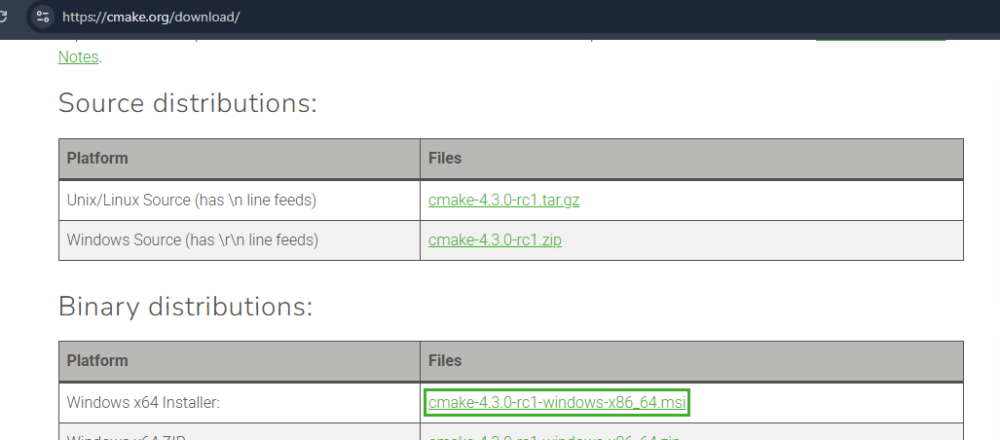 

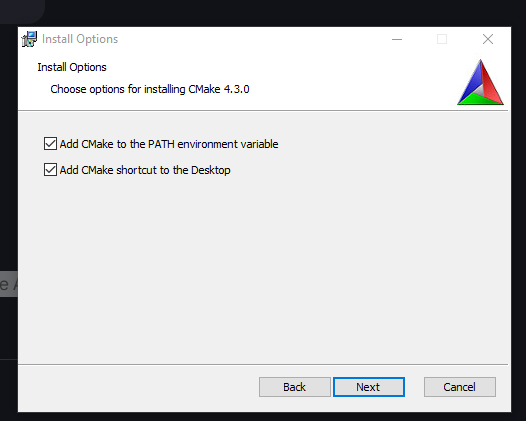 

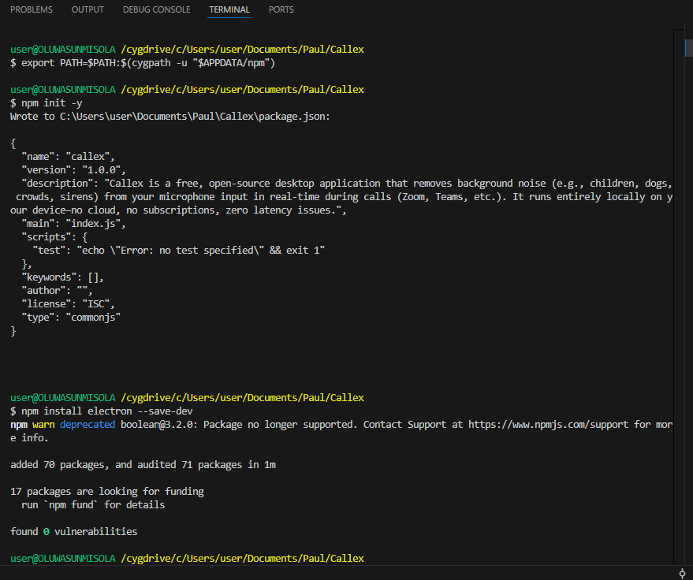 

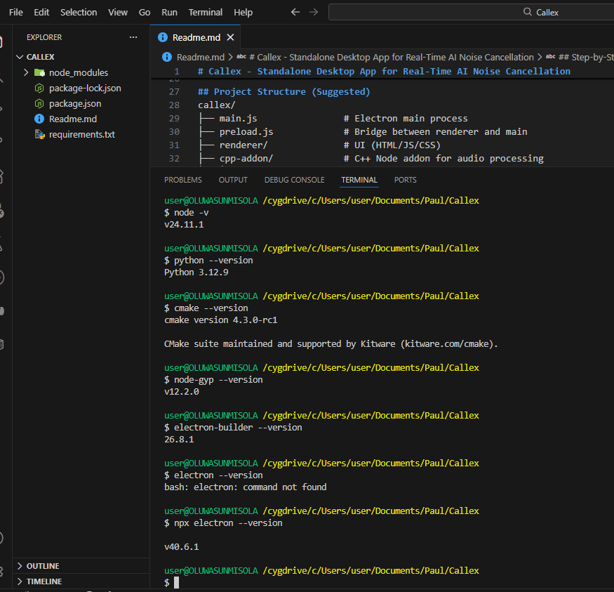


### 2. Select & Prototype the AI Model
**Recommended: DeepFilterNet3** (best quality in 2026 benchmarks).

- Clone repo: `git clone https://github.com/Rikorose/DeepFilterNet.git models/deepfilternet`
- Download pretrained ONNX model (from repo's models/ folder or releases): 

   * Find `DeepFilterNet3_onnx.tar.gz` in `./models/` in the github repo
   * Unzip wth the file into models/ on your repo on vscode:
   * Move file to the right directory from tmp to model dir 
   
    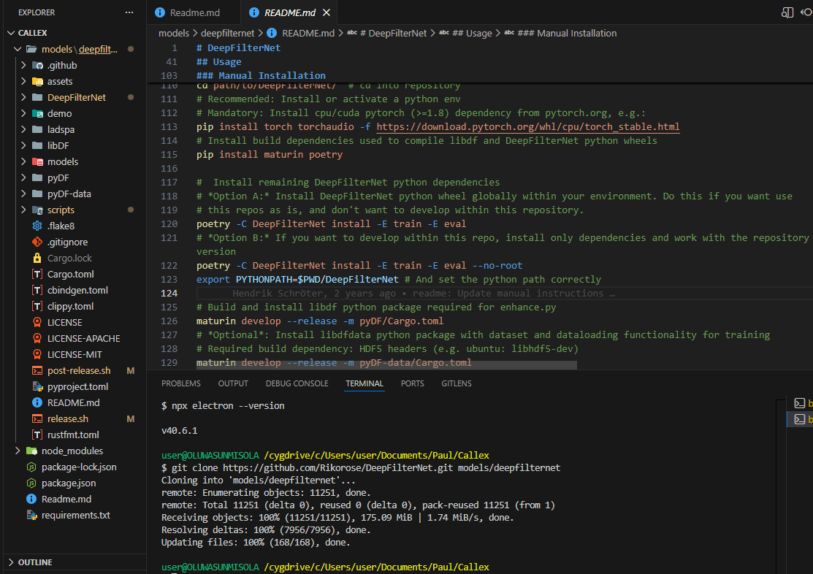 

    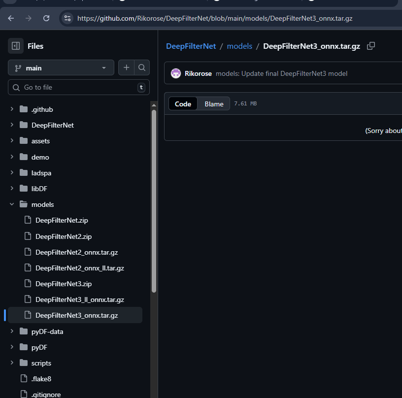 

    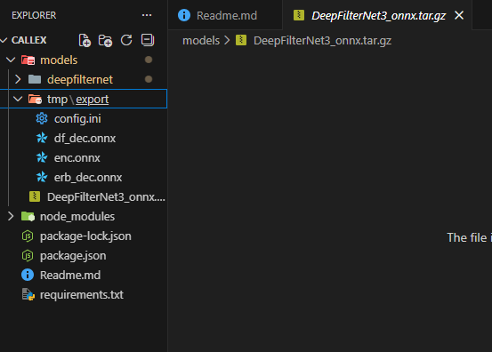 

    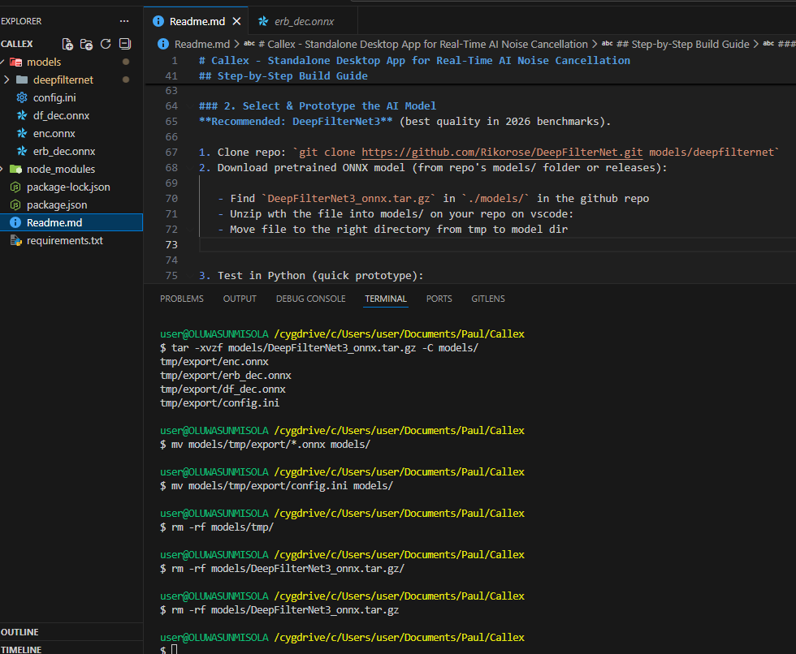

    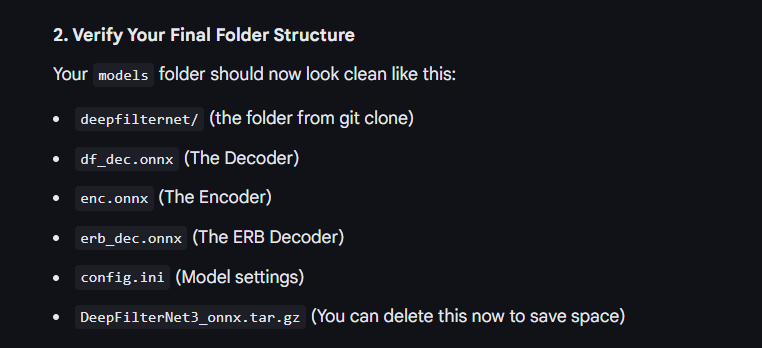

3. Test in Python (quick prototype):
   - `pip install onnxruntime soundfile numpy`

   Now it's time for the moment of truth. We are going to run a Python script that loads your three new .onnx files and verifies they are "talking" to each other correctly.

   - Write/test script: Load model, process a noisy WAV → output clean WAV.
   - Create a file in your callex/ root folder named check_ai.py and paste the below code and run python check_ai.py

```python
import onnxruntime as ort
import os

# Define paths to your new model files
models = {
    "Encoder": "models/enc.onnx",
    "ERB Decoder": "models/erb_dec.onnx",
    "Main Decoder": "models/df_dec.onnx"
}

print("--- Callex AI Model Verification ---")

all_good = True
for name, path in models.items():
    if os.path.exists(path):
        try:
            # Try to load the model into memory
            session = ort.InferenceSession(path)
            print(f"✅ {name}: LOADED (Inputs: {[i.name for i in session.get_inputs()]})")
        except Exception as e:
            print(f"❌ {name}: FAILED to load. Error: {e}")
            all_good = False
    else:
        print(f"❌ {name}: NOT FOUND at {path}")
        all_good = False

if all_good:
    print("\n🚀 SUCCESS: The Callex 'Brain' is fully operational and ready for C++ integration!")
else:
    print("\n⚠️ ERROR: Some parts are missing. Check your 'models' folder.")
```

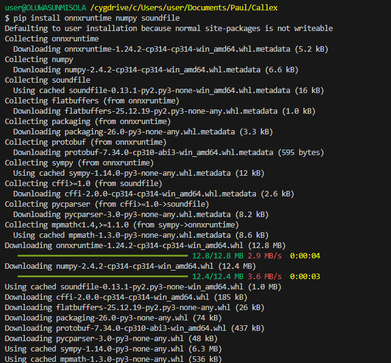 

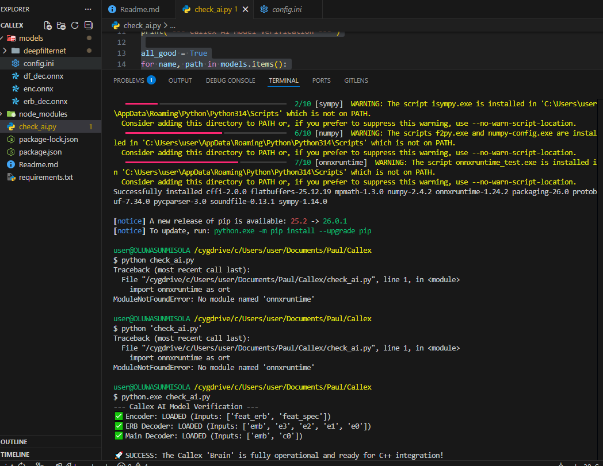


    - Benchmark: Measure latency/CPU on sample audio (aim <50ms per 10ms frame).

    Since the "Heartbeat" test passed, that means our PC can officially "think" using the AI. Now we need to see if it can think fast enough for a live call.
        
    We shall create a file named benchmark_ai.py and run it with python.exe(python is sufficient if not using cygwin). This script simulates processing 1 second of audio to see how much "stress" it puts on your CPU.

    In a live Zoom call, audio is processed in tiny chunks (frames). If the AI takes longer than 10ms to process a 10ms chunk, the audio will crackle and lag.

```python
import onnxruntime as ort
import numpy as np
import time

# Load the main encoder (the heaviest part of the brain)
session = ort.InferenceSession("models/enc.onnx")

# DeepFilterNet3 expects:
# 1. 'input': The raw audio (480 samples)
# 2. 'c0': State/Memory buffer (usually zeros to start)
input_name = "input"
state_name = "c0"

# Create dummy audio and a dummy state buffer
fake_audio = np.random.randn(1, 1, 480).astype(np.float32)
fake_state = np.zeros((1, 96, 1, 2), dtype=np.float32) # Standard DFN3 state size

print("--- Callex Latency Benchmark (DeepFilterNet3) ---")
start_time = time.time()

# Process 100 frames (1 second of audio)
for _ in range(100):
    session.run(None, {input_name: fake_audio, state_name: fake_state})

end_time = time.time()
avg_ms = ((end_time - start_time) * 1000) / 100

print(f"Average latency per 10ms frame: {avg_ms:.2f}ms")

if avg_ms < 8:
    print("🚀 SUPREME: DeepFilterNet3 will run like butter.")
elif avg_ms < 15:
    print("✅ GREAT: Ready for the C++ engine.")
else:
    print("⚠️ SLOW: Consider the RNNoise fallback for older CPUs.")
```

Lets inspect first and know the how DeepFilterNet3 operates so we are sure of what to expect and do moving forward:

* Create inspect_models.py and run it with python.exe:

```python
import onnxruntime as ort

model_files = ["models/enc.onnx", "models/erb_dec.onnx", "models/df_dec.onnx"]

for f in model_files:
    print(f"\n--- Inspecting {f} ---")
    try:
        session = ort.InferenceSession(f)
        for inp in session.get_inputs():
            print(f"Input: {inp.name} | Shape: {inp.shape}")
        for out in session.get_outputs():
            print(f"Output: {out.name} | Shape: {out.shape}")
    except Exception as e:
        print(f"Could not load {f}: {e}")
```

Those inspection results confirm that DeepFilterNet3 is a "Streaming" model. The 'S' in the shapes stands for Sequence, which in your case will be 1 (one frame at a time for real-time).

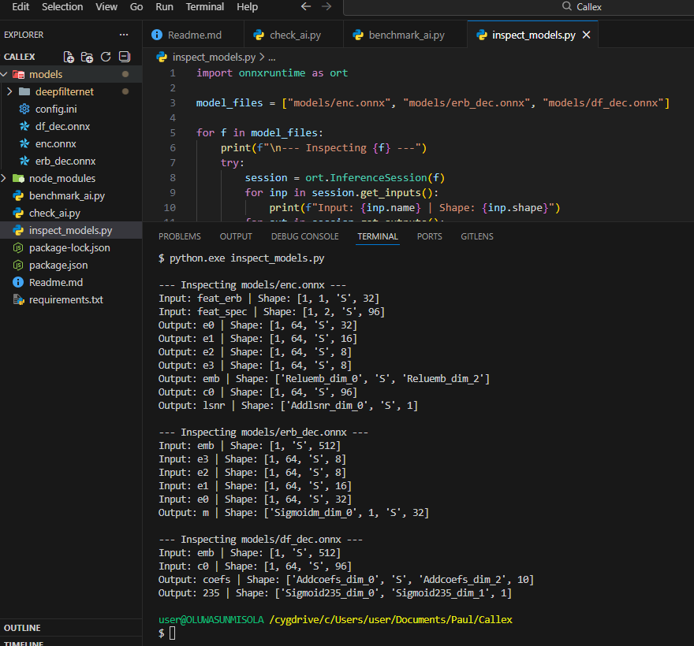

#### The Verdict
DeepFilterNet3 is powerful, but its architecture is complex:
The Encoder (enc.onnx) doesn't take raw audio; it expects pre-processed "Features" (feat_erb, feat_spec).
It outputs "Embeddings" (emb) and "States" (c0) that must be passed into the Decoders.
If we proceed with DeepFilterNet3: We need to write significant C++ logic to handle the STFT (converting audio to frequencies) before hitting the AI.
If we pivot to RNNoise (Fallback): It is a single model that takes raw audio samples. It is much easier for a first version of Callex.


4. Fallback: If needed, use RNNoise (clone https://github.com/xiph/rnnoise) – simpler C integration.


