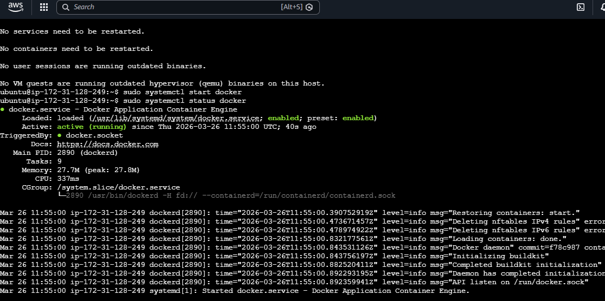
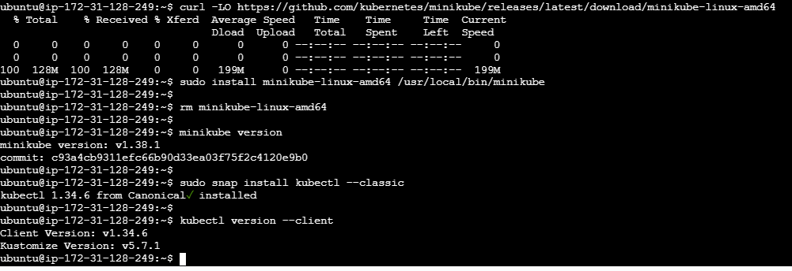
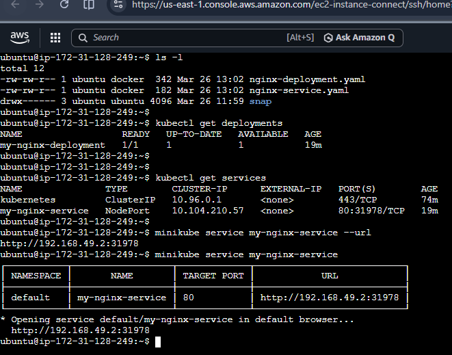
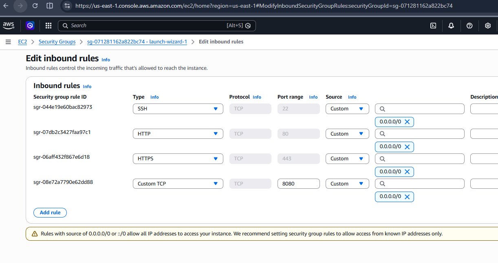
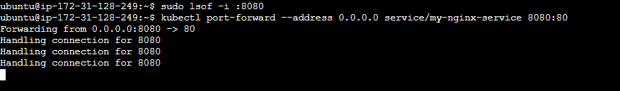
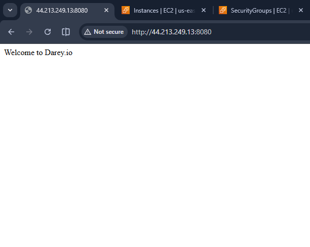
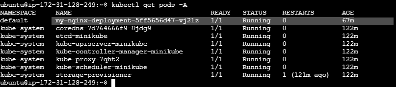
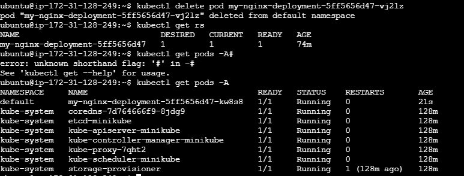
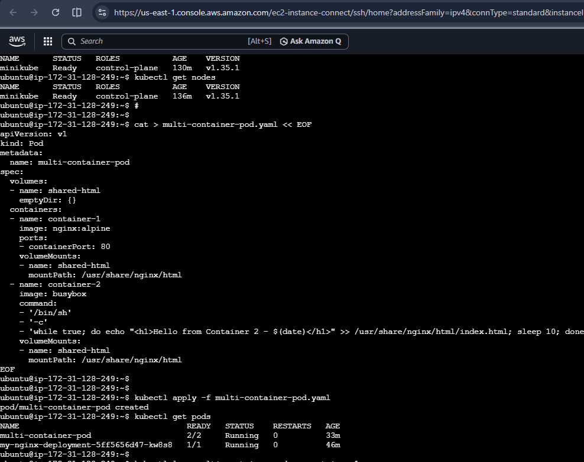
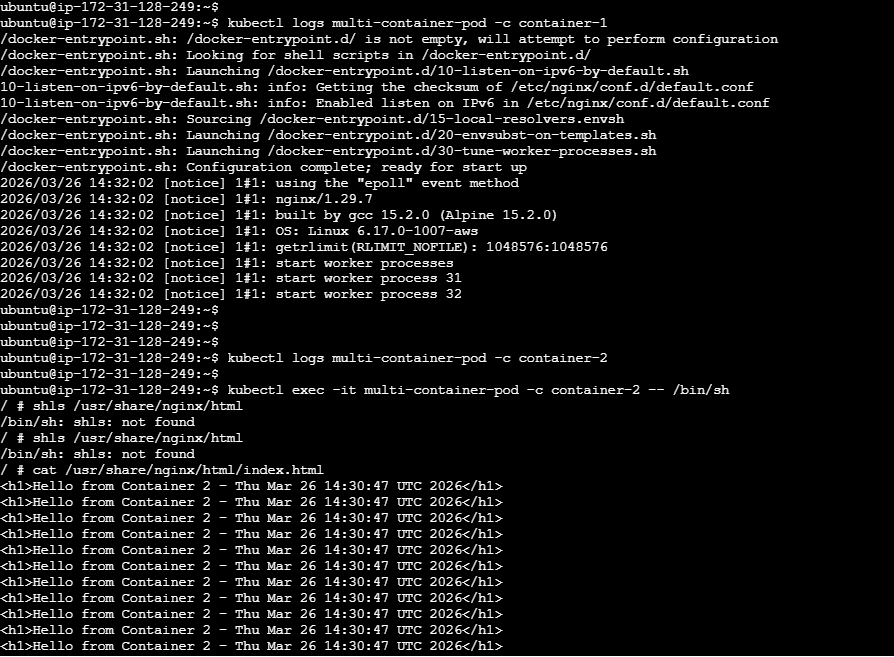

# Minikube + Kubernetes Nginx Deployment Project on Ubuntu AWS EC2

This Project walks you through setting up Docker, Minikube, kubectl, and deploying a simple Nginx application on Ubuntu (AWS EC2).

## Prerequisites
- Ubuntu 22.04 or 24.04 EC2 instance (**t3.medium or larger recommended**)
- At least 2 vCPU, 4 GB RAM, * **20 GB storage** 
- Internet connection
- SSH access to the instance

---

## Step-by-Step Guide

### Phase 1: Initial Setup

1. Update package list  
```bash
  sudo apt-get update
```

2. Install Docker

```Bash
sudo apt-get install -y ca-certificates curl
sudo install -m 0755 -d /etc/apt/keyrings
sudo curl -fsSL https://download.docker.com/linux/ubuntu/gpg -o /etc/apt/keyrings/docker.asc
sudo chmod a+r /etc/apt/keyrings/docker.asc

echo \
  "deb [arch=$(dpkg --print-architecture) signed-by=/etc/apt/keyrings/docker.asc] https://download.docker.com/linux/ubuntu \
  $(. /etc/os-release && echo "$VERSION_CODENAME") stable" | \
  sudo tee /etc/apt/sources.list.d/docker.list > /dev/null

sudo apt-get update
sudo apt-get install -y docker-ce docker-ce-cli containerd.io docker-buildx-plugin docker-compose-plugin
```


3. Start Docker and check status

```Bash
sudo systemctl start docker
sudo systemctl status docker

# Add your user to docker group
# Grant permission
sudo usermod -aG docker $USER
# add user to group
newgrp docker
```


4. Install Minikube

```bash
curl -LO https://github.com/kubernetes/minikube/releases/latest/download/minikube-linux-amd64
sudo install minikube-linux-amd64 /usr/local/bin/minikube
rm minikube-linux-amd64
minikube version
```

5. Install kubectl

```Bash
sudo snap install kubectl --classic
kubectl version --client
```

6. Start Minikube using Docker driver
```bash
  minikube start --driver=docker
```

 




### Phase 2: Deploy Nginx with NodePort Service

1. Create deployment file

```Bash
cat > nginx-deployment.yaml << EOF
apiVersion: apps/v1
kind: Deployment
metadata:
  name: my-nginx-deployment
spec:
  replicas: 1
  selector:
    matchLabels:
      app: my-nginx
  template:
    metadata:
      labels:
        app: my-nginx
    spec:
      containers:
      - name: my-nginx
        image: dareyregistry/my-nginx:1.0
        ports:
        - containerPort: 80
EOF
```

2. Create service file

```Bash
cat > nginx-service.yaml << EOF
apiVersion: v1
kind: Service
metadata:
  name: my-nginx-service
spec:
  selector:
    app: my-nginx
  ports:
    - protocol: TCP
      port: 80
      targetPort: 80
  type: NodePort
EOF
```

3.  Apply Deployment and NodePort Service yamls

```bash
# Apply the deployment
kubectl apply -f nginx-deployment.yaml

# Apply the service
kubectl apply -f nginx-service.yaml
```



### Phase 4: Kubectl Operations

```bash

### Working with Pods

# List all pods
kubectl get pods -A

#Describe a pod (replace <pod-name> and namespace accordingly)
kubectl describe pod <pod-name> -n namespace
#or 
kubectl describe pod my-nginx-deployment-5ff5656d47-vj2lz -n default
# or
kubectl describe pod my-nginx-deployment-5ff5656d47-vj2lz

# Delete a pod (it may be recreated automatically)
kubectl delete pod <pod-name> -n <namespace>
# or
kubectl delete pod my-nginx-deployment-5ff5656d47-vj2lz


# Check nodes
kubectl get nodes

# Describe the node (replace minikube with your actual node name if different)
kubectl describe node minikube


# Check deployments
kubectl get deployments

# Check services
kubectl get services

# If you are using Minikube on your PC 
# Get the service URL 
minikube service my-nginx-service --url 

# Or open it automatically in browser (if you have GUI forwarding or are using a browser on the instance)
minikube service my-nginx-service

# Access the website
# Copy the URL from above step (e.g., http://127.0.0.1:3xxxx) and open it in your browser.
# You should see the Nginx page served by the container if you are using Minikube on your PC 


# If you are using Minikube on Cloud e.g AWS 
# For the above to work on Cloud you will need to
kubectl port-forward --address 0.0.0.0 service/my-nginx-service 3xxxx:80

# Use this as no 31978 is not often use by engineers, 8080 is common and acceptable
kubectl port-forward --address 0.0.0.0 service/my-nginx-service 8080:80

# Update your AWS Security Group:
# Add an Inbound Rule, Type: Custom TCP. Port: 8080. Source: Anywhere (0.0.0.0/0) or your own IP. 
# You can actually us http://44.213.249.13:31978 but it is not professional.
# Access it in your browser:
http://<YOUR-EC2-PUBLIC-IP>:8080

#In our case: 
http://44.213.249.13:8080
```

 

 



 




### Phase 6: Multi-Container Pod (Containers Communicating Inside the Same Pod)
This phase shows how two containers in one Pod share the same network and storage, allowing them to communicate easily via localhost and shared files.

Create the multi-container-pod.yaml
```Bash
cat > multi-container-pod.yaml << EOF
apiVersion: v1
kind: Pod
metadata:
  name: multi-container-pod
spec:
  volumes:
  - name: shared-html
    emptyDir: {}
  containers:
  - name: container-1
    image: nginx:alpine
    ports:
    - containerPort: 80
    volumeMounts:
    - name: shared-html
      mountPath: /usr/share/nginx/html
  - name: container-2
    image: busybox
    command:
    - '/bin/sh'
    - '-c'
    - 'while true; do echo "<h1>Hello from Container 2 - $(date)</h1>" >> /usr/share/nginx/html/index.html; sleep 10; done'
    volumeMounts:
    - name: shared-html
      mountPath: /usr/share/nginx/html
EOF
```

```bash
# Apply the multi-container-pod.yaml
kubectl apply -f multi-container-pod.yaml

# Check pod status
kubectl get pods

# Wait until multi-container-pod shows Running and 2/2 ready.
# View logs from Nginx container (container-1)
kubectl logs multi-container-pod -c container-1

# View logs from BusyBox container (container-2)
kubectl logs multi-container-pod -c container-2


# List the mutually shared file
kubectl exec -it multi-container-pod -c container-2 -- ls /usr/share/nginx/html
# OR
# kubectl exec -it multi-container-pod -c container-1 -- ls /usr/share/nginx/html


# Access the shell inside the BusyBox container (container-2)
kubectl exec -it multi-container-pod -c container-2 -- /bin/sh
# OR
# kubectl exec -it multi-container-pod -c container-1 -- /bin/sh

# Inside the shell, run these commands:
cat /usr/share/nginx/html/index.html
exit

# Access Nginx from inside the BusyBox container using localhost,
# This should work in minikube on PC' 
# While still inside the BusyBox shell (or re-enter it), run:
wget -qO- http://localhost

# or
curl http://localhost
# You should see the HTML content being continuously updated by container-2.

```

 




### Phase 7
```bash
# Cleanup (when finished)
minikube stop
minikube delete
```