# Frontend App with Podman, DockerHub and Kubernetes

**A complete deployment of a static HTML/CSS landing page using DockerHub + Kubernetes (Kind)**

---

## 🎯 Hypothetical Use Case

You are building a simple static company landing page (HTML + CSS only).  
The goal is to:

- Containerize the app with **Nginx** (Podman)
- Push the image to **Docker Hub**
- Deploy it to a local **Kubernetes cluster** using **Kind**
- Expose it via a **ClusterIP Service**
- Access the live site locally via `kubectl port-forward`

This project demonstrates the full pipeline: local development → Docker → Kubernetes.


---
#### 📋 Task 1: Prerequisites

Before you begin, make sure you have:

- Install [Podman Desktop](https://podman-desktop.io/downloads/windows) 
    * install only, skip onbaording, podman, kubectl & Compose Setups.
    * you only need the engine not the deskstop actually.
    * verify: ```podman --version```
    * Since we skip setups we need init & start manually before Kind can work:
        - ```podman machine init```
        - ```podman machine start```
    
    * Veify if machine is running
        - ```podman machine ls```

    
- Install [Kind](https://kind.sigs.k8s.io/) (Kubernetes IN Docker)
    * ```winget install kubernetes.kind```   or ```choco install kind --ignore-dependencies -y```

    * Restart your terminal after it finishes
    * verify: ```kind --version```

- Install [kubectl](https://kubernetes.io/docs/tasks/tools/#kubectl)
    * Using this command: 
    ```winget install -e --id Kubernetes.kubectl``` 
       or 
    ```choco install kubernetes-cli --ignore-dependencies -y```

    * verify: ```kubectl version --client```

- A terminal (bash/zsh recommended) Git Bash Admin
    
    * cd into project repo e.g: ```cd frontend-k8s-demo/"```


- Initialise Git
    * ```git init```

- A free [Docker Hub](https://hub.docker.com/) account
    * Get your username
    * Docker Hub will automatically create the repository for you if it doesn't exist.


-   Create your Cluster in Kind.

    * If using PowerShell Admin as your terminal: Use exactly what you wrote:
        ```powershell
        $env:KIND_EXPERIMENTAL_PROVIDER="podman"        # You might have to restart your powershell admin terminal
        kind create cluster --name my-frontend-cluster   # Once you install kind, then you can run this command
        ```

    * If using Git Bash Admin(Recommended): Use export instead:
        ```bash
        export KIND_EXPERIMENTAL_PROVIDER=podman        # You might have to restart your git bash admin terminal
        kind create cluster --name my-frontend-cluster  # Once you install kind, then you can run this command
        ```


Other interesting commands we used here:

```bash
podman machine stop

# we offer 4gb of our RAM size to Kind in order to create kubernetes cluster for us
podman machine set --memory 4096  

# While kind is lightweight, running an entire Kubernetes control plane and your frontend applications on a single CPU core can make the cluster extremely slow or cause it to "hang" during heavy tasks like starting up or pulling images and it significantly reduces the time it takes to create the cluster and deploy your frontend pods.
podman machine set --cpus 2  

# To see if container has been created. We opened a new admin terminal and set this first: $env:KIND_EXPERIMENTAL_PROVIDER="podman"
podman machine start

podman ps -a   

# To watch what is going on as Kind creates the cluster the control plane
podman logs -f my-frontend-cluster-control-plane  
```

```bash
# We did this 

kubectl get pods -n kube-system

# We saw:
# etcd: The cluster's "database" (remembers everything).
# kube-apiserver: The "receptionist" (talks to your kubectl commands).
# kube-scheduler: The "assigner" (decides which node runs which pod).
# kindnet: The "post office" (handles the networking between pods).


podman start my-frontend-cluster-control-plane  # We used this when we powered off(stop) the vm and restarted it, we needed to 
# start the container/control plane as well


#########################################################
 Important Note
#########################################################

# The node my-frontend-cluster-control-plane is doing double duty. It acts as both the Control Plane (the brain) and a Worker node (where your frontend apps will actually run). That is why you wont see worker node or nodes seperate from the control plane.

# In this specific project, you need to know, that: 
# Kind acts as the Kubernetes cluster (the Orchestrator), but it runs inside Podman containers:
# Kind: Is the "Master/Node" logic. It creates a virtual Kubernetes environment.
# Podman: Is the physical host. It provides the actual "compute" power where the Kind nodes live.
# Analogy: Podman is the apartment building, and Kind is the individual apartment you are setting up inside it.
```


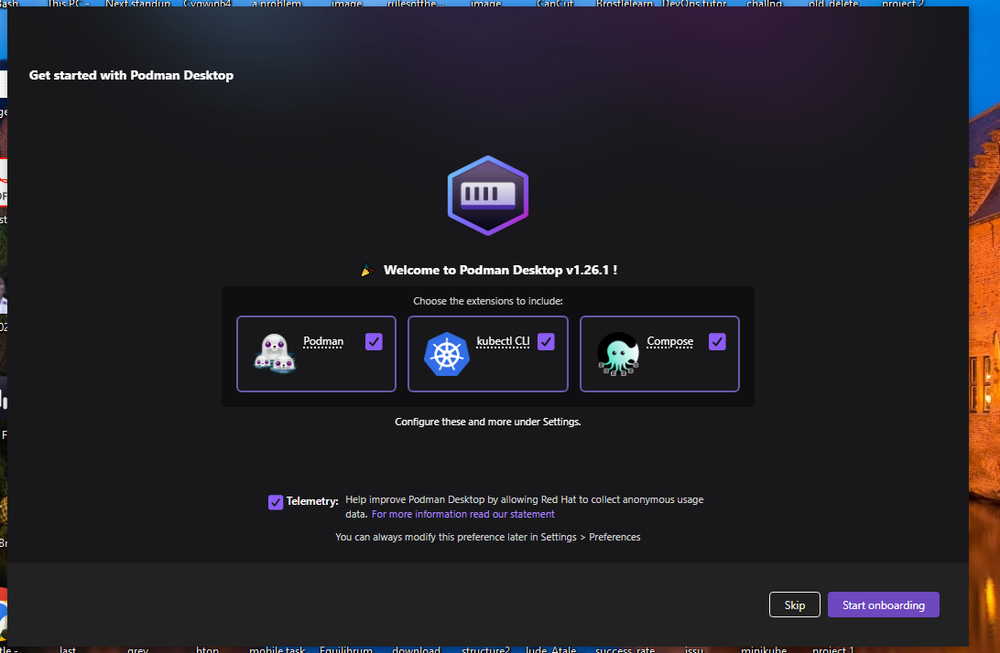 

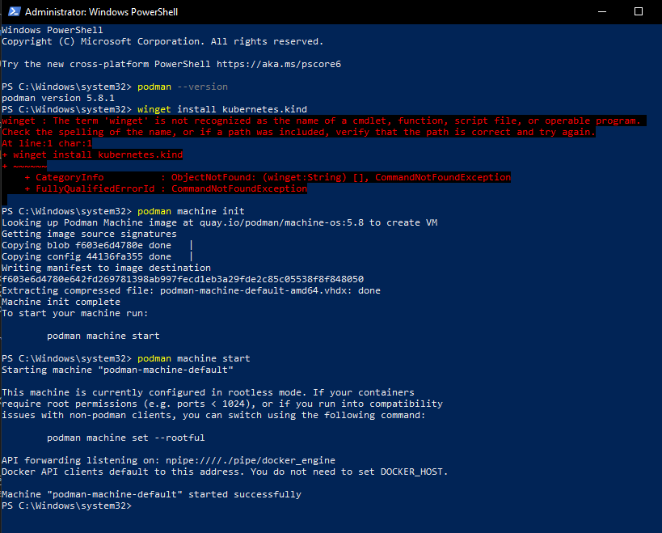 

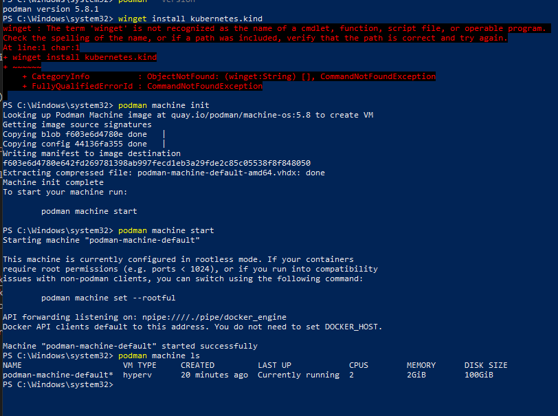 

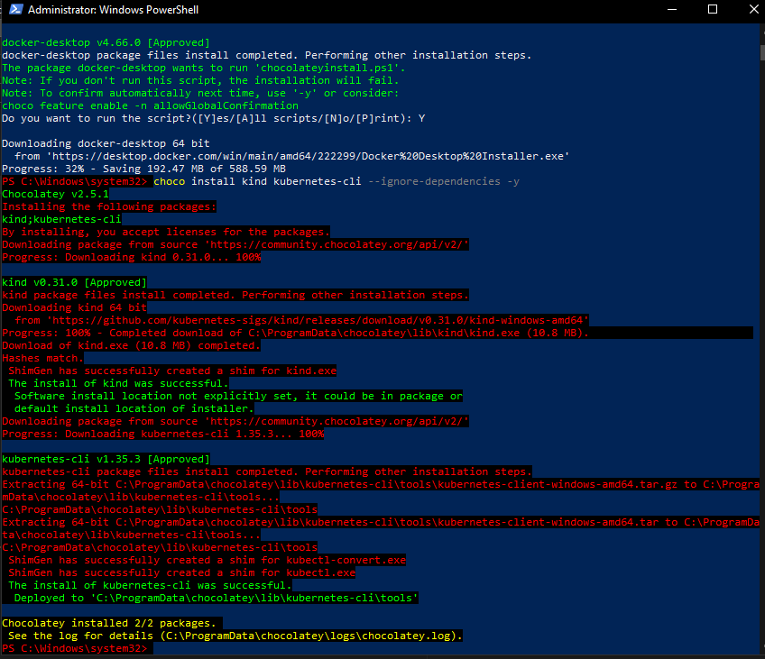 

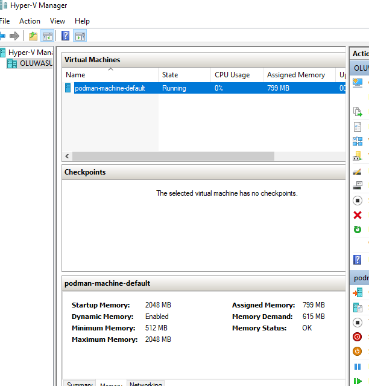 

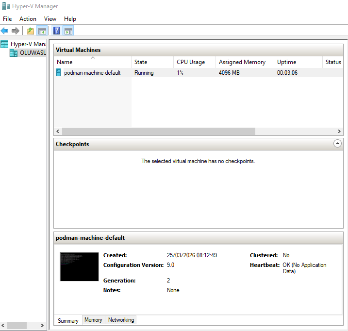 

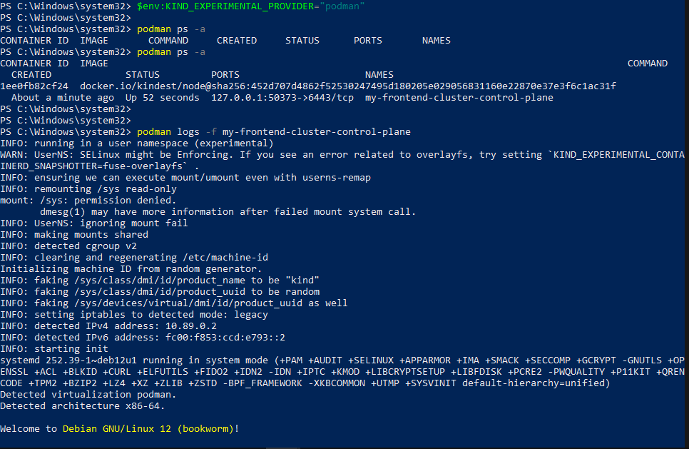 

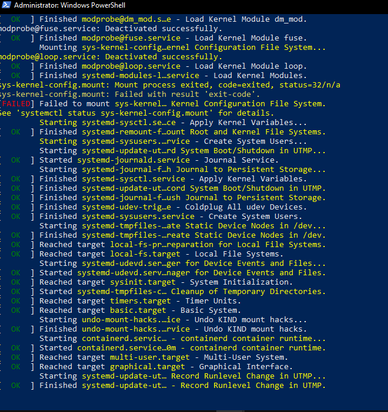 

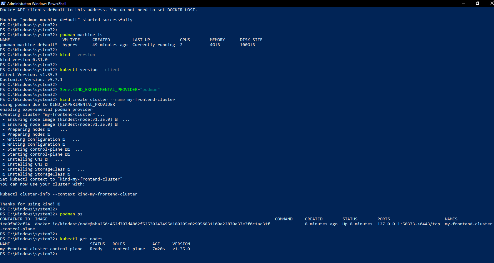 

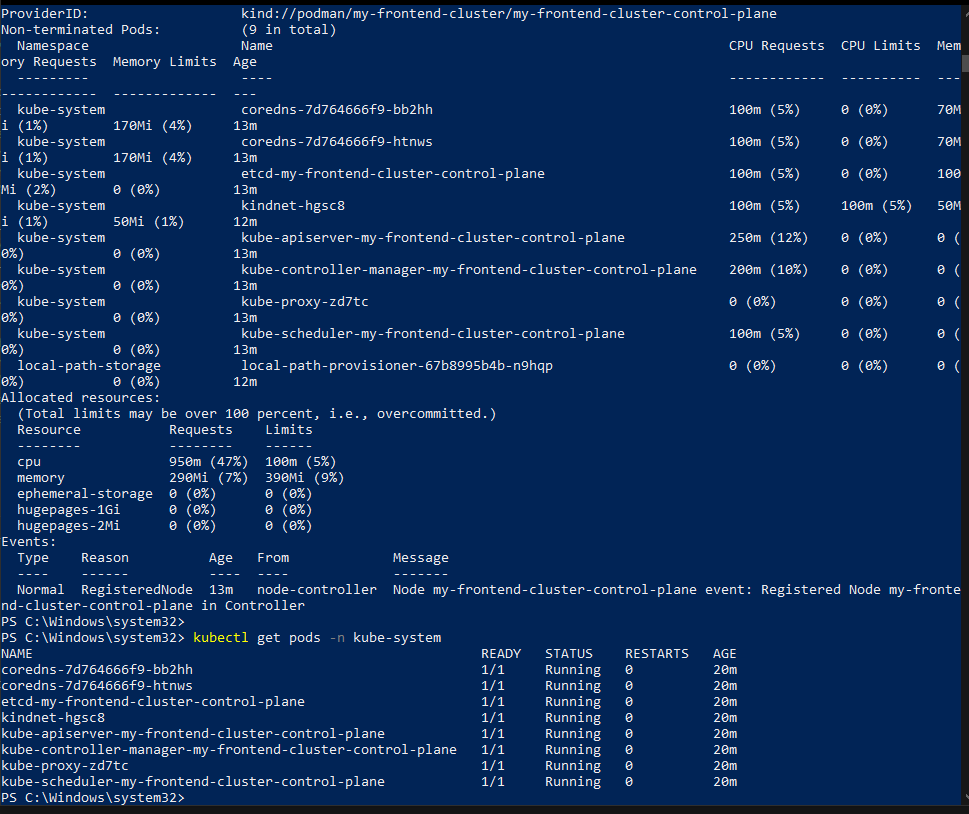


#### Task 2: Dockerize the application (using Podman)

We created a file named Dockerfile in the root of our project.
In the Dockerfile, specify Nginx as the base image.
Copied index.html and styles.css files into the Nginx HTML directory.
Build the image using Podman:

```Bash
cd frontend-demo-proj # your project root directory

podman build -t brostle/frontend-k8s-demo:latest .

# (Replace 'brostle' with your actual Docker Hub username)
```


#### Task 3: Push to Docker Hub
Log in to DockerHub using Podman:

```Bash
cd frontend-demo-proj # your project root directory

# We use this according to the instruction of the project
podman login docker.io

# Push your image:
podman push brostle/frontend-k8s-demo:latest

# OR We could have used this
# This "pushes" the image into your local cluster only & not dockerhub 
kind load docker-image brostle/frontend-k8s-demo:latest --name my-frontend-cluster 
```


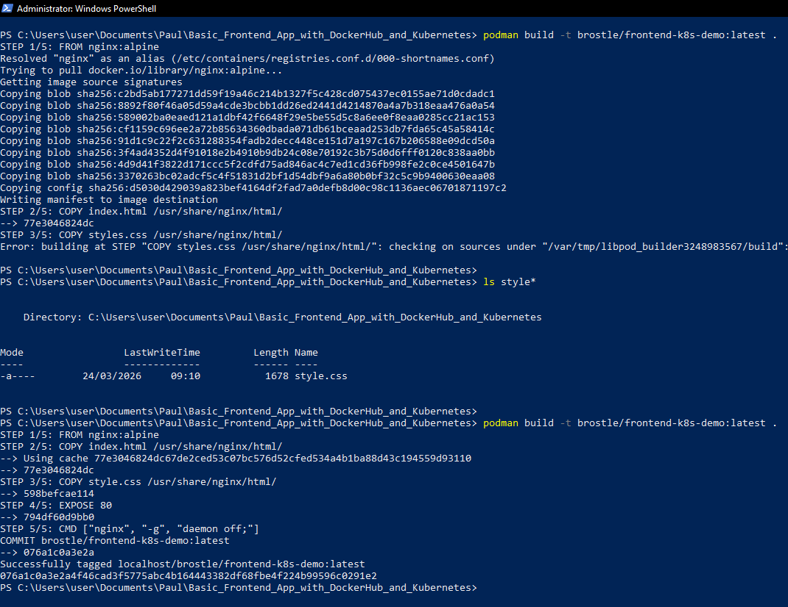 

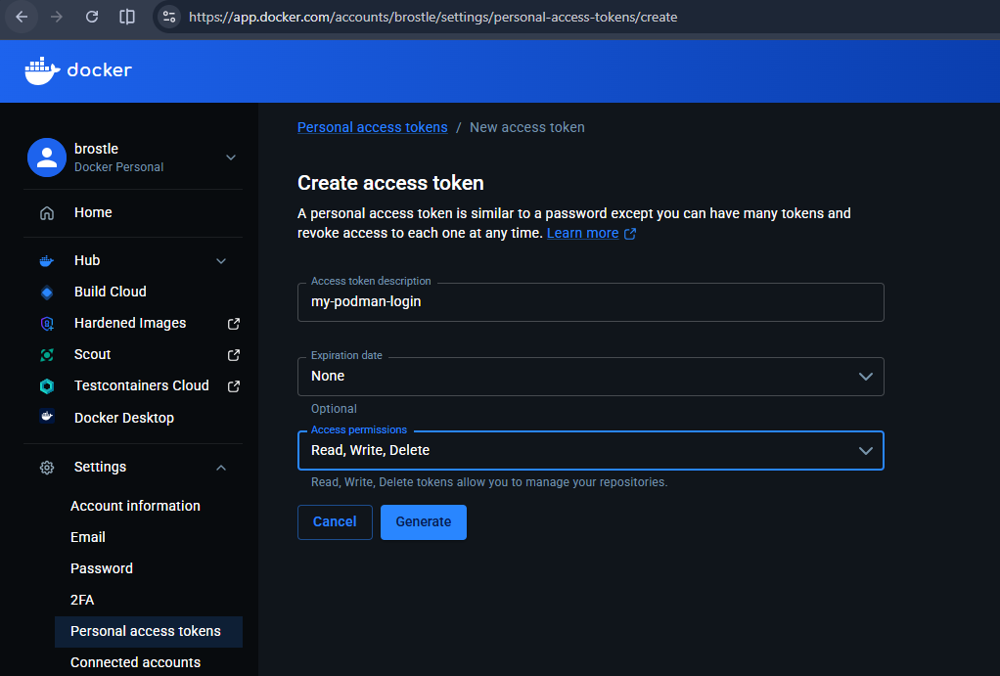 

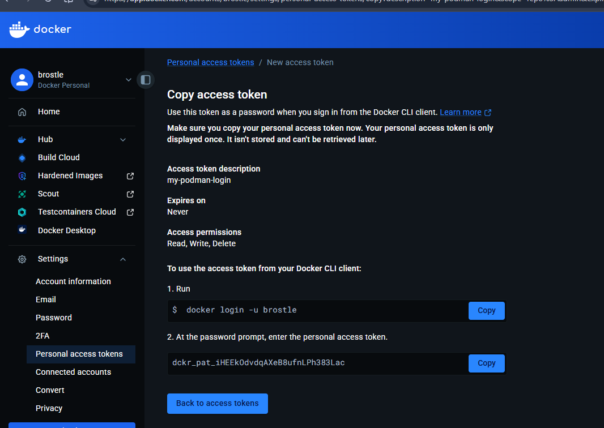 

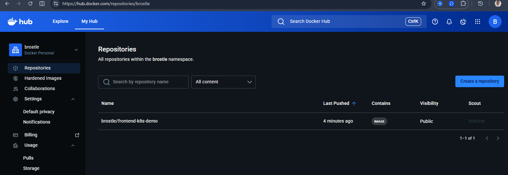


#### Task 4: Deploy to Kubernetes

CD into your project root directory

We created a Kubernetes Deployment YAML file named  and can be accessed: ```./deployment.yaml```

In the file, we specify our DockerHub image and set the desired number of replicas (e.g., 3).

And Applied the deployment to our cluster

```bash
# Apply deployment to cluster
kubectl apply -f deployment.yaml

# Check the deployment status:
kubectl get pods

kubectl get deployments

# Other interesting commands we used here:

# Describe your replicaset
kubectl describe rs frontend-deployment-5d89f6799f  

# Deletes a pod
kubectl delete pod frontend-deployment-5d89f6799f-kl462

# Open a second terminal and run this command before deleting to see self-healing kubernetes
kubectl get pods -w
```


#### Task 5: Create a Service (ClusterIP)
We created a Kubernetes Service YAML file named and can be accessed: ```./service.yaml```
We specified the service type as ClusterIP.
We applied the service
And verify the service

```bash
# Apply the service:
kubectl apply -f service.yaml

# Verify the service:
kubectl get services
```


#### Task 6: Access the Application

We port-forwarded the service so we can access it locally.

```bash
# Port-forward the service to access it locally:
# This maps a port on your laptop directly to the Service
kubectl port-forward svc/frontend-service 8080:80


# Other interesting commands used here:

# List all services
kubectl get svc -o wide

# See how much CPU and Memory your Service's Pods are actually using:
kubectl top pod -l app=frontend

# This tells Kubernetes: "Throw away the old pods and start new ones using the most recent version of the image."
kubectl rollout restart deployment frontend-deployment
```

We opened and visited our browser http://localhost:8080

We now see our simple frontend application running.

```bash
###################
# Important Note
###################

# In the cloud, you almost never use NodePort or port-forward for production. You use type: LoadBalancer.
# How it works: When you set type: LoadBalancer, the cloud provider (AWS/GCP) automatically spins up a real, external Load Balancer # (like an ALB), gives it a pretty DNS name, and handles all the routing to your nodes for you.
```

##### Comparison Table
Feature	port-forward	NodePort	LoadBalancer (Cloud)
Used for	Quick debugging	Internal/Legacy apps	Production Traffic
Complexity	Zero config	High (Firewalls/IPs)	Automated by Cloud
Security	Very Secure (Tunnel)	Risky (Exposed Port)	Secure (Managed Entry)


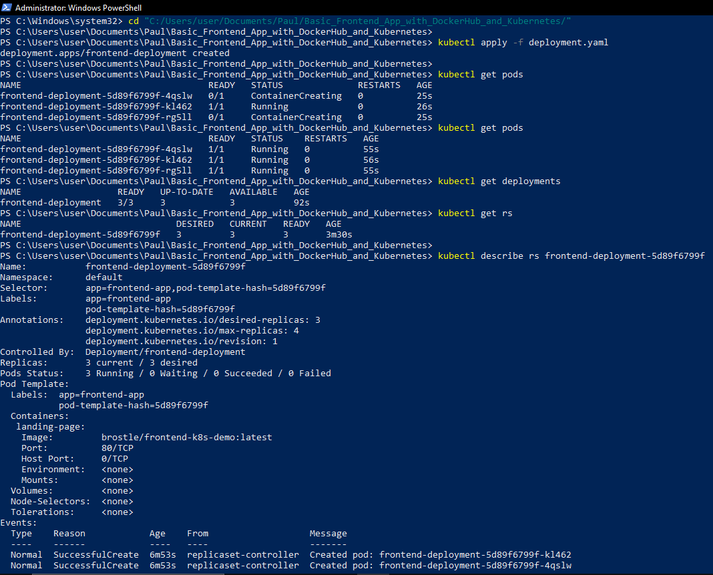 

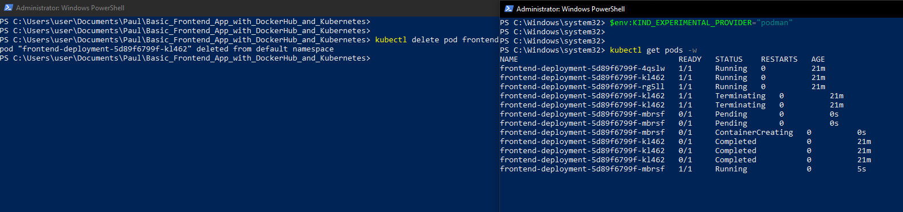 

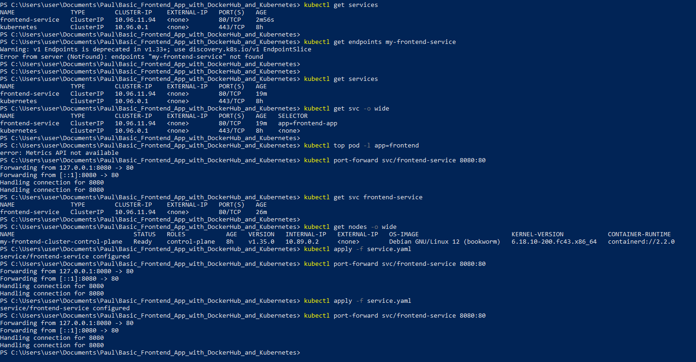 

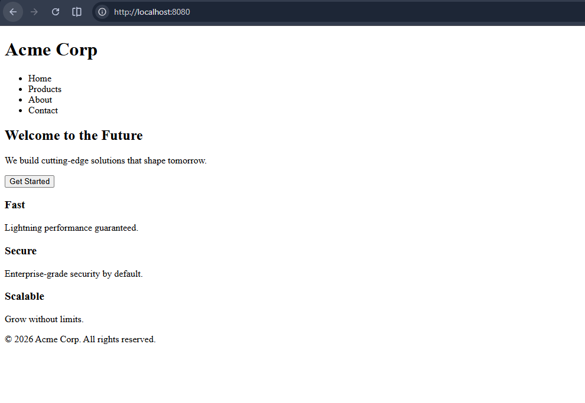 

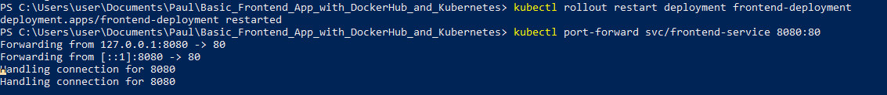


#### Cleanup (when finished)

```bash
# Delete the Kind cluster
kind delete cluster --name my-frontend-cluster

# Remove the Podman image
podman rmi brostle/frontend-k8s-demo:latest

# Optional: clean up unused Podman resources
podman system prune -a --force
```


#### Files Created in this Project:

We created the following files:

1. index.html: our frontend code

2. style.css: our style

3. dockerfile: we containerised our frontend code

4. deployment.yaml: for deploying our app to kubernetes

5. service.yaml: for communicating within our kubernetes cluster


Level	Name	Where it lives
Local Folder	Frontend Application...	Your Windows Desktop/Documents
Container Image	frontend-k8s-demo	Inside Podman and Docker Hub
Kubernetes Cluster	my-frontend-cluster	Inside the Kind environment


